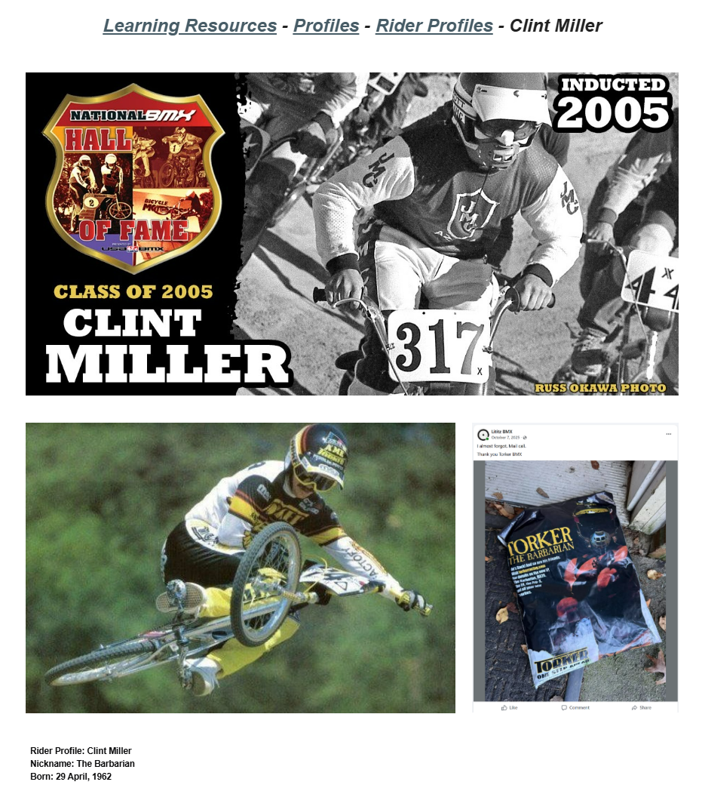

# Clint Miller

**Lititz BMX Rider Profile**

Published profile of Clint “The Barbarian” Miller, documenting his professional career, championships, sponsors and later DirtWerx connection.

## Profile at a glance

| Field | Published record |
|---|---|
| Born | 29 April, 1962 |
| Nickname | The Barbarian |
| Turned professional | 1978, age 15 |
| Hall of Fame | 2005 ABA BMX Hall of Fame |

## Archival treatment

This is a source-bound learning profile. The source image and supplied text are preserved together. Quotations, current-status statements, external summaries and historical claims retain their published attribution instead of being silently promoted to independent archive conclusions.

- The final character assessment is preserved as an attributed Torker Racing statement.

## Preserved source

- [Read the exact supplied transcription](source/PUBLISHED-TEXT.md)
- [Open the original LititzBMX.com profile](https://sites.google.com/view/lititzbmxinventorylist/learning-resources/profiles/rider-profiles/clint-miller-rider-profiles)
- Stable local source image: `source/page.png`

---

[← Todd Lyons](../todd-lyons/) · [Rider Profiles](../) · [Harry Leary →](../harry-leary/)
