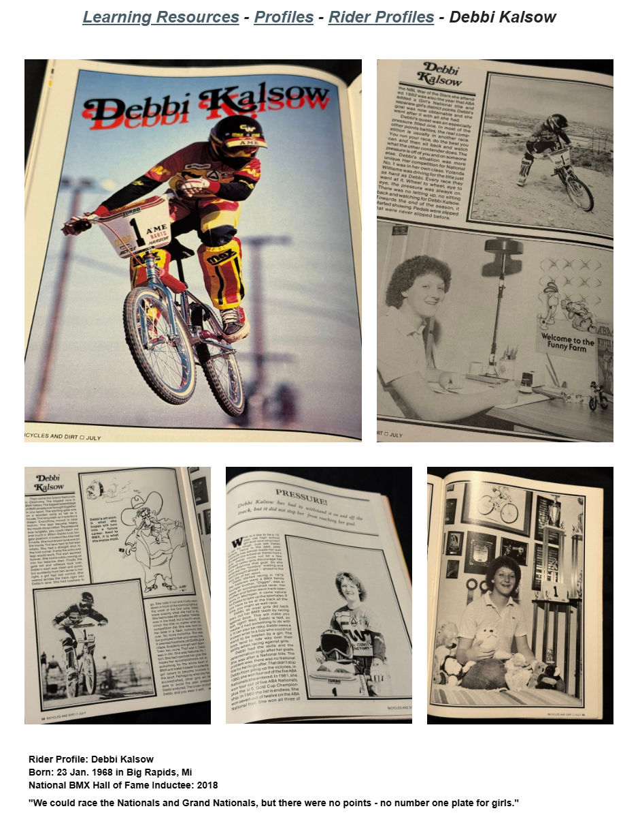

# Debbi Kalsow

**Lititz BMX Rider Profile**

Pioneering BMX racer profile preserving the published account of her racing career, women’s points-system barriers, major wins, print references and later team work.

## Profile at a glance

| Field | Published record |
|---|---|
| Born | 23 Jan. 1968 in Big Rapids, Mi |
| National BMX Hall of Fame | Inducted 2018 |
| First sponsor | East Lansing Cycle Shop — 1979 |

## Archival treatment

This is a source-bound learning profile. The source image and supplied text are preserved together. Quotations, current-status statements, external summaries and historical claims retain their published attribution instead of being silently promoted to independent archive conclusions.

- The source alternates between the spellings “Kalsow” and “Kaslow.” Both are preserved in the transcription.
- The Pinkbike passage is preserved as attributed source text, not independently verified by this archive record.

## Preserved source

- [Read the exact supplied transcription](source/PUBLISHED-TEXT.md)
- [Open the original LititzBMX.com profile](https://sites.google.com/view/lititzbmxinventorylist/learning-resources/profiles/rider-profiles/debbi-kalsow-rider-profiles)
- Stable local source image: `source/page.png`

---

[Rider Profiles](../) · [Eric Rupe →](../eric-rupe/)
