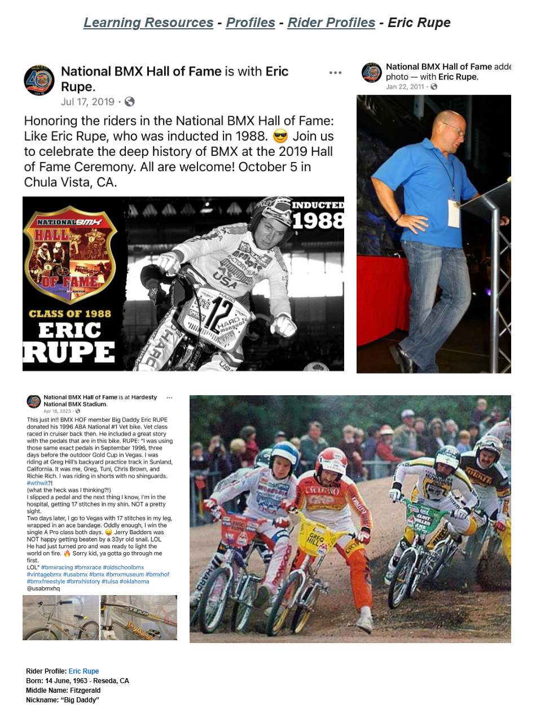

# Eric Rupe

**Lititz BMX Rider Profile**

Published rider profile documenting Eric “Big Daddy” Rupe’s beginnings, championship record, long career and Mongoose history.

## Profile at a glance

| Field | Published record |
|---|---|
| Born | 14 June, 1963 — Reseda, CA |
| Nickname | “Big Daddy” |
| Hall of Fame | 1988 ABA Hall of Fame inductee |
| First race bike | Schwinn Sting-Ray |

## Archival treatment

This is a source-bound learning profile. The source image and supplied text are preserved together. Quotations, current-status statements, external summaries and historical claims retain their published attribution instead of being silently promoted to independent archive conclusions.

- The source’s prime-years height field is preserved exactly in the transcription; the overview renders it as approximately 5 ft 6 in.
- The final “Four Fun Facts” section is explicitly identified by the source as Copilot-generated and is retained as an AI-supplied source note, not archive verification.

## Preserved source

- [Read the exact supplied transcription](source/PUBLISHED-TEXT.md)
- [Open the original LititzBMX.com profile](https://sites.google.com/view/lititzbmxinventorylist/learning-resources/profiles/rider-profiles/eric-rupe-rider-profiles)
- Stable local source image: `source/page.png`

---

[← Debbi Kalsow](../debbi-kalsow/) · [Rider Profiles](../) · [Todd Lyons →](../todd-lyons/)
