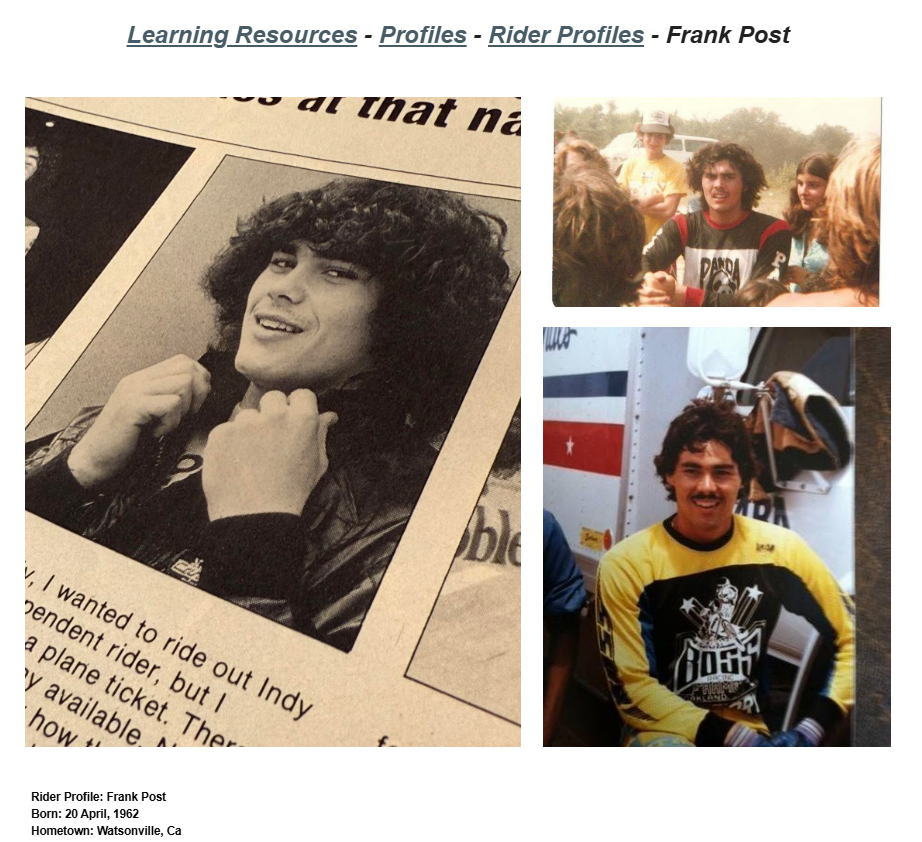

# Frank Post

**Lititz BMX Rider Profile**

Published profile documenting Frank Post’s entry into BMX, professional career, selected wins, retirement and later occupations.

## Profile at a glance

| Field | Published record |
|---|---|
| Born | 20 April, 1962 |
| Hometown | Watsonville, Ca |
| Turned professional | May 1978, age 16 |
| First professional win | May 27, 1979 — Watsonville Spring National |

## Archival treatment

This is a source-bound learning profile. The source image and supplied text are preserved together. Quotations, current-status statements, external summaries and historical claims retain their published attribution instead of being silently promoted to independent archive conclusions.

- The RoostBMX quotation is preserved with its original spelling and punctuation.
- The source spelling “amatuer” is preserved in the exact transcription and normalized only in the overview.

## Preserved source

- [Read the exact supplied transcription](source/PUBLISHED-TEXT.md)
- [Open the original LititzBMX.com profile](https://sites.google.com/view/lititzbmxinventorylist/learning-resources/profiles/rider-profiles/frank-post-rider-profiles)
- Stable local source image: `source/page.png`

---

[← Greg Hill](../greg-hill/) · [Rider Profiles](../) · [Tommy Brackens →](../tommy-brackens/)
