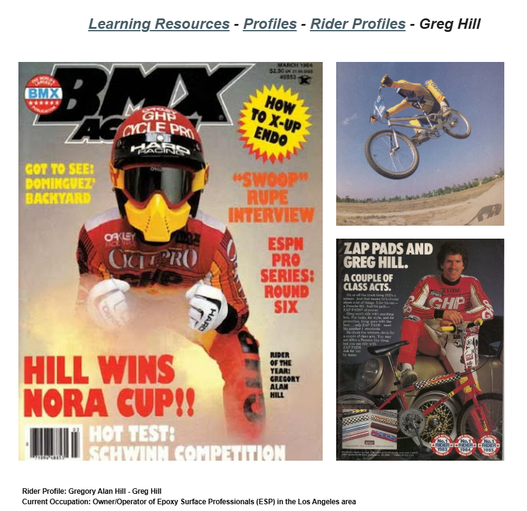

# Greg Hill

**Lititz BMX Rider Profile**

Published profile documenting Greg Hill’s racing career, selected championships, GHP and the profile’s time-bound references to his current work and family.

## Profile at a glance

| Field | Published record |
|---|---|
| Full name | Gregory Alan Hill |
| Born | 27 October, 1963 |
| Turned professional | 28 March, 1978, age 14 |
| First race bike | Schwinn “Apple Crate” |

## Archival treatment

This is a source-bound learning profile. The source image and supplied text are preserved together. Quotations, current-status statements, external summaries and historical claims retain their published attribution instead of being silently promoted to independent archive conclusions.

- The parenthetical comparison to Kyle A. Huffman’s birth date is preserved as Lititz BMX curatorial context.
- Current occupation and 2025 nomination language are time-bound source statements.

## Preserved source

- [Read the exact supplied transcription](source/PUBLISHED-TEXT.md)
- [Open the original LititzBMX.com profile](https://sites.google.com/view/lititzbmxinventorylist/learning-resources/profiles/rider-profiles/greg-hill-rider-profiles)
- Stable local source image: `source/page.png`

---

[← Harry Leary](../harry-leary/) · [Rider Profiles](../) · [Frank Post →](../frank-post/)
