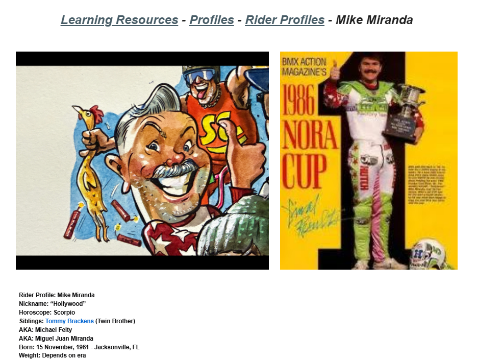

# Mike Miranda

**Lititz BMX Rider Profile**

Published profile of Mike “Hollywood” Miranda preserving career milestones, teams, quotations, retirement and the page’s deliberate Tommy Brackens “twin” joke.

## Profile at a glance

| Field | Published record |
|---|---|
| Born | 15 November, 1961 — Jacksonville, FL |
| Nickname | “Hollywood” |
| 1986 honor | NORA Cup “Rider” winner |
| Retired | 3 April, 1989 — Orlando, FL |

## Archival treatment

This is a source-bound learning profile. The source image and supplied text are preserved together. Quotations, current-status statements, external summaries and historical claims retain their published attribution instead of being silently promoted to independent archive conclusions.

- “Tommy Brackens (Twin Brother)” is archived as a satirical page device, not a factual biological relationship.
- The source says Miranda turned professional on 15 February 1982, described as his “18th birthday,” although the published birth date would make him 20; the discrepancy is preserved.
- The sentence about wins and style is explicitly attributed to Copilot and retained as an AI-supplied note.

## Preserved source

- [Read the exact supplied transcription](source/PUBLISHED-TEXT.md)
- [Open the original LititzBMX.com profile](https://sites.google.com/view/lititzbmxinventorylist/learning-resources/profiles/rider-profiles/mike-miranda-rider-profiles)
- Stable local source image: `source/page.png`

---

[← Tommy Brackens](../tommy-brackens/) · [Rider Profiles](../) · [Michael “Mike” Poulson →](../mike-poulson/)
