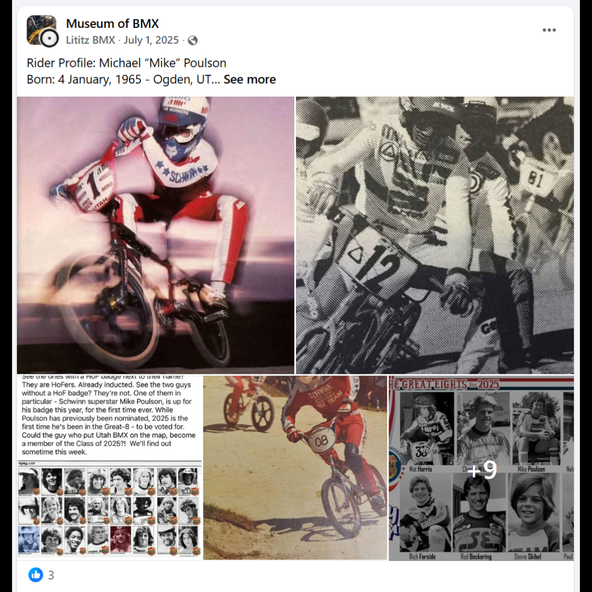

# Michael “Mike” Poulson

**Lititz BMX Rider Profile**

Published profile of Mike “MP” Poulson preserving his amateur and professional career, Hall of Fame recognition, print appearances and later landscaping work.

## Profile at a glance

| Field | Published record |
|---|---|
| Born | 4 January, 1965 — Ogden, UT |
| Nickname | MP |
| Started racing | 1978 |
| Hall of Fame | 2025 National BMX Hall of Fame — Early Racer category |

## Archival treatment

This is a source-bound learning profile. The source image and supplied text are preserved together. Quotations, current-status statements, external summaries and historical claims retain their published attribution instead of being silently promoted to independent archive conclusions.

- No polished full-page profile screenshot was supplied in this intake; the preserved image is the supplied public profile/social capture.
- The reported high-school earnings figure and USA BMX assessment remain source-attributed statements.

## Preserved source

- [Read the exact supplied transcription](source/PUBLISHED-TEXT.md)
- [Open the original LititzBMX.com profile](https://sites.google.com/view/lititzbmxinventorylist/learning-resources/profiles/rider-profiles/mike-poulson-rider-profiles)
- Stable local source image: `source/page.png`

---

[← Mike Miranda](../mike-miranda/) · [Rider Profiles](../)
