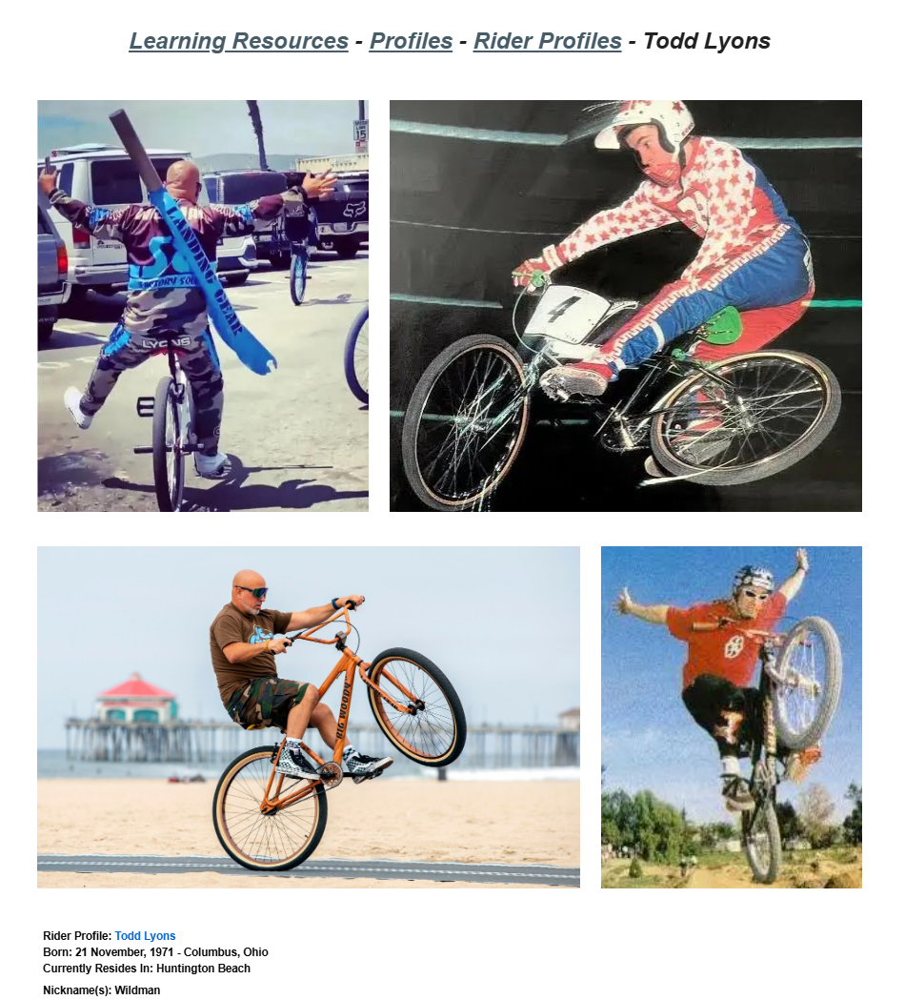

# Todd Lyons

**Lititz BMX Rider Profile**

Published profile of Todd “Wildman” Lyons, tracing his early racing, backflip milestone, dirt-jumping career and later industry work.

## Profile at a glance

| Field | Published record |
|---|---|
| Born | 21 November 1971 — Columbus, Ohio |
| Current residence in source | Huntington Beach |
| Nickname | Wildman |
| First BMX bike | Redline MX II |

## Archival treatment

This is a source-bound learning profile. The source image and supplied text are preserved together. Quotations, current-status statements, external summaries and historical claims retain their published attribution instead of being silently promoted to independent archive conclusions.

- Current-residence and occupational statements are preserved as time-bound published source content.
- The closing Lititz BMX podcast statement is preserved as archive commentary and linked to its recording.

## Preserved source

- [Read the exact supplied transcription](source/PUBLISHED-TEXT.md)
- [Open the original LititzBMX.com profile](https://sites.google.com/view/lititzbmxinventorylist/learning-resources/profiles/rider-profiles/todd-lyons-rider-profiles)
- Stable local source image: `source/page.png`

---

[← Eric Rupe](../eric-rupe/) · [Rider Profiles](../) · [Clint Miller →](../clint-miller/)
