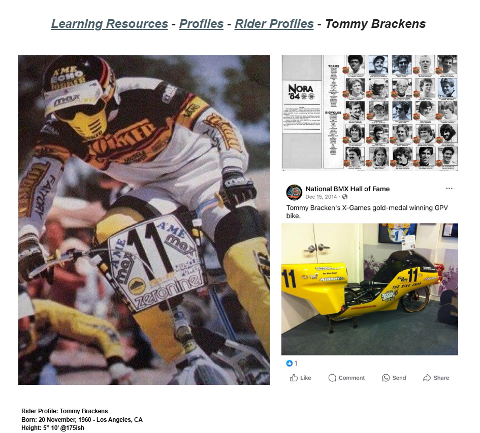

# Tommy Brackens

**Lititz BMX Rider Profile**

Published profile of Tommy “The Human Dragster” Brackens, covering his motocross-to-BMX transition, professional career, NORA Cup and Brackens Racing Products.

## Profile at a glance

| Field | Published record |
|---|---|
| Born | 20 November, 1960 — Los Angeles, CA |
| Nickname | The Human Dragster |
| Turned professional | December 1980, age 20 |
| Retired | 1990 |

## Archival treatment

This is a source-bound learning profile. The source image and supplied text are preserved together. Quotations, current-status statements, external summaries and historical claims retain their published attribution instead of being silently promoted to independent archive conclusions.

- The source lists Powerlite Racing under 1991 despite also stating retirement in 1990; both are preserved as published without silent correction.
- The source’s opening character summary is explicitly marked as Copilot-generated and is not treated as archive verification.

## Preserved source

- [Read the exact supplied transcription](source/PUBLISHED-TEXT.md)
- [Open the original LititzBMX.com profile](https://sites.google.com/view/lititzbmxinventorylist/learning-resources/profiles/rider-profiles/tommy-brackens-rider-profiles)
- Stable local source image: `source/page.png`

---

[← Frank Post](../frank-post/) · [Rider Profiles](../) · [Mike Miranda →](../mike-miranda/)
