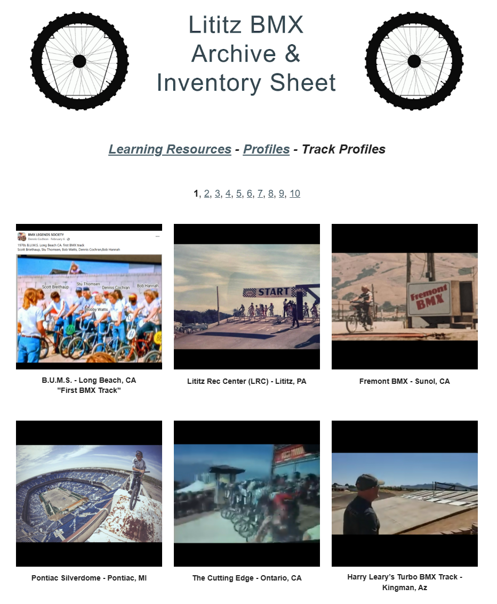

# Track Profiles — A Visual Track Atlas

The Track Profiles archive preserves the complete ten-page Google Sites visual index as a page-ordered source record. Each page retains its imagery, published track names, locations, ordering and exact source URL.

| Metric | Record |
|---|---:|
| Defined source pages | 10 |
| Source pages fully captured | 10 |
| Source captures preserved | 20 — top and bottom for every page |
| Transcribed visual entries | 150 |
| Invented track histories | **None** |

> This is an existence-and-image archive. A track’s appearance here does not establish dates, ownership, operators, sanctioning history, rider participation or event history.

<table>
<tr><td align="center" width="50%"><a href="pages/p01/"> <strong>Source Page 1</strong></a> Complete source capture — 15 published entries</td><td align="center" width="50%"><a href="pages/p02/"> <strong>Source Page 2</strong></a> Complete source capture — 15 published entries</td></tr><tr><td align="center" width="50%"><a href="pages/p03/"> <strong>Source Page 3</strong></a> Complete source capture — 15 published entries</td><td align="center" width="50%"><a href="pages/p04/"> <strong>Source Page 4</strong></a> Complete source capture — 15 published entries</td></tr><tr><td align="center" width="50%"><a href="pages/p05/"> <strong>Source Page 5</strong></a> Complete source capture — 15 published entries</td><td align="center" width="50%"><a href="pages/p06/"> <strong>Source Page 6</strong></a> Complete source capture — 15 published entries</td></tr><tr><td align="center" width="50%"><a href="pages/p07/"> <strong>Source Page 7</strong></a> Complete source capture — 15 published entries</td><td align="center" width="50%"><a href="pages/p08/"> <strong>Source Page 8</strong></a> Complete source capture — 15 published entries</td></tr><tr><td align="center" width="50%"><a href="pages/p09/"> <strong>Source Page 9</strong></a> Complete source capture — 15 published entries</td><td align="center" width="50%"><a href="pages/p10/"> <strong>Source Page 10</strong></a> Complete source capture — 15 published entries</td></tr>
</table>

## Machine-readable access

- [Track page register — JSON](../data/track-page-register.json)
- [Track page register — CSV](../data/track-page-register.csv)
- [Track entry register — JSON](../data/track-entry-register.json)
- [Track entry register — CSV](../data/track-entry-register.csv)
- [Known gaps and source limitations](../docs/KNOWN-GAPS.md)

[← Back to Profiles](../)
