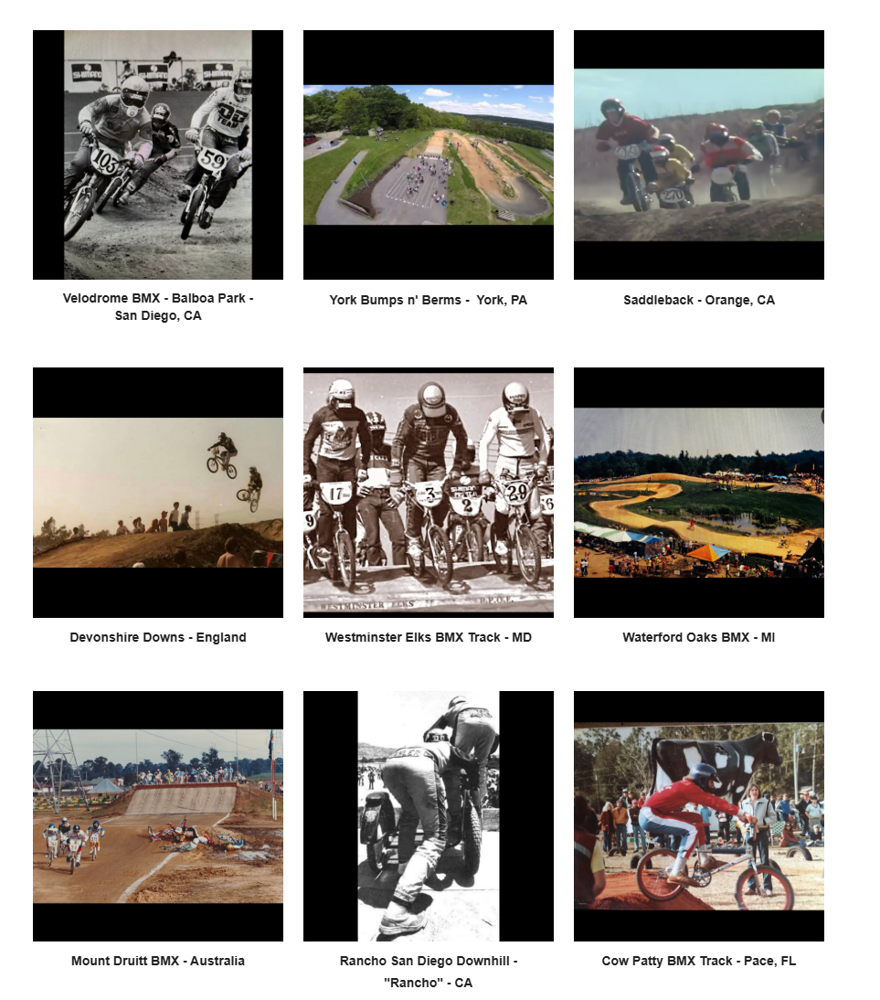

# Track Profiles — Source Page 1

## Published entries

1. B.U.M.S. - Long Beach, CA — “First BMX Track”
2. Lititz Rec Center (LRC) - Lititz, PA
3. Fremont BMX - Sunol, CA
4. Pontiac Silverdome - Pontiac, MI
5. The Cutting Edge - Ontario, CA
6. Harry Leary’s Turbo BMX Track - Kingman, Az
7. Velodrome BMX - Balboa Park - San Diego, CA
8. York Bumps n' Berms - York, PA
9. Saddleback - Orange, CA
10. Devonshire Downs - England
11. Westminster Elks BMX Track - MD
12. Waterford Oaks BMX - MI
13. Mount Druitt BMX - Australia
14. Rancho San Diego Downhill - “Rancho” - CA
15. Cow Patty BMX Track - Pace, FL

## Source record

- Source page: [Open Track Profiles page 1](https://sites.google.com/view/lititzbmxinventorylist/learning-resources/profiles/track-profiles)
- Archive status: **source complete**
- Expected layout: 15 visual entries across one Google Sites index page
- Interpretive boundary: names and locations are transcribed only from the supplied page image; this record does not infer track dates, operators, sanctioning bodies, riders or events.

---

[Track Profiles](../../) · [Page 2 →](../p02/)
