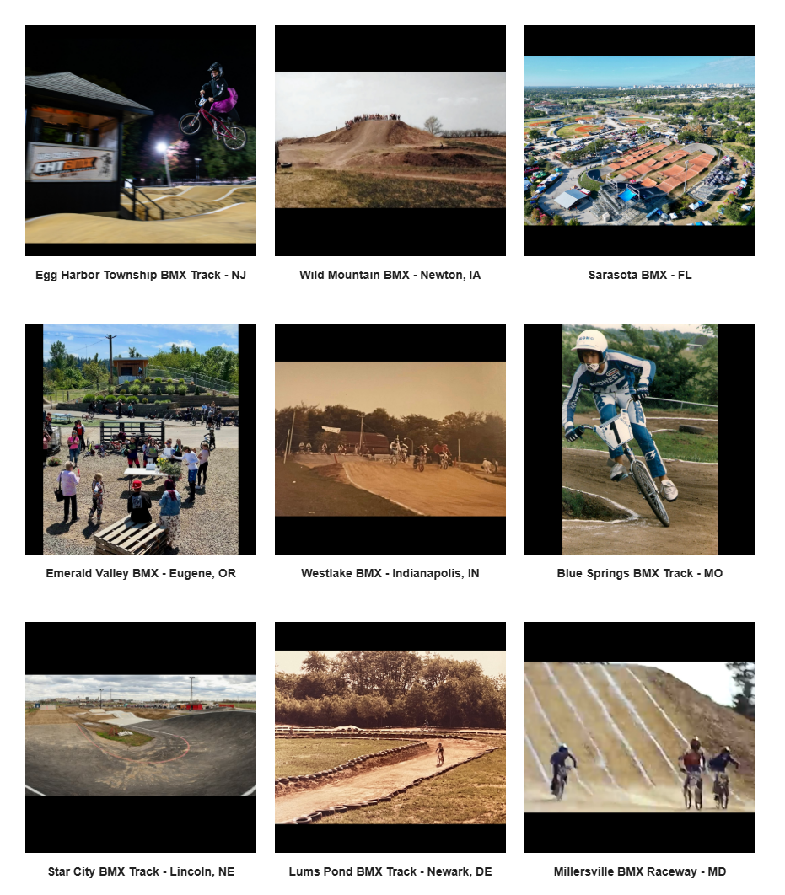

# Track Profiles — Source Page 2

## Published entries

1. H Town BMX Supercross - North Houston, TX
2. Canyon Country BMX Track - Santa Clarita, CA
3. Boystown - South Dade County, FL
4. Catamount BMX - Bennington, VT
5. “High Voltage” - Oakland Hills, CA
6. Bay Area BMX Track - Coos Bay, OR
7. Egg Harbor Township BMX Track - NJ
8. Wild Mountain BMX - Newton, IA
9. Sarasota BMX - FL
10. Emerald Valley BMX - Eugene, OR
11. Westlake BMX - Indianapolis, IN
12. Blue Springs BMX Track - MO
13. Star City BMX Track - Lincoln, NE
14. Lums Pond BMX Track - Newark, DE
15. Millersville BMX Raceway - MD

## Source record

- Source page: [Open Track Profiles page 2](https://sites.google.com/view/lititzbmxinventorylist/learning-resources/profiles/track-profiles/p2-track-profiles)
- Archive status: **source complete**
- Expected layout: 15 visual entries across one Google Sites index page
- Interpretive boundary: names and locations are transcribed only from the supplied page image; this record does not infer track dates, operators, sanctioning bodies, riders or events.

---

[← Page 1](../p01/) · [Track Profiles](../../) · [Page 3 →](../p03/)
