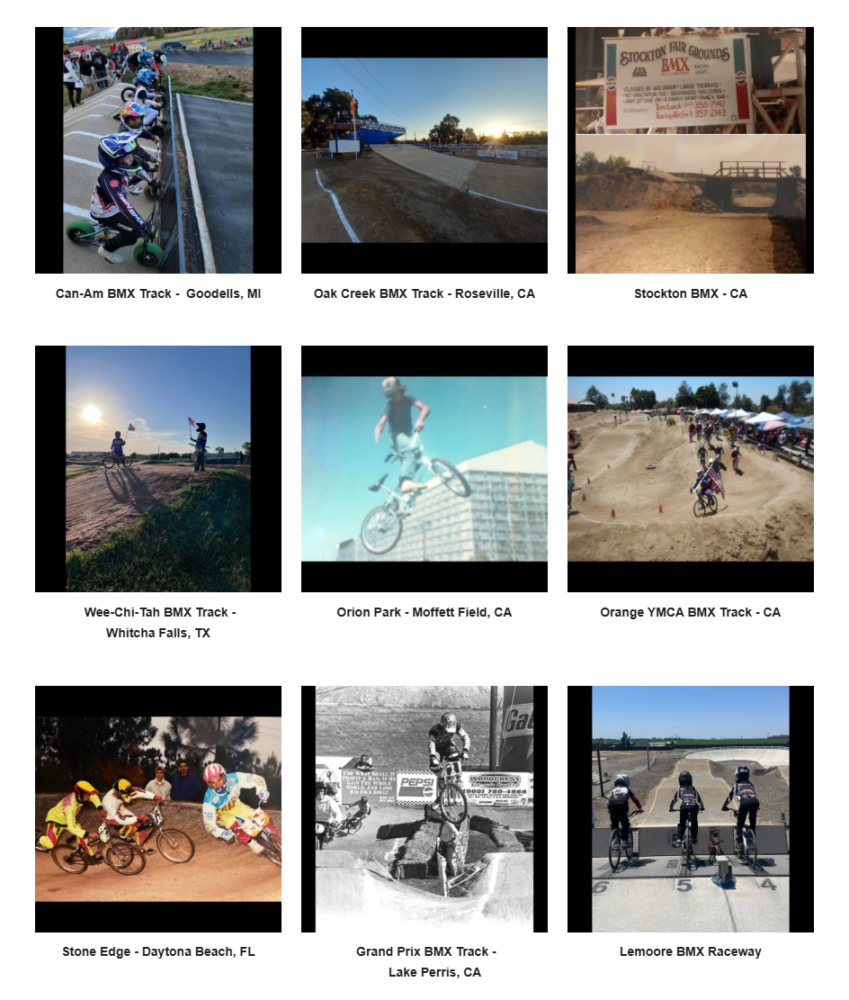

# Track Profiles — Source Page 3

## Published entries

1. Capital City Family BMX - Lansing, MI
2. Yankee Hill BMX Track - Lincoln, NE
3. BMX Track on Charlotte Motor Speedway - Charlotte, NC
4. Pine Bluff BMX - AR
5. Kearny Moto Park - San Diego, CA
6. Cactus Park BMX - Lakeside, CA
7. Can-Am BMX Track - Goodells, MI
8. Oak Creek BMX Track - Roseville, CA
9. Stockton BMX - CA
10. Wee-Chi-Tah BMX Track - Whitcha Falls, TX
11. Orion Park - Moffett Field, CA
12. Orange YMCA BMX Track - CA
13. Stone Edge - Daytona Beach, FL
14. Grand Prix BMX Track - Lake Perris, CA
15. Lemoore BMX Raceway

## Source record

- Source page: [Open Track Profiles page 3](https://sites.google.com/view/lititzbmxinventorylist/learning-resources/profiles/track-profiles/p3-track-profiles)
- Archive status: **source complete**
- Expected layout: 15 visual entries across one Google Sites index page
- Interpretive boundary: names and locations are transcribed only from the supplied page image; this record does not infer track dates, operators, sanctioning bodies, riders or events.

---

[← Page 2](../p02/) · [Track Profiles](../../) · [Page 4 →](../p04/)
