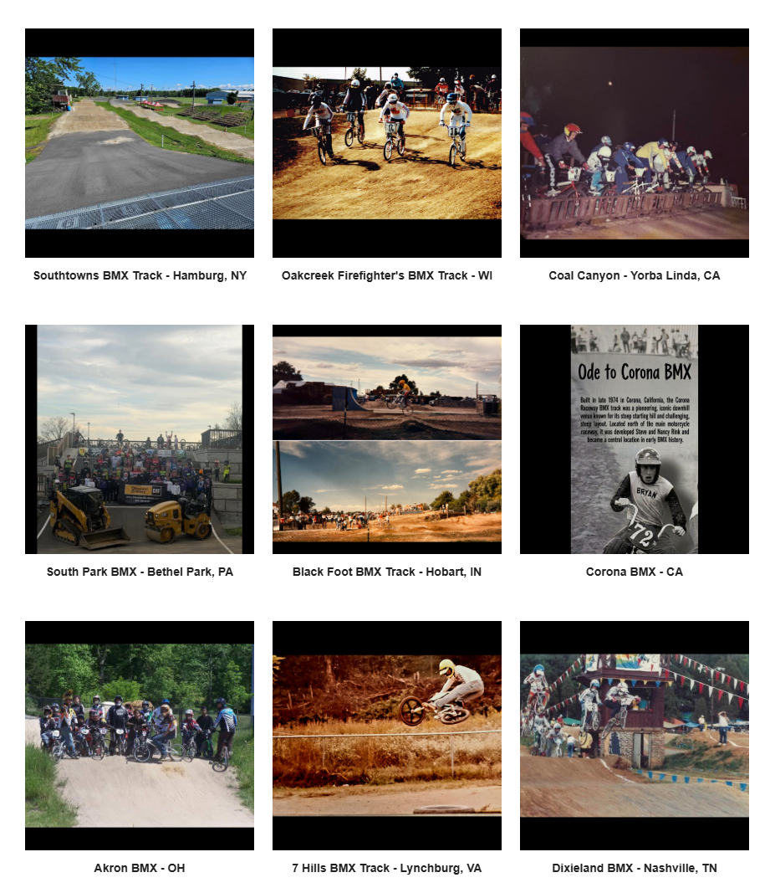

# Track Profiles — Source Page 4

## Published entries

1. Chesapeake BMX - Severn, MD
2. Trumble BMX Track - CT
3. Northampton Indoor BMX - MA
4. Decano BMX Track - CO
5. Riverside BMX Track - Clackamas, OR
6. La Mirada Regional Park BMX - CA
7. Southtowns BMX Track - Hamburg, NY
8. Oakcreek Firefighter's BMX Track - WI
9. Coal Canyon - Yorba Linda, CA
10. South Park BMX - Bethel Park, PA
11. Black Foot BMX Track - Hobart, IN
12. Corona BMX - CA
13. Akron BMX - OH
14. 7 Hills BMX Track - Lynchburg, VA
15. Dixieland BMX - Nashville, TN

## Source record

- Source page: [Open Track Profiles page 4](https://sites.google.com/view/lititzbmxinventorylist/learning-resources/profiles/track-profiles/p4-track-profiles)
- Archive status: **source complete**
- Expected layout: 15 visual entries across one Google Sites index page
- Interpretive boundary: names and locations are transcribed only from the supplied page image; this record does not infer track dates, operators, sanctioning bodies, riders or events.

---

[← Page 3](../p03/) · [Track Profiles](../../) · [Page 5 →](../p05/)
