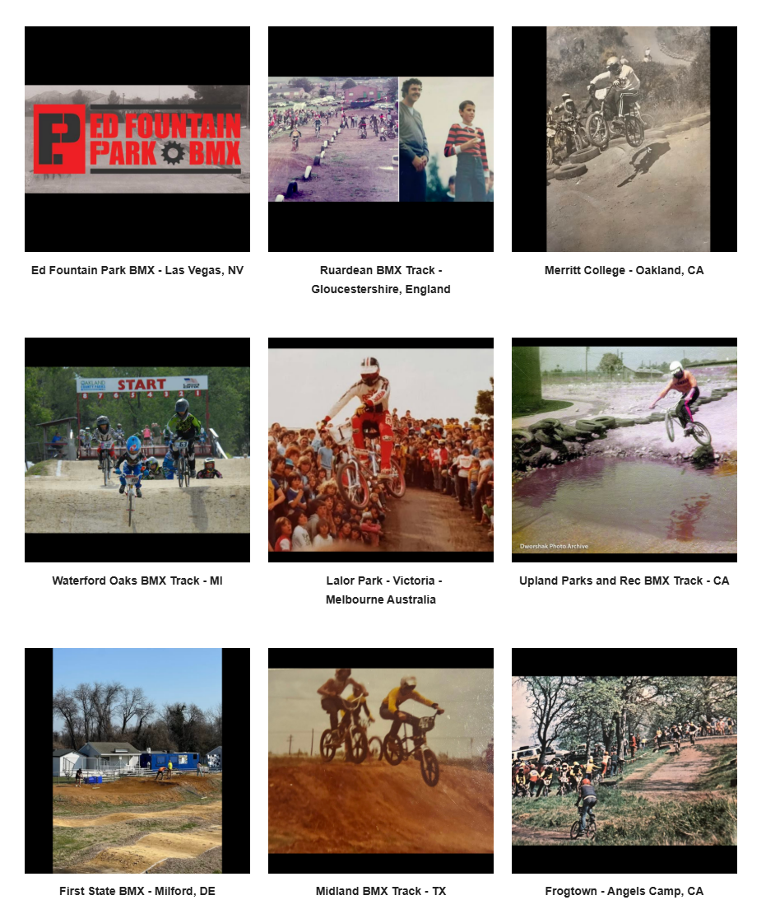

# Track Profiles — Source Page 5

## Published entries

1. Airtime BMX - Reedley, CA
2. Brockwell Park BMX Track - London - “UK's 1st Documented BMX track”
3. Auburn-Dewitt BMX Track - Auburn, CA
4. Milton BMX Track - Ontario, Canada
5. Hedge End BMX Track - UK
6. Sarasota BMX Track - FL
7. Ed Fountain Park BMX - Las Vegas, NV
8. Ruardean BMX Track - Gloucestershire, England
9. Merritt College - Oakland, CA
10. Waterford Oaks BMX Track - MI
11. Lalor Park - Victoria - Melbourne Australia
12. Upland Parks and Rec BMX Track - CA
13. First State BMX - Milford, DE
14. Midland BMX Track - TX
15. Frogtown - Angels Camp, CA

## Source record

- Source page: [Open Track Profiles page 5](https://sites.google.com/view/lititzbmxinventorylist/learning-resources/profiles/track-profiles/p5-track-profiles)
- Archive status: **source complete**
- Expected layout: 15 visual entries across one Google Sites index page
- Interpretive boundary: names and locations are transcribed only from the supplied page image; this record does not infer track dates, operators, sanctioning bodies, riders or events.

---

[← Page 4](../p04/) · [Track Profiles](../../) · [Page 6 →](../p06/)
