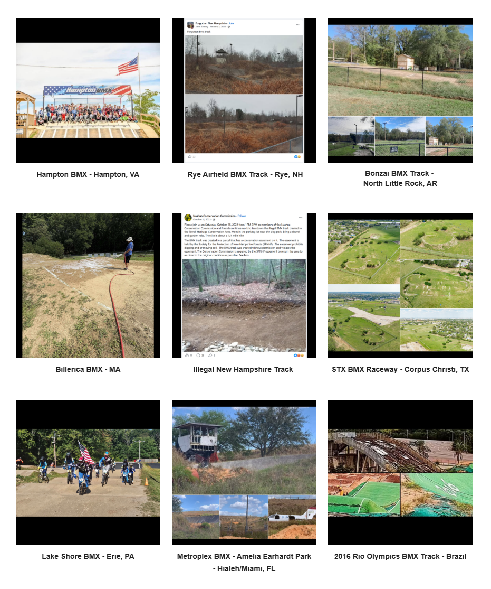

# Track Profiles — Source Page 6

## Published entries

1. Westmoreland BMX - Apollo, PA
2. Hillside BMX - Springvale, ME
3. The Sandbox - Sand Island State Recreation Area - Honolulu, Oahu
4. Revolution Bike Park - York, PA
5. Northeast Velodrome - Derry, NH
6. Yucca Valley BMX - CA
7. Hampton BMX - Hampton, VA
8. Rye Airfield BMX Track - Rye, NH
9. Bonzai BMX Track - North Little Rock, AR
10. Billerica BMX - MA
11. Illegal New Hampshire Track
12. STX BMX Raceway - Corpus Christi, TX
13. Lake Shore BMX - Erie, PA
14. Metroplex BMX - Amelia Earhardt Park - Hialeah/Miami, FL
15. 2016 Rio Olympics BMX Track - Brazil

## Source record

- Source page: [Open Track Profiles page 6](https://sites.google.com/view/lititzbmxinventorylist/learning-resources/profiles/track-profiles/p6-track-profiles)
- Archive status: **source complete**
- Expected layout: 15 visual entries across one Google Sites index page
- Interpretive boundary: names and locations are transcribed only from the supplied page image; this record does not infer track dates, operators, sanctioning bodies, riders or events.

---

[← Page 5](../p05/) · [Track Profiles](../../) · [Page 7 →](../p07/)
