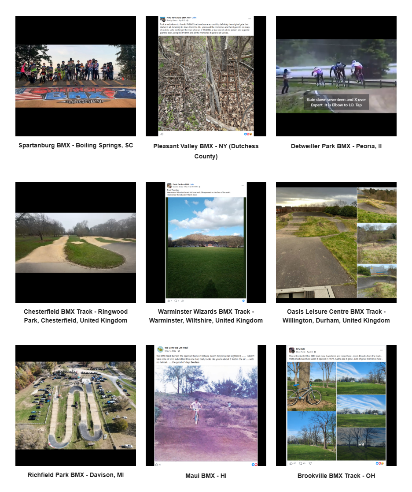

# Track Profiles — Source Page 7

## Published entries

1. The Cove BMX Track - Adelaide, Australia
2. Dronfield BMX Track - Dronfield, North East Derbyshire, United Kingdom
3. Mill Valley Jumps - Marin County, CA
4. River Valley BMX - Sumner, WA
5. Bexley BMX - Christchurch, New Zealand
6. Piste de BMX Montivilliers - Normandy, France.
7. Spartanburg BMX - Boiling Springs, SC
8. Pleasant Valley BMX - NY (Dutchess County)
9. Detweiller Park BMX - Peoria, Il
10. Chesterfield BMX Track - Ringwood Park, Chesterfield, United Kingdom
11. Warminster Wizards BMX Track - Warminster, Wiltshire, United Kingdom
12. Oasis Leisure Centre BMX Track - Willington, Durham, United Kingdom
13. Richfield Park BMX - Davison, MI
14. Maui BMX - HI
15. Brookville BMX Track - OH

## Source record

- Source page: [Open Track Profiles page 7](https://sites.google.com/view/lititzbmxinventorylist/learning-resources/profiles/track-profiles/p7-track-profiles)
- Archive status: **source complete**
- Expected layout: 15 visual entries across one Google Sites index page
- Interpretive boundary: names and locations are transcribed only from the supplied page image; this record does not infer track dates, operators, sanctioning bodies, riders or events.

---

[← Page 6](../p06/) · [Track Profiles](../../) · [Page 8 →](../p08/)
