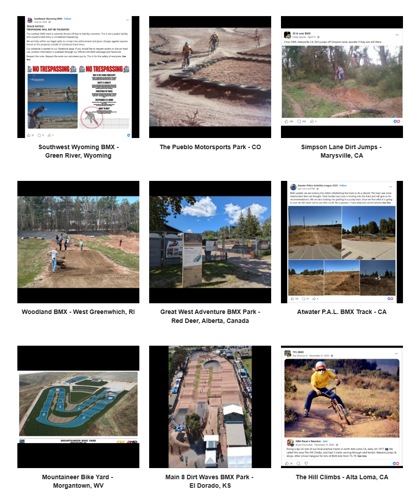

# Track Profiles — Source Page 8

## Published entries

1. Blanchard Woods BMX - Evans, GA
2. Huncote Leisure Centre BMX Track - England, United Kingdom
3. Nanaimo BMX Park - BC, Canada
4. Wakefield BMX - MA
5. Koonawarra BMX track - Victoria, Australia
6. Corvallis BMX Track - OR
7. Southwest Wyoming BMX - Green River, Wyoming
8. The Pueblo Motorsports Park - CO
9. Simpson Lane Dirt Jumps - Marysville, CA
10. Woodland BMX - West Greenwich, RI
11. Great West Adventure BMX Park - Red Deer, Alberta, Canada
12. Atwater P.A.L. BMX Track - CA
13. Mountaineer Bike Yard - Morgantown, WV
14. Main 8 Dirt Waves BMX Park - El Dorado, KS
15. The Hill Climbs - Alta Loma, CA

## Source record

- Source page: [Open Track Profiles page 8](https://sites.google.com/view/lititzbmxinventorylist/learning-resources/profiles/track-profiles/p8-track-profiles)
- Archive status: **source complete**
- Expected layout: 15 visual entries across one Google Sites index page
- Interpretive boundary: names and locations are transcribed only from the supplied page image; this record does not infer track dates, operators, sanctioning bodies, riders or events.

---

[← Page 7](../p07/) · [Track Profiles](../../) · [Page 9 →](../p09/)
