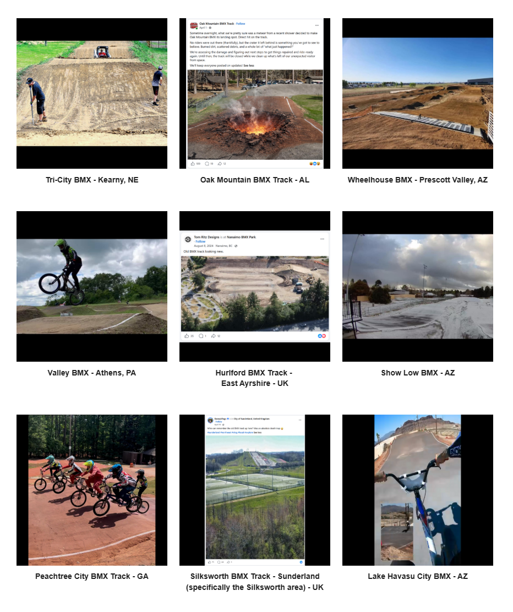

# Track Profiles — Source Page 9

## Published entries

1. Rock City BMX - Rockford, MI
2. “Wetlands BMX Track” - Bolsa Chica Dirt Jumps - Huntington Beach, CA
3. Cleves BMX - OH
4. Okeeheelee BMX - West Palm Beach, FL
5. Bowie BMX Bike Park - TX
6. Columbus BMX - IN
7. Tri-City BMX - Kearny, NE
8. Oak Mountain BMX Track - AL
9. Wheelhouse BMX - Prescott Valley, AZ
10. Valley BMX - Athens, PA
11. Hurlford BMX Track - East Ayrshire - UK
12. Show Low BMX - AZ
13. Peachtree City BMX Track - GA
14. Silksworth BMX Track - Sunderland (specifically the Silksworth area) - UK
15. Lake Havasu City BMX - AZ

## Source record

- Source page: [Open Track Profiles page 9](https://sites.google.com/view/lititzbmxinventorylist/learning-resources/profiles/track-profiles/p9-track-profiles)
- Archive status: **source complete**
- Expected layout: 15 visual entries across one Google Sites index page
- Interpretive boundary: names and locations are transcribed only from the supplied page image; this record does not infer track dates, operators, sanctioning bodies, riders or events.

---

[← Page 8](../p08/) · [Track Profiles](../../) · [Page 10 →](../p10/)
