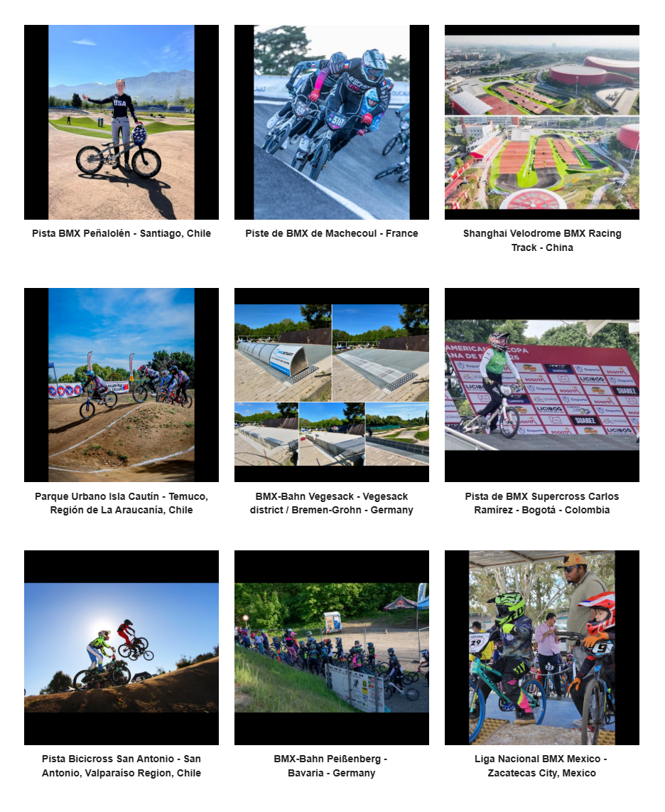

# Track Profiles — Source Page 10

## Published entries

1. BMX Track Sukma - Bukit Siol, Jalan Semariang, Kuching, Sarawak, Malaysia
2. Stadium de BMX La Chapelle Saint Mesmin - France
3. Kawanote Public BMX Track - Arakawa City, Tokyo, Japan
4. Arena BMX Nasional - Nilai, Negeri Sembilan, Malaysia
5. Saint-Quentin-en-Yvelines - Montigny-le-Bretonneux - France
6. MSC (Midoriyama Studio City) BMX Racing Track - Yokohama City, Kanagawa Prefectur, Japan
7. Pista BMX Peñalolén - Santiago, Chile
8. Piste de BMX de Machecoul - France
9. Shanghai Velodrome BMX Racing Track - China
10. Parque Urbano Isla Cautín - Temuco, Región de La Araucanía, Chile
11. BMX-Bahn Vegesack - Vegesack district / Bremen-Grohn - Germany
12. Pista de BMX Supercross Carlos Ramírez - Bogotá - Colombia
13. Pista Bicicross San Antonio - San Antonio, Valparaíso Region, Chile
14. BMX-Bahn Peißenberg - Bavaria - Germany
15. Liga Nacional BMX Mexico - Zacatecas City, Mexico

## Source record

- Source page: [Open Track Profiles page 10](https://sites.google.com/view/lititzbmxinventorylist/learning-resources/profiles/track-profiles/p10-track-profiles)
- Archive status: **source complete**
- Expected layout: 15 visual entries across one Google Sites index page
- Interpretive boundary: names and locations are transcribed only from the supplied page image; this record does not infer track dates, operators, sanctioning bodies, riders or events.

---

[← Page 9](../p09/) · [Track Profiles](../../)
