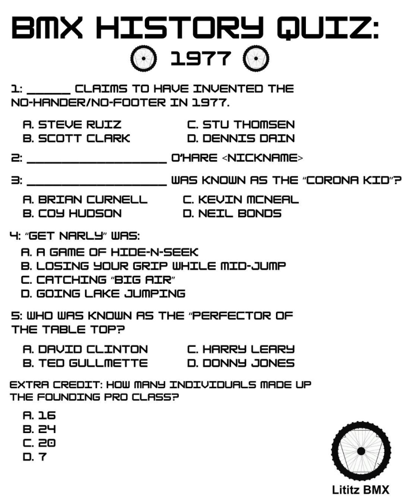

# BMX History Quiz — 1977

**Live resource:** https://sites.google.com/view/lititzbmxinventorylist/learning-resources/quizzes/1977-bmx-history-quiz  
**Archive status:** Source complete / package v1.0  
**Published components:** 5 questions, 1 extra-credit question, 1 two-page supporting article

## Source-supported response map

| Item | Response | Verification |
|---|---|---|
| 1 | Stu Thomsen | Verified |
| 2 | “Dirt Clod” O’Hare | Verified |
| 3 | Kevin McNeal | Verified |
| 4 | A game of hide-n-seek | Verified |
| 5 | Donny Jones | Verified |
| Extra credit | 20 | Verified by counting the founding PRO list |

## Source documents

- [Published quiz transcription](QUIZ-TRANSCRIPTION.md)
- [Supporting article transcription](ARTICLE-TRANSCRIPTION.md)
- [Question ledger — CSV](QUESTION-LEDGER.csv)
- [Live page capture](page-captures/page-001-1977-live-resource.png)
- [Standalone quiz master](source-images/source-001-1977-quiz-master.png)
- [Supporting BMX Action article spread](source-images/source-002-1977-bmx-action-article-spread.png)

## Critical findings

- The supporting source is a retrospective published in BMX Action, December 1986, pages 30–31.
- All five questions and the extra-credit response are supported by the supplied article.
- The literal `<nickname>` placeholder in Question 2 is preserved.
