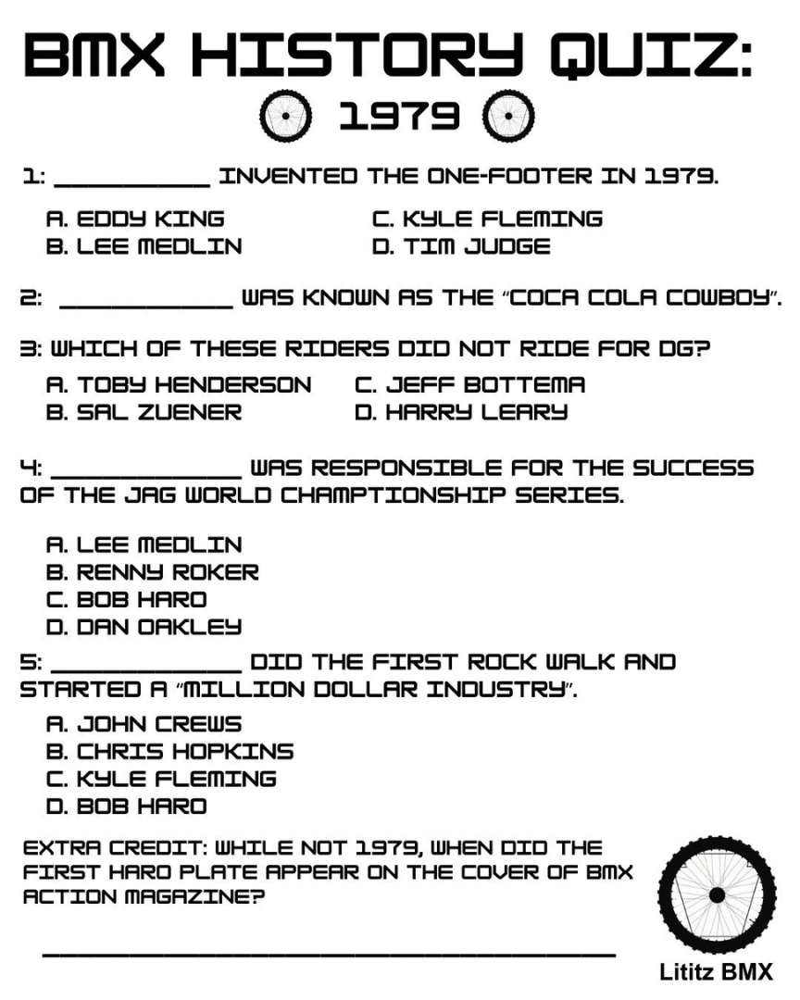
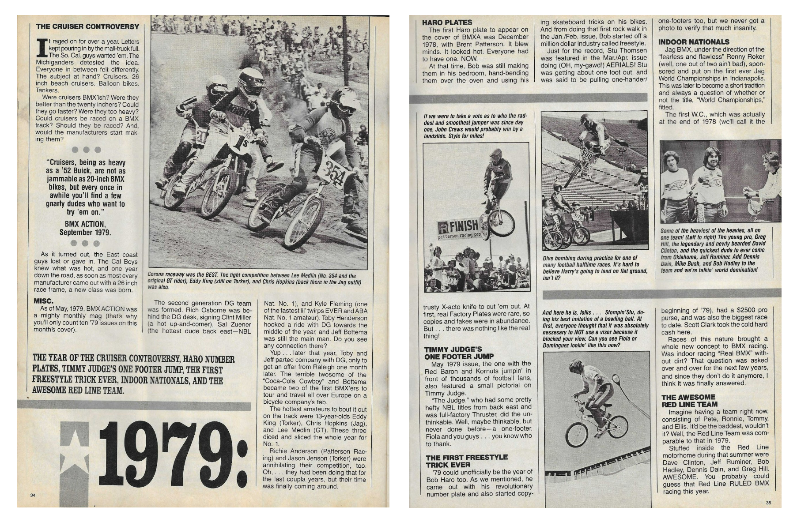

# BMX History Quiz: 1979

## Archived learning resource

**Live learning page:** https://sites.google.com/view/lititzbmxinventorylist/learning-resources/quizzes/1979-bmx-history-quiz  
**Archive package version:** 1.1  
**Prepared:** July 19, 2026  
**Resource type:** Quiz and supporting historical article

This GitHub-ready package preserves the 1979 entry in the Lititz BMX history-quiz learning series under the same locked archival workflow used for the earlier Lititz BMX GitHub preservation projects:

- preserve the published interface and source sequence;
- preserve original wording separately from verified answers and normalized archival notes;
- transcribe the quiz and supporting article;
- verify every answer against the supplied evidence;
- document discrepancies, indirect attributions, and exclusions rather than disguising them;
- map every supplied image to a stable archive filename; and
- record SHA-256 fixity information.

---

## Resource structure

1. Published 1979 quiz
2. Supporting *BMX Action* retrospective article
3. Verified answer key
4. Source transcription and issue documentation
5. Stable source images and full live-page capture
6. Structured archival ledger in Markdown, CSV, and Excel

---

## Published quiz image

---

## Complete published quiz transcription

The complete published quiz is displayed below so visitors can take it directly from this archive page. Wording, spelling, capitalization, punctuation, and answer choices remain as published; documented issues are not silently corrected.

**BMX HISTORY QUIZ:**

**1979**
### 1
**________ INVENTED THE ONE-FOOTER IN 1979.**

- A. EDDY KING
- B. LEE MEDLIN
- C. KYLE FLEMING
- D. TIM JUDGE

### 2
**__________ WAS KNOWN AS THE “COCA COLA COWBOY”.**

### 3
**WHICH OF THESE RIDERS DID NOT RIDE FOR DG?**

- A. TOBY HENDERSON
- B. SAL ZUENER
- C. JEFF BOTTEMA
- D. HARRY LEARY

### 4
**__________ WAS RESPONSIBLE FOR THE SUCCESS OF THE JAG WORLD CHAMPIONSHIP SERIES.**

- A. LEE MEDLIN
- B. RENNY ROKER
- C. BOB HARO
- D. DAN OAKLEY

### 5
**__________ DID THE FIRST ROCK WALK AND STARTED A “MILLION DOLLAR INDUSTRY”.**

- A. JOHN CREWS
- B. CHRIS HOPKINS
- C. KYLE FLEMING
- D. BOB HARO

### Extra Credit
**WHILE NOT 1979, WHEN DID THE FIRST HARO PLATE APPEAR ON THE COVER OF BMX ACTION MAGAZINE?**

---

## Verified answers

<strong>Reveal verified answers</strong>

| Item | Answer |
|---|---|
| 1 | **D. Tim Judge** |
| 2 | **Toby Henderson** |
| 3 | **D. Harry Leary** |
| 4 | **B. Renny Roker** |
| 5 | **D. Bob Haro** |
| Extra credit | **December 1978** |

[Open the complete verified answer key](quiz/1979-verified-answer-key.md)

## Critical verification findings

### Renny Roker was checked against the known series error

Both supplied 1979 sources use **Renny Roker**. The known erroneous form **Renny Rocker** is not present in this entry.

### Question 2 is contextual

The article names Toby Henderson and Jeff Bottema before referring to the pair as “the ‘Coca-Cola Cowboy’ and Bottema.” The answer is supported, but the attribution is contextual rather than written as a standalone identification.

### Question 3 is an exclusion answer

The article identifies Sal Zuener, Toby Henderson, and Jeff Bottema as DG riders. Harry Leary is the remaining option.

### Question 4 uses broader wording

The quiz says **Jag World Championship Series**. The article says Renny Roker directed Jag BMX in staging the first Jag World Championships and describes the event as becoming a short tradition.

### All answers are supported

All five main questions and the extra-credit question are supported by the supplied two-page article spread. No external answer key was invented.

[Open the complete critical verification findings](CRITICAL-VERIFICATION-FINDINGS.md)

---

## Supporting historical source image

The complete supporting-source transcription remains available in **Core documentation** below.

---

## Core documentation

- [Published quiz transcription](quiz/1979-quiz-transcription.md)
- [Verified answer key](quiz/1979-verified-answer-key.md)
- [Supporting article transcription](article/1979-source-article-transcription.md)
- [Source-transcription index](SOURCE-TRANSCRIPTIONS.md)
- [Archival ledger — Markdown](1979-BMX-History-Quiz-Ledger-v1.0.md)
- [Archival ledger — CSV](1979-BMX-History-Quiz-Ledger-v1.0.csv)
- [Archival ledger — Excel](1979-BMX-History-Quiz-Ledger-v1.0.xlsx)
- [Image manifest](IMAGE-MANIFEST.csv)
- [SHA-256 fixity manifest](SHA256SUMS.txt)

---

## Preserved images

- [1979 *BMX Action* retrospective spread](source-images/source-001-1979-bmx-action-spread.png)
- [Standalone 1979 quiz image](source-images/source-002-1979-quiz.png)
- [Full live-page capture](page-captures/page-001-1979-learning-resource.png)

---

## Source inventory

- **1** standalone quiz image
- **1** two-page supporting magazine spread
- **1** full live-page capture
- **5** main quiz questions
- **1** extra-credit question
- **6** verified answers
- **4** prominently documented verification nuances

---

## Preservation note

The Google Site remains the primary public learning experience. This GitHub package serves as the durable documentation, transcription, verification, structured-ledger, source-evidence, and fixity layer.

The supplied magazine image is preserved as a research and educational source record. Copyright and other rights in the original magazine content remain with their respective rights holders.
