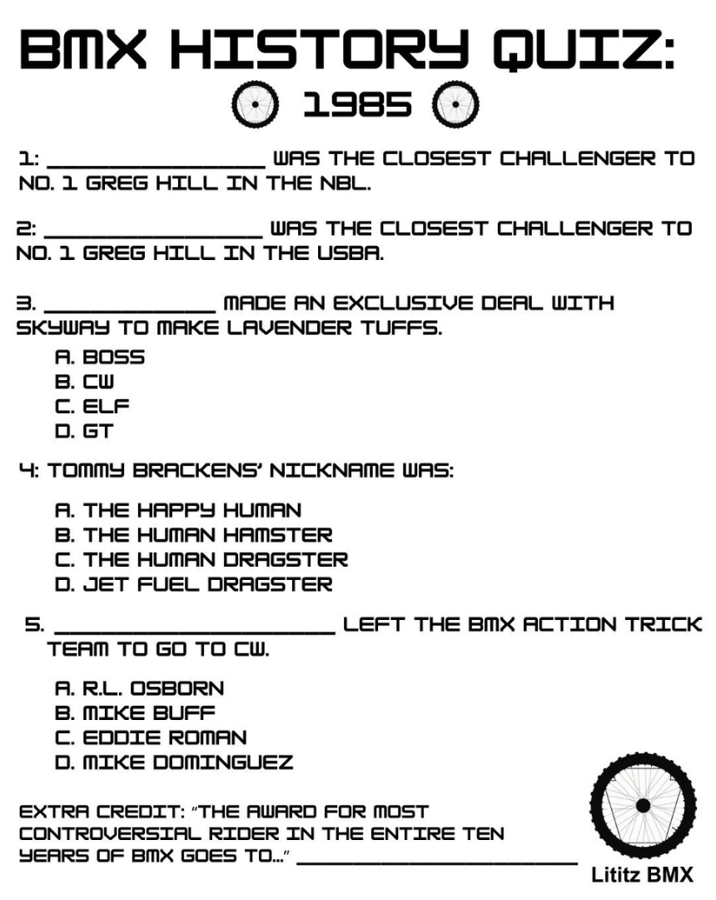

# BMX History Quiz: 1985

## Archived learning resource

**Live learning page:** https://sites.google.com/view/lititzbmxinventorylist/learning-resources/quizzes/1985-bmx-history-quiz  
**Archive package version:** 1.1  
**Prepared:** July 19, 2026  
**Resource type:** Quiz and supporting historical article

This GitHub-ready package preserves the 1985 entry in the Lititz BMX history-quiz learning series under the same locked archival workflow used for the preceding Lititz BMX GitHub preservation projects:

- preserve the published interface and source sequence;
- preserve original wording separately from verified answers and archival findings;
- transcribe the complete visible quiz and supporting article source;
- verify every answer against identified evidence;
- document source limitations rather than silently filling gaps;
- map every supplied image to a stable archive filename; and
- record SHA-256 fixity information.

---

## Resource structure

1. Published 1985 quiz
2. Supporting *BMX Action* retrospective article
3. Verified answer key
4. Critical evidence findings
5. Stable source images and full live-page capture
6. Structured archival ledger in Markdown, CSV, and Excel

---

## Published quiz image

---

## Complete published quiz transcription

The complete published quiz is displayed below so visitors can take it directly from this archive page. Wording, spelling, capitalization, punctuation, and answer choices remain as published; documented issues are not silently corrected.

**BMX HISTORY QUIZ:**

**1985**
### 1
**____________________ WAS THE CLOSEST CHALLENGER TO NO. 1 GREG HILL IN THE NBL.**

### 2
**____________________ WAS THE CLOSEST CHALLENGER TO NO. 1 GREG HILL IN THE USBA.**

### 3
**________________ MADE AN EXCLUSIVE DEAL WITH SKYWAY TO MAKE LAVENDER TUFFS.**

- A. BOSS
- B. CW
- C. ELF
- D. GT

### 4
**TOMMY BRACKENS’ NICKNAME WAS:**

- A. THE HAPPY HUMAN
- B. THE HUMAN HAMSTER
- C. THE HUMAN DRAGSTER
- D. JET FUEL DRAGSTER

### 5
**________________________ LEFT THE BMX ACTION TRICK TEAM TO GO TO CW.**

- A. R.L. OSBORN
- B. MIKE BUFF
- C. EDDIE ROMAN
- D. MIKE DOMINGUEZ

### Extra Credit
**“THE AWARD FOR MOST CONTROVERSIAL RIDER IN THE ENTIRE TEN YEARS OF BMX GOES TO...” __________________________**

---

## Verified answers

<strong>Reveal verified answers</strong>

| Item | Answer | Evidence classification |
|---|---|---|
| 1 | **Pete Loncarevich** | Direct |
| 2 | **Toby Henderson** | Direct |
| 3 | **B. CW** | Direct |
| 4 | **C. The Human Dragster** | Direct |
| 5 | **B. Mike Buff** | Direct |
| Extra credit | **Ronnie Anderson** | Direct |

[Open the complete verified answer key](quiz/1985-verified-answer-key.md)

## Critical verification findings

### All answers directly supported

Every published prompt is answered explicitly by the supplied article. No outside reconstruction or unsupported inference was needed.

### Source ends mid-sentence

The supplied article spread ends a separate paragraph after the words:

> until it got

The missing continuation was not invented or silently supplied.

[Open the complete critical verification findings](CRITICAL-VERIFICATION-FINDINGS.md)

---

## Supporting historical source image

The complete supporting-source transcription remains available in **Core documentation** below.

---

## Core documentation

- [Published quiz transcription](quiz/1985-quiz-transcription.md)
- [Verified answer key](quiz/1985-verified-answer-key.md)
- [Supporting-article transcription](article/1985-source-article-transcription.md)
- [Source-transcription index](SOURCE-TRANSCRIPTIONS.md)
- [Archival ledger — Markdown](1985-BMX-History-Quiz-Ledger-v1.0.md)
- [Archival ledger — CSV](1985-BMX-History-Quiz-Ledger-v1.0.csv)
- [Archival ledger — Excel](1985-BMX-History-Quiz-Ledger-v1.0.xlsx)
- [Image manifest](IMAGE-MANIFEST.csv)
- [SHA-256 fixity manifest](SHA256SUMS.txt)

---

## Preserved images

- [1985 BMX Action retrospective spread](source-images/source-001-1985-bmx-action-spread.png)
- [Standalone 1985 quiz image](source-images/source-002-1985-quiz.png)
- [Full live-page capture](page-captures/page-001-1985-learning-resource.png)

---

## Source inventory

- **1** standalone quiz image
- **1** two-page supporting magazine spread
- **1** full live-page capture
- **5** main quiz questions
- **1** extra-credit question
- **6** answer dispositions
- **6** directly verified answers
- **1** documented source truncation
- **0** unresolved answer exceptions
- **0** guessed answers

---

## Preservation note

The Google Site remains the primary public learning experience. This GitHub package serves as the durable documentation, transcription, verification, structured-ledger, source-evidence, and fixity layer.

The supplied magazine image is preserved as a research and educational source record. Copyright and other rights in the original magazine content remain with their respective rights holders.
