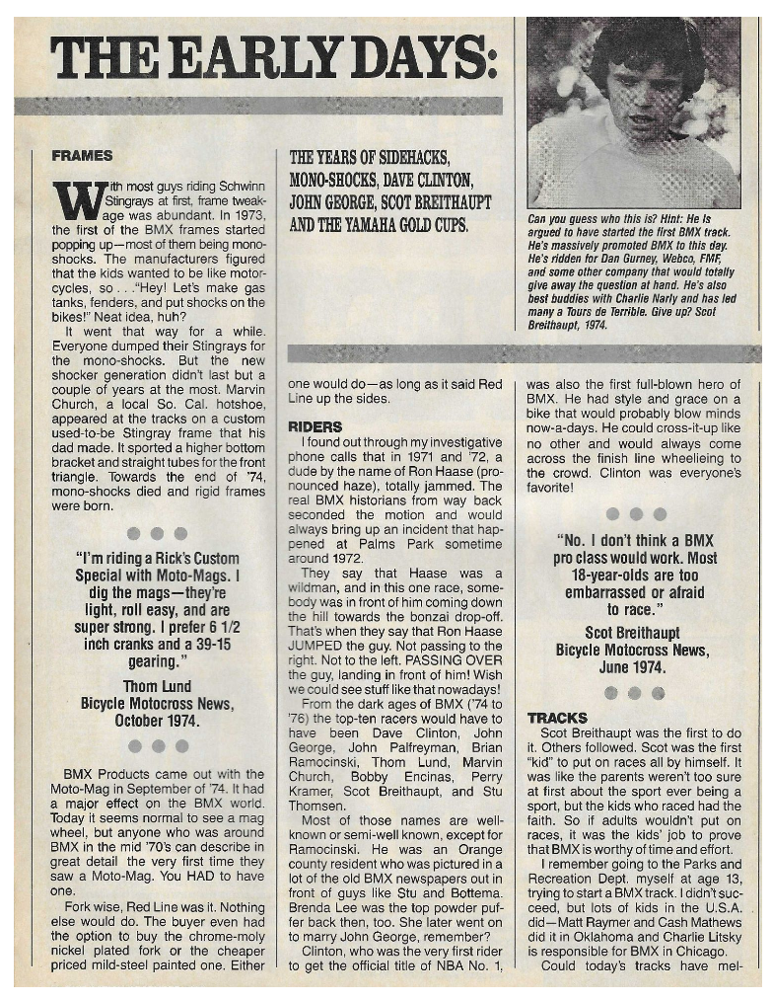

# BMX History Quiz — The Early Days

**Live resource:** https://sites.google.com/view/lititzbmxinventorylist/learning-resources/quizzes/early-days-bmx-history-quiz  
**Archive status:** Source complete / package v1.1  
**Published components:** 5 questions, 1 extra-credit question, 1 supporting article

---

## Resource structure

1. Published quiz image and complete text
2. Collapsed source-supported response map
3. Critical findings and unresolved-answer documentation
4. Supporting historical article image
5. Complete source transcriptions, question ledger, and preserved evidence images

---

## Published quiz image

---

## Complete published quiz transcription

The complete published quiz is displayed below so visitors can take it directly from this archive page. Wording, spelling, capitalization, punctuation, and answer choices remain as published; documented issues are not silently corrected.

1. ______ is credited as the first “kid” to organize races by himself.

   A. Scot Breithaupt  
   B. Byron Friday  
   C. Doug Takahashi  
   D. Jeff Botemma

2. Larry Huffman’s influence in BMX was

   ________________________________________

3. Which of the following was noted by BMX Action as “one of the biggest piles of junk ever made”?

   A. JAD  
   B. BMX Products  
   C. Kastan KEX w/ strut  
   D. Yamaha Dual-Shocker

4. The 1974 Yamaha Gold Cup was held at:

   A. Jack Murphy  
   B. Sunol  
   C. L.A. Coliseum  
   D. Candlestick

5. _________ is when a long surgical tube was stretched infront of the riders. Riders would line their bikes up with their plates infront of the tube. Once released - the race started.

   A. Tube/Strap Start  
   B. Rubber Band Start  
   C. Snap Start  
   D. Snap-Go

### Extra credit

What did Ron Haase do at Palms Park around 1972 (according to some)?

________________________________________

________________________________________

---

## Source-supported answers

<strong>Reveal source-supported answers</strong>

| Item | Response | Verification |
|---|---|---|
| 1 | Scot Breithaupt | Verified from the Tracks section |
| 2 | Unresolved | Larry Huffman is not mentioned in the supplied article |
| 3 | Unresolved | The quoted “pile of junk” wording is not present in the supplied article |
| 4 | Unresolved | The Yamaha Gold Cup location is not stated in the supplied article |
| 5 | Rubber Band Start | Prompt-supported inference; not independently confirmed by the article |
| Extra credit | Ron Haase reportedly jumped/passed over another rider and landed in front | Verified as an attributed story in the Riders section |

---

## Critical findings

- The source article ends mid-sentence and is not reconstructed.
- Three published questions remain unresolved from the supplied source.
- Published spelling and wording are retained exactly where transcribed.

---

## Supporting historical source image

The complete supporting-source transcription remains available in **Core documentation** below.

---

## Core documentation

- [Published quiz transcription](QUIZ-TRANSCRIPTION.md)
- [Supporting article transcription](ARTICLE-TRANSCRIPTION.md)
- [Question ledger — CSV](QUESTION-LEDGER.csv)
- [Live page capture](page-captures/page-001-early-days-live-resource.png)
- [Standalone quiz master](source-images/source-001-early-days-quiz-master.png)
- [Supporting article scan](source-images/source-002-early-days-article-scan.png)
- [Supplied composite](source-images/source-003-early-days-quiz-and-article-composite.png)

---

## Source inventory

- **1** standalone quiz image
- **1** supporting article scan
- **1** full live-page capture
- **1** supplied composite image
- **5** main quiz questions
- **1** extra-credit question
- **3** unresolved main-question records
- **1** prompt-supported inference
- **0** answers invented without evidence

---

## Preservation note

The Google Site remains the primary public learning experience. This GitHub page provides a durable, searchable, accessible presentation of the published quiz while preserving the separate transcription, evidence, and verification records.
