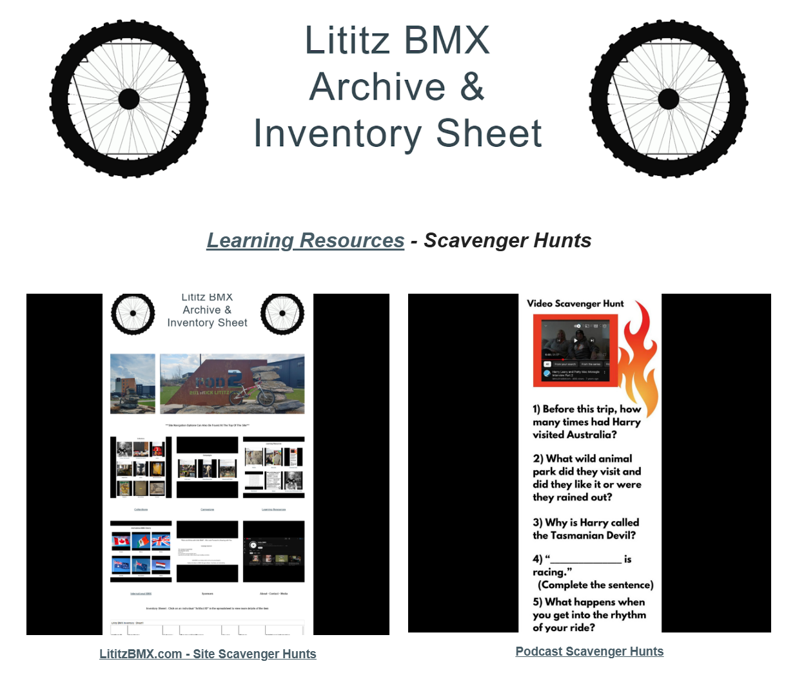

[Learning Resources](../) › **Scavenger Hunts**

# Lititz BMX Scavenger Hunts

**Live category page:** https://sites.google.com/view/lititzbmxinventorylist/learning-resources/scavenger-hunts  
**Archive package version:** 1.0  
**Prepared:** July 22, 2026

Lititz BMX scavenger hunts turn the archive and original media into guided learning experiences. The published category currently leads visitors toward two branches: the LititzBMX.com site-learning laps and podcast scavenger hunts.

[Open the live Scavenger Hunts category on LititzBMX.com](https://sites.google.com/view/lititzbmxinventorylist/learning-resources/scavenger-hunts)

---

## Published category presentation

---

## [LititzBMX.com Learning Laps](site-scavenger-hunts/)

A three-stage site-scavenger-hunt series:

- **First Lap — Explore:** learn how to navigate the archive.
- **Second Lap — Connect:** link riders, artifacts, collections, media, and stories.
- **Third Lap — Interpret:** identify patterns, influences, themes, and historical meaning.

This GitHub archive preserves the original PDFs, worksheet images, full accessible text, live-page captures, source notes, manifests, and checksums for all three laps.

[Open the preserved Learning Laps series](site-scavenger-hunts/) · [Open the active series on LititzBMX.com](https://sites.google.com/view/lititzbmxinventorylist/learning-resources/scavenger-hunts/site-scavenger-hunts)

## Podcast Scavenger Hunts

The podcast-scavenger-hunt branch is included here as part of the published category context, but its individual learning resources are outside the scope of this package.

[Open Podcast Scavenger Hunts on LititzBMX.com](https://sites.google.com/view/lititzbmxinventorylist/learning-resources/scavenger-hunts/podcast-scavenger-hunts)

---

## Scope

This archive contains **two contextual index records** and **three Learning Laps**. The index pages explain the published hierarchy and are not counted as additional laps.

[View the image manifest](IMAGE-MANIFEST.csv) · [View the source manifest](SOURCE-MANIFEST.csv) · [View series checksums](SHA256SUMS.txt)
