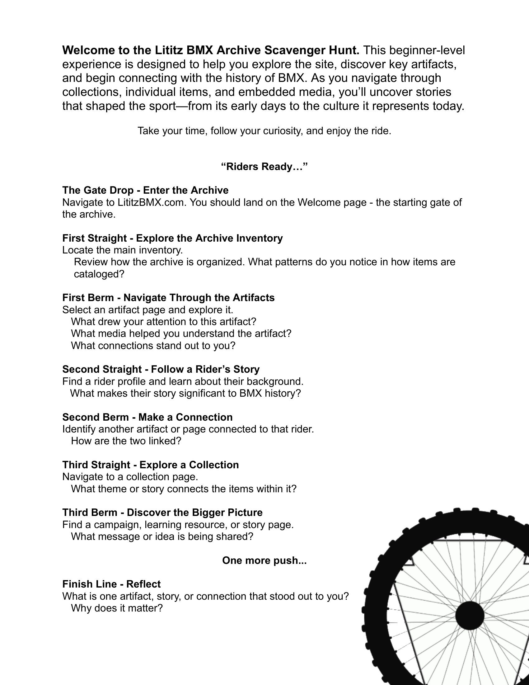
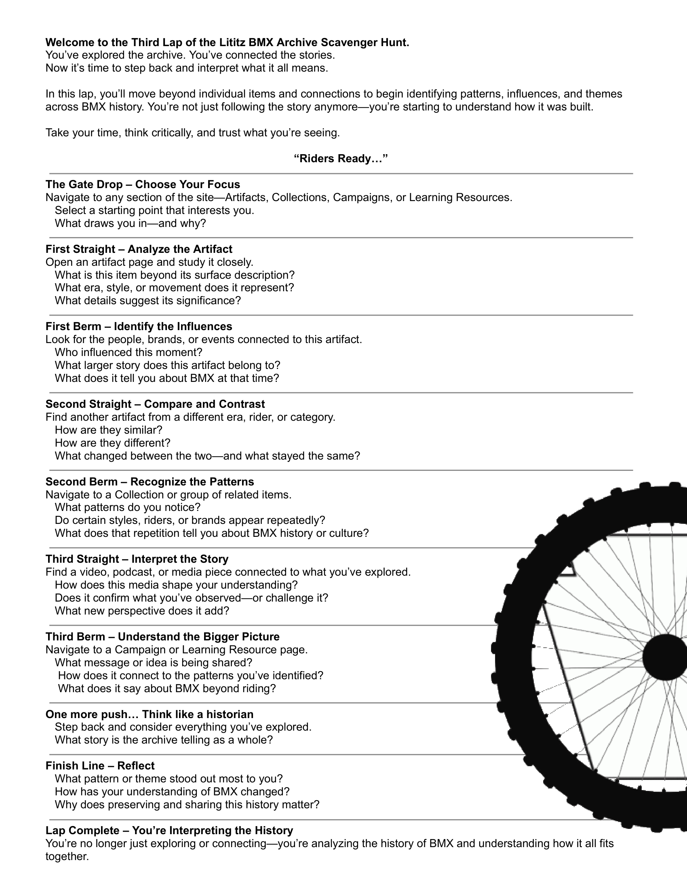

[Learning Resources](../../) › [Scavenger Hunts](../) › **LititzBMX.com Learning Laps**

# LititzBMX.com Learning Laps

**Live series page:** https://sites.google.com/view/lititzbmxinventorylist/learning-resources/scavenger-hunts/site-scavenger-hunts  
**Series type:** Three-stage site scavenger hunt / guided archive-learning sequence  
**Archive package version:** 1.0  
**Prepared:** July 22, 2026

The LititzBMX.com Learning Laps guide visitors through a deliberate progression: first learning to explore the archive, then connecting its people and objects, and finally interpreting the larger historical patterns those records reveal.

[Open the active Learning Laps series on LititzBMX.com](https://sites.google.com/view/lititzbmxinventorylist/learning-resources/scavenger-hunts/site-scavenger-hunts)

---

## Published series presentation

---

## Learning progression

| Lap | Level | Primary focus |
|---|---|---|
| [First Lap](first-lap/) | Beginner | Explore and navigate the archive |
| [Second Lap](second-lap/) | Intermediate | Connect riders, artifacts, collections, media, and stories |
| [Third Lap](third-lap/) | Advanced | Analyze patterns, influences, themes, and historical meaning |

---

## [First Lap — Explore the Lititz BMX Archive](first-lap/)

A beginner experience to help you navigate and explore the Lititz BMX Archive.

[Open the preserved First Lap](first-lap/) · [Open the active First Lap](https://sites.google.com/view/lititzbmxinventorylist/learning-resources/scavenger-hunts/site-scavenger-hunts/1st-lap-site-scavenger-hunts)

---

## [Second Lap — Connecting the Story](second-lap/)

An intermediate experience focused on connecting riders, artifacts, and BMX history.

[Open the preserved Second Lap](second-lap/) · [Open the active Second Lap](https://sites.google.com/view/lititzbmxinventorylist/learning-resources/scavenger-hunts/site-scavenger-hunts/2nd-lap-site-scavenger-hunts)

---

## [Third Lap — Interpreting the History](third-lap/)

An advanced experience focused on connecting riders, artifacts, and BMX history.

[Open the preserved Third Lap](third-lap/) · [Open the active Third Lap](https://sites.google.com/view/lititzbmxinventorylist/learning-resources/scavenger-hunts/site-scavenger-hunts/3rd-lap-site-scavenger-hunts)

---

## Accessibility and preservation

Every lap includes:

- the original source PDF;
- a clean archival worksheet render;
- the supplied live Google Sites page capture;
- the complete worksheet wording as readable Markdown;
- a standalone UTF-8 plain-text file;
- source and version notes;
- previous/index/next navigation; and
- SHA-256 fixity information.

The active Google Sites pages remain the primary public learning experiences. This repository preserves the durable public record and accessible text layers.

[View the Learning Laps ledger](LEARNING-LAPS-LEDGER.md) · [Download the CSV ledger](LEARNING-LAPS-LEDGER.csv) · [Return to Scavenger Hunts](../)
