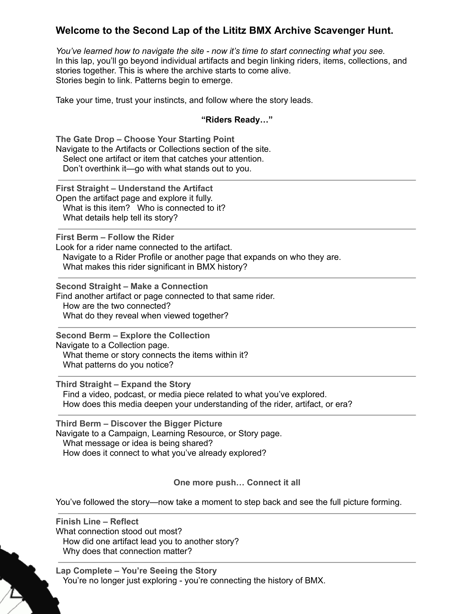

[Learning Resources](../../../) › [Scavenger Hunts](../../) › [LititzBMX.com Learning Laps](../) › **Second Lap**

# Second Lap — Connecting the Story

**Live learning page:** https://sites.google.com/view/lititzbmxinventorylist/learning-resources/scavenger-hunts/site-scavenger-hunts/2nd-lap-site-scavenger-hunts  
**Resource level:** Intermediate  
**Resource type:** Site scavenger hunt / guided archive-learning experience  
**Archive package version:** 1.0  
**Prepared:** July 22, 2026

An intermediate experience focused on connecting riders, artifacts, and BMX history.

[Open the active Second Lap experience on LititzBMX.com](https://sites.google.com/view/lititzbmxinventorylist/learning-resources/scavenger-hunts/site-scavenger-hunts/2nd-lap-site-scavenger-hunts)

---

## Published worksheet

[Open the original PDF](source/Lititz-BMX-Second-Lap-Scavenger-Hunt.pdf) · [Open the worksheet image](source-images/source-001-second-lap-published-worksheet.png) · [View the supplied live-page capture](page-captures/page-001-second-lap-live-resource.png)

> **Accessible text:** The worksheet image is preserved above as published. The same wording appears below as readable, selectable text and is also available as a standalone plain-text file.

[Open the standalone plain-text version](text/second-lap-plain-text.txt)

---

## Accessible text version

**Welcome to the Second Lap of the Lititz BMX Archive Scavenger Hunt.**

You’ve learned how to navigate the site - now it’s time to start connecting what you see.

In this lap, you’ll go beyond individual artifacts and begin linking riders, items, collections, and stories together. This is where the archive starts to come alive.

Stories begin to link. Patterns begin to emerge.

Take your time, trust your instincts, and follow where the story leads.

> **“Riders Ready…”**

### The Gate Drop – Choose Your Starting Point

Navigate to the Artifacts or Collections section of the site.

Select one artifact or item that catches your attention.

Don’t overthink it—go with what stands out to you.

### First Straight – Understand the Artifact

Open the artifact page and explore it fully.

What is this item? Who is connected to it?

What details help tell its story?

### First Berm – Follow the Rider

Look for a rider name connected to the artifact.

Navigate to a Rider Profile or another page that expands on who they are.

What makes this rider significant in BMX history?

### Second Straight – Make a Connection

Find another artifact or page connected to that same rider.

How are the two connected?

What do they reveal when viewed together?

### Second Berm – Explore the Collection

Navigate to a Collection page.

What theme or story connects the items within it?

What patterns do you notice?

### Third Straight – Expand the Story

Find a video, podcast, or media piece related to what you’ve explored.

How does this media deepen your understanding of the rider, artifact, or era?

### Third Berm – Discover the Bigger Picture

Navigate to a Campaign, Learning Resource, or Story page.

What message or idea is being shared?

How does it connect to what you’ve already explored?

### One more push… Connect it all

You’ve followed the story—now take a moment to step back and see the full picture forming.

### Finish Line – Reflect

What connection stood out most?

How did one artifact lead you to another story?

Why does that connection matter?

### Lap Complete – You’re Seeing the Story

You’re no longer just exploring - you’re connecting the history of BMX.

---

## Source and preservation notes

- The original one-page PDF is preserved unchanged in `source/`.
- The displayed worksheet image is a 200-DPI archival render generated from the original PDF.
- The supplied Google Sites page capture is preserved separately in `page-captures/`.
- The complete worksheet wording is reproduced in this README and in a standalone UTF-8 plain-text file.
- The live page adds the public-facing title “Connecting the Story” and the intermediate experience description. The original PDF controls the worksheet wording and visual design.
- Interface artifacts visible only in supplied screenshots, including cursor, caret, or reaction-overlay elements, are preserved in the page capture but are not treated as worksheet content.
- The active Google Sites page remains the public learning experience; this GitHub record preserves the durable source, accessible text, and publication context.

## Fixity

[View SHA-256 checksums for this lap](SHA256SUMS.txt)

---

[← First Lap](../first-lap/) | [Learning Laps Index](../) | [Third Lap →](../third-lap/)
