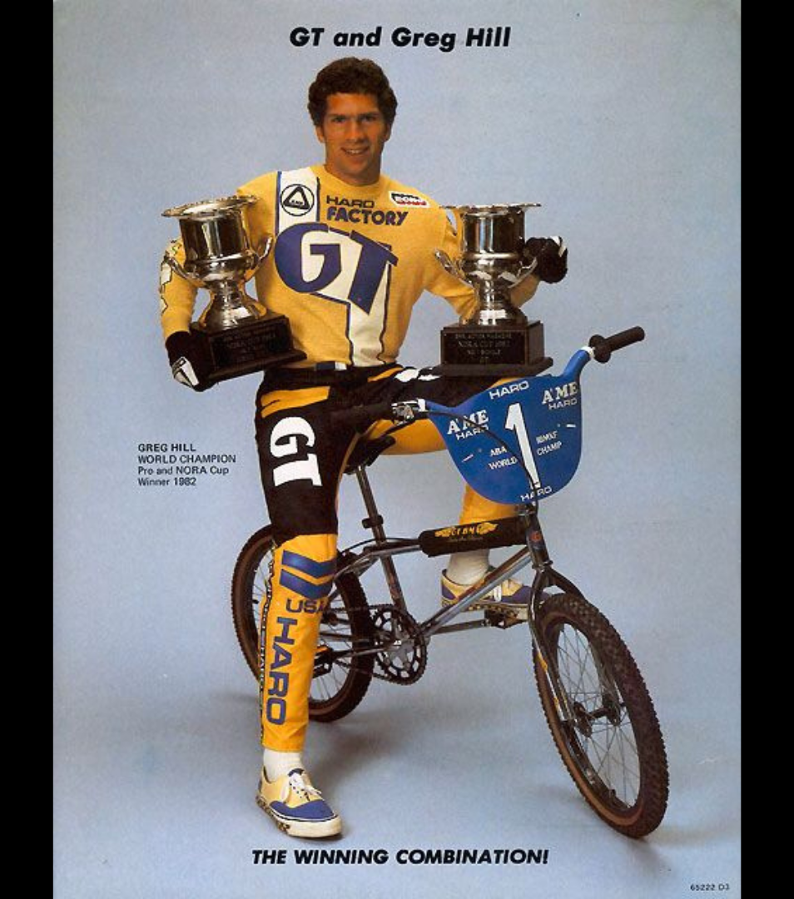
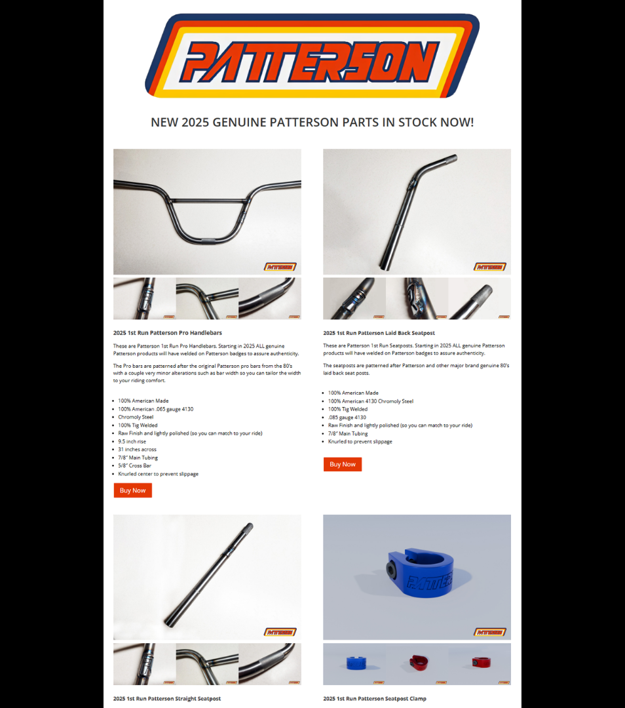

# Interactive BMX Word Search

## Click a term. Learn the history behind it.

**Live interactive resource:** [Open the Lititz BMX Interactive BMX Word Search](https://sites.google.com/view/lititzbmxinventorylist/learning-resources/word-search)  
**Archive package version:** 1.0  
**Archive display version:** 1.1  
**Prepared:** July 19, 2026  
**Visual display upgrade:** July 20, 2026

The Lititz BMX Interactive BMX Word Search connects a published 20 × 20 puzzle to rider, award, manufacturer, and intentionally creative learning pages. This GitHub archive preserves both sides of that experience: the puzzle itself and the historical or interpretive destination attached to each term.

The visual-display layer follows the archival standard established through the BMX History Quiz Series, **#RebuildRadicalRick**, and **#OperationDIRTWERX**:

- show the preserved images directly on the archive pages;
- keep original wording separate from normalized archival summaries;
- display full public-page captures beside the documented text;
- preserve discrepancies and known exceptions without silently correcting them; and
- retain stable manifests, source transcriptions, structured ledgers, and fixity records.

---

## Resource structure

1. Published master puzzle and verified coordinate map
2. Visual directory of all 17 official terms
3. Sixteen complete destination-page archive records
4. One documented known exception: CUP
5. Sixteen standalone source images and sixteen full page captures
6. Structured ledgers, source transcriptions, image manifest, and SHA-256 fixity records

---

## Published puzzle

[Open the complete puzzle verification and coordinate map](puzzle/PUZZLE-VERIFICATION.md)

---

## Explore the 17 published terms

Each image opens the complete archive record for that term, including the preserved page wording, source image, puzzle location, full public-page capture, and verification notes.

<table>
<tr>
<td align="center" width="33%"> <a href="profiles/01-nora.md"><strong>1. NORA</strong></a> <small>BMX NORA Cup Award – BMX Action Reader Poll Trophy</small></td>
<td align="center" width="33%"> <a href="profiles/02-encinas.md"><strong>2. Encinas</strong></a> <small>Bobby Encinas – BMX Pioneer, Promoter & Cultural Ambassador</small></td>
<td align="center" width="33%"> <a href="profiles/03-thomsen.md"><strong>3. Thomsen</strong></a> <small>Stu Thomsen – “The Man” & Early BMX Dominator</small></td>
</tr>
<tr>
<td align="center" width="33%"> <a href="profiles/04-patterson.md"><strong>4. Patterson</strong></a> <small>Patterson BMX – Race Heritage & Modern Revival</small></td>
<td align="center" width="33%"> <a href="profiles/05-hill.md"><strong>5. Hill</strong></a> <small>Greg Hill – BMX Racing Icon & NORA Cup Champion</small></td>
<td align="center" width="33%"> <a href="profiles/06-miranda.md"><strong>6. Miranda</strong></a> <small>The Brothers Who Rode Beyond BMX</small></td>
</tr>
<tr>
<td align="center" width="33%"> <a href="profiles/07-brackens.md"><strong>7. Brackens</strong></a> <small>Tommy Brackens – “The Human Dragster”</small></td>
<td align="center" width="33%"> <a href="profiles/08-loncarevich.md"><strong>8. Loncarevich</strong></a> <small>Pete “Pistol Pete” Loncarevich – BMX Champion & Industry Innovator</small></td>
<td align="center" width="33%"> <a href="profiles/09-ellis.md"><strong>9. Ellis</strong></a> <small>Gary Ellis – BMX Champion & GT Racing Mainstay</small></td>
</tr>
<tr>
<td align="center" width="33%"><a href="profiles/10-cup-known-exception.md"><strong>10. CUP</strong></a> <em>Known published exception</em> Listed in the puzzle, absent from the supplied grid, and preserved without invented evidence.</td>
<td align="center" width="33%"> <a href="profiles/11-gt.md"><strong>11. GT</strong></a> <small>GT Bicycles – Pioneers of Performance BMX Engineering</small></td>
<td align="center" width="33%"> <a href="profiles/12-redline.md"><strong>12. Redline</strong></a> <small>Redline BMX – Innovation, Craftsmanship, and Legacy</small></td>
</tr>
<tr>
<td align="center" width="33%"> <a href="profiles/13-diamondback.md"><strong>13. Diamondback</strong></a> <small>Diamondback – Southern California BMX Innovation & Racing Legacy</small></td>
<td align="center" width="33%"> <a href="profiles/14-mongoose.md"><strong>14. Mongoose</strong></a> <small>Mongoose – From MotoMag Innovation to BMX Icon</small></td>
<td align="center" width="33%"> <a href="profiles/15-robinson.md"><strong>15. Robinson</strong></a> <small>Robinson Racing – Garage-Built Roots & GT-Era Evolution</small></td>
</tr>
<tr>
<td align="center" width="33%"> <a href="profiles/16-hutch.md"><strong>16. Hutch</strong></a> <small>Hutch BMX – From Local Shop to Freestyle & Racing Icon</small></td>
<td align="center" width="33%"> <a href="profiles/17-shimano.md"><strong>17. Shimano</strong></a> <small>Shimano – Precision Engineering & Global Cycling Innovation</small></td>
</tr>
</table>

---

## Puzzle verification summary

| Classification | Terms |
|---|---|
| One verified grid occurrence | Encinas, Thomsen, Patterson, Hill, Miranda, Brackens, Loncarevich, Ellis, Redline, Diamondback, Mongoose, Robinson, Hutch, Shimano |
| Multiple verified occurrences | NORA (2), GT (5) |
| Published but not located | CUP |

No intended NORA or GT occurrence is selected without an official answer key. CUP remains in its official list position and is documented as a known exception rather than removed or inserted into the grid.

---

## Core documentation

- [Learning-resource ledger — Markdown](Interactive-Word-Search-Learning-Resource-Ledger-v1.0.md)
- [Learning-resource ledger — CSV](Interactive-Word-Search-Learning-Resource-Ledger-v1.0.csv)
- [Learning-resource ledger — Excel](Interactive-Word-Search-Learning-Resource-Ledger-v1.0.xlsx)
- [Combined source transcriptions](SOURCE-TRANSCRIPTIONS.md)
- [Puzzle verification](puzzle/PUZZLE-VERIFICATION.md)
- [Puzzle answer map — CSV](puzzle/PUZZLE-ANSWER-MAP.csv)
- [Image manifest](IMAGE-MANIFEST.csv)
- [SHA-256 fixity manifest](SHA256SUMS.txt)

---

## Source inventory

- **1** master puzzle image
- **17** published terms
- **16** supplied destination pages
- **16** profile-page captures visibly embedded in their archive records
- **16** standalone source images visibly embedded in their archive records
- **14** terms with one verified grid location
- **2** terms with multiple verified grid locations
- **1** documented known exception: CUP
- **0** missing materials reconstructed through assumption

---

## Critical verification findings

- `CUP` is published in the official answer list but is not present in the supplied grid.
- `NORA` appears twice and `GT` appears five times.
- No intended occurrence is selected for NORA or GT without an official answer key.
- The Miranda entry is intentionally fictional alternate history and is labeled accordingly on its archive page.
- The live Diamondback page uses the working slug `diamonback-word-search`; that exact URL remains preserved.
- CUP has no unique destination page, page capture, or standalone source image; the absence remains visible rather than being filled with invented material.

---

## Preservation note

The Google Site remains the primary interactive learning experience. This GitHub archive now provides a durable visual exhibit as well as the transcription, verification, structured-ledger, source-evidence, discrepancy, and fixity layer.

The public profile text, full-page captures, associated source images, puzzle geometry, and documented exceptions remain distinct records so future corrections or research findings can be added without erasing the original published state.

[Return to Lititz BMX Learning Resources](../README.md)
