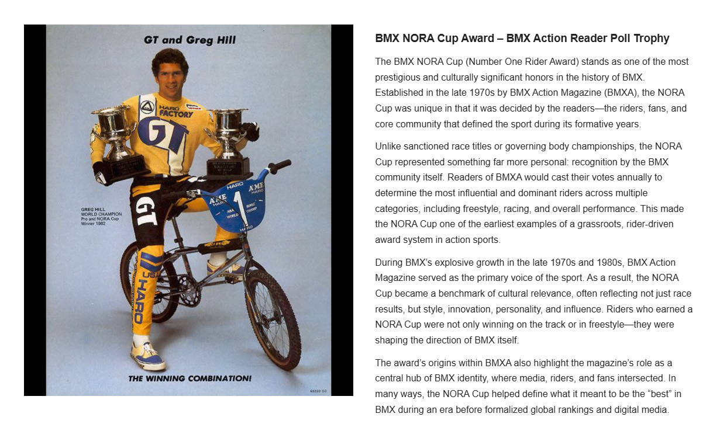

[Word Search overview](../README.md) | [Learning Resources](../../README.md) | [Encinas →](./02-encinas.md)

# 01 — NORA

## BMX NORA Cup Award – BMX Action Reader Poll Trophy

## Record identification

**Official list position:** 1  
**Category:** Award / concept  
**Content classification:** Factual educational profile  
**Grid status:** Multiple matches (2)  
**Live learning page:** [Open live learning page](https://sites.google.com/view/lititzbmxinventorylist/learning-resources/word-search/nora-word-search)  
**Archive package version:** 1.0  
**Archive display version:** 1.1

---

## Resource structure

1. Original published learning-page text
2. Associated standalone source image
3. Normalized archival summary and puzzle verification
4. Preserved full public learning-page capture
5. Source documentation and verification notes

---

## Original page text

```text
The BMX NORA Cup (Number One Rider Award) stands as one of the most prestigious and culturally significant honors in the history of BMX. Established in the late 1970s by BMX Action Magazine (BMXA), the NORA Cup was unique in that it was decided by the readers—the riders, fans, and core community that defined the sport during its formative years.

Unlike sanctioned race titles or governing body championships, the NORA Cup represented something far more personal: recognition by the BMX community itself. Readers of BMXA would cast their votes annually to determine the most influential and dominant riders across multiple categories, including freestyle, racing, and overall performance. This made the NORA Cup one of the earliest examples of a grassroots, rider-driven award system in action sports.

During BMX’s explosive growth in the late 1970s and 1980s, BMX Action Magazine served as the primary voice of the sport. As a result, the NORA Cup became a benchmark of cultural relevance, often reflecting not just race results, but style, innovation, personality, and influence. Riders who earned a NORA Cup were not only winning on the track or in freestyle—they were shaping the direction of BMX itself.

The award’s origins within BMXA also highlight the magazine’s role as a central hub of BMX identity, where media, riders, and fans intersected. In many ways, the NORA Cup helped define what it meant to be the “best” in BMX during an era before formalized global rankings and digital media.
```

---

## Associated source image


Greg Hill stands with a GT BMX bicycle while holding two trophy cups in a vintage promotional image.

---

## Normalized archival summary

The entry explains the NORA Cup as a reader-selected BMX Action Magazine award that recognized competitive achievement, cultural influence, style, innovation, and community standing during BMX’s formative decades.

---

## Puzzle verification

- **Verified match count:** 2
- `R7C14-R4C14 (up)`
- `R9C12-R9C15 (right)`

---

## Critical verification findings

- The published grid contains NORA twice. No intended occurrence is selected without an official answer key. The separate published term CUP is retained as a known exception and is likely conceptually associated with NORA Cup.
- Visible text includes “GT and Greg Hill,” “GREG HILL WORLD CHAMPION Pro and NORA Cup Winner 1982,” and “THE WINNING COMBINATION!”
- Historical claims are preserved as statements made by the supplied learning-resource page unless separately verified in a future research audit.

---

[Back to resource index](../README.md) | [Encinas →](./02-encinas.md)

---

## Preserved public learning-page capture



This full-page capture preserves the public presentation, image placement, headings, and surrounding learning context as supplied for the archive.

---

## Core documentation

- [Profile page capture](../page-captures/page-001-nora-profile.png)
- [Standalone source image](../source-images/source-001-nora-greg-hill-trophies.png)
- [Source transcription](../SOURCE-TRANSCRIPTIONS.md#source-001-nora)
- [Word Search archive overview](../README.md)
- [Puzzle verification and coordinate map](../puzzle/PUZZLE-VERIFICATION.md)
- [Image manifest](../IMAGE-MANIFEST.csv)
- [SHA-256 fixity manifest](../SHA256SUMS.txt)

---

## Preservation note

The Google Site remains the primary public learning experience. This GitHub page provides a durable, searchable, accessible presentation of the published profile while preserving its associated image, full-page capture, puzzle evidence, transcription, and verification record.

---

[Word Search overview](../README.md) | [Learning Resources](../../README.md) | [Encinas →](./02-encinas.md)
