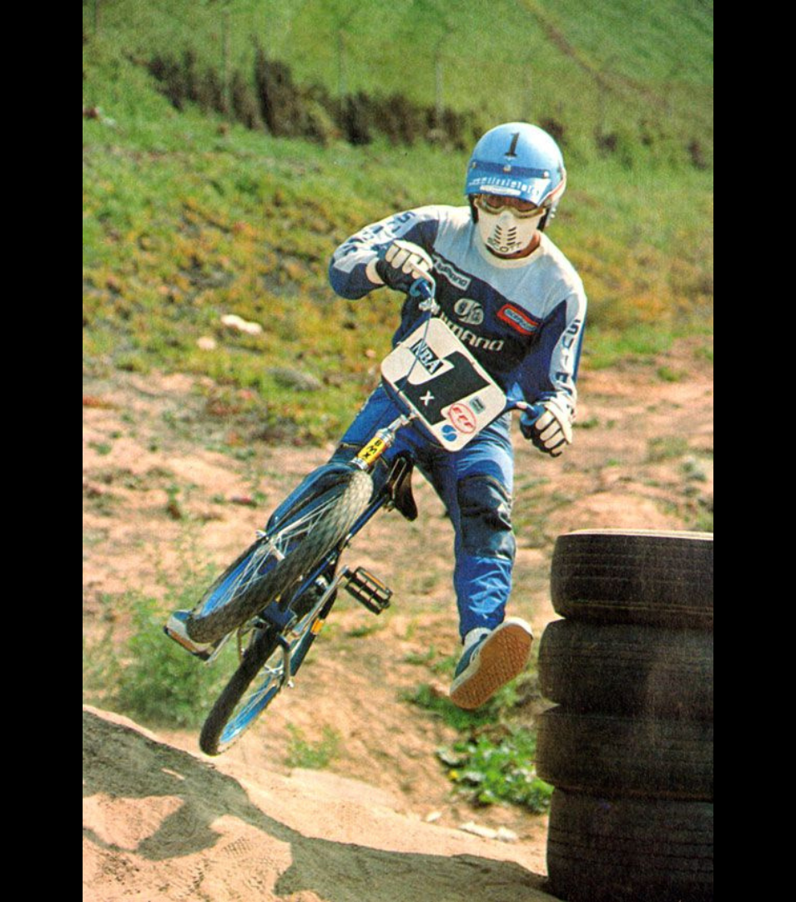

[← NORA](./01-nora.md) | [Back to resource index](../README.md) | [Thomsen →](./03-thomsen.md)

# 02 — Encinas

## Bobby Encinas – BMX Pioneer, Promoter & Cultural Ambassador

**Official list position:** 2  
**Category:** Rider  
**Content classification:** Factual rider profile  
**Grid status:** Verified unique  
**Live learning page:** https://sites.google.com/view/lititzbmxinventorylist/learning-resources/word-search/encinas-word-search  

## Original page text

```text
Bobby Encinas is recognized as one of the earliest superstars of BMX and a pioneering force in the sport’s development both on and off the track. Beginning his racing career in 1973 at age 12 in Southern California, Encinas was part of the original generation of riders who transitioned from mimicking motocross to formal BMX competition. He achieved early success, including winning the first-ever Sidehack class at the 1975 NBA Winter Nationals, and became one of the first sponsored riders and team captains for Shimano. His career also included district titles and competitive success in both 20” and cruiser classes, helping establish the foundation of early BMX racing.

Beyond competition, Encinas’ greatest impact came through his role as a promoter and mentor. Having overcome a troubled youth, he credited BMX with changing his life and dedicated himself to growing the sport at the grassroots level. As a pioneer of BMX teaching clinics and a national ambassador through touring programs and his work with Actionline, Encinas helped introduce countless young riders to BMX and shape future generations. Inducted into the ABA BMX Hall of Fame in 1987, his legacy reflects not only competitive achievement but a lasting commitment to the culture, accessibility, and positive influence of BMX.
```

## Associated source image



A BMX racer in blue-and-gray gear is airborne beside stacked tires on an outdoor dirt course.

## Normalized archival summary

The entry presents Bobby Encinas as an early BMX racer, sponsored rider, team captain, promoter, mentor, clinic pioneer, and grassroots ambassador.

## Puzzle verification

- **Verified match count:** 1
- `R2C16-R8C16 (down)`

## Source evidence

- [Profile page capture](../page-captures/page-002-encinas-profile.png)
- [Standalone source image](../source-images/source-002-bobby-encinas-racing.png)
- [Source transcription](../SOURCE-TRANSCRIPTIONS.md#source-002-encinas)

## Verification notes

- No special exception identified in the supplied source set.
- No additional source-image text is transcribed.
- Historical claims are preserved as statements made by the supplied learning-resource page unless separately verified in a future research audit.

---

[← NORA](./01-nora.md) | [Back to resource index](../README.md) | [Thomsen →](./03-thomsen.md)
