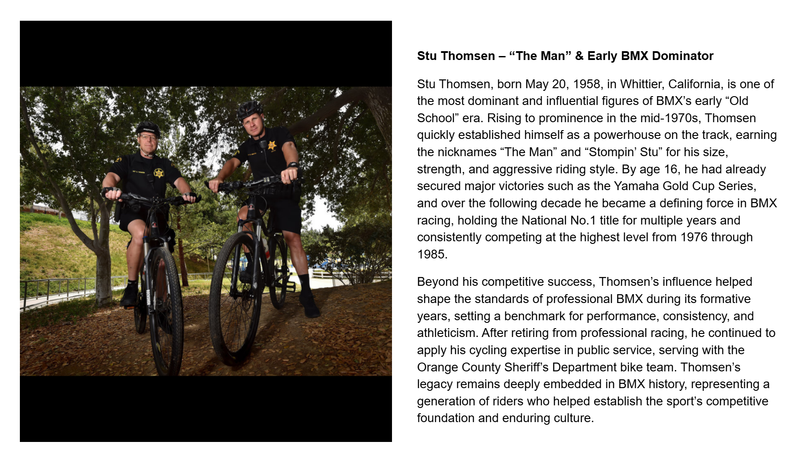

[← Encinas](./02-encinas.md) | [Word Search overview](../README.md) | [Learning Resources](../../README.md) | [Patterson →](./04-patterson.md)

# 03 — Thomsen

## Stu Thomsen – “The Man” & Early BMX Dominator

## Record identification

**Official list position:** 3  
**Category:** Rider  
**Content classification:** Factual rider profile  
**Grid status:** Verified unique  
**Live learning page:** [Open live learning page](https://sites.google.com/view/lititzbmxinventorylist/learning-resources/word-search/thomsen-word-search)  
**Archive package version:** 1.0  
**Archive display version:** 1.1

---

## Resource structure

1. Original published learning-page text
2. Associated standalone source image
3. Normalized archival summary and puzzle verification
4. Preserved full public learning-page capture
5. Source documentation and verification notes

---

## Original page text

```text
Stu Thomsen, born May 20, 1958, in Whittier, California, is one of the most dominant and influential figures of BMX’s early “Old School” era. Rising to prominence in the mid-1970s, Thomsen quickly established himself as a powerhouse on the track, earning the nicknames “The Man” and “Stompin’ Stu” for his size, strength, and aggressive riding style. By age 16, he had already secured major victories such as the Yamaha Gold Cup Series, and over the following decade he became a defining force in BMX racing, holding the National No.1 title for multiple years and consistently competing at the highest level from 1976 through 1985.

Beyond his competitive success, Thomsen’s influence helped shape the standards of professional BMX during its formative years, setting a benchmark for performance, consistency, and athleticism. After retiring from professional racing, he continued to apply his cycling expertise in public service, serving with the Orange County Sheriff’s Department bike team. Thomsen’s legacy remains deeply embedded in BMX history, representing a generation of riders who helped establish the sport’s competitive foundation and enduring culture.
```

---

## Associated source image


Two uniformed bicycle officers pose with mountain bikes beneath trees on an outdoor trail.

---

## Normalized archival summary

The entry presents Stu Thomsen as a foundational professional racer whose size, strength, consistency, and long competitive career helped establish standards for elite early BMX racing, followed by bicycle-based public service.

---

## Puzzle verification

- **Verified match count:** 1
- `R10C16-R16C16 (down)`

---

## Critical verification findings

- The image supports the page’s later public-service discussion. The archive does not identify individuals from appearance alone.
- No additional source-image text is transcribed.
- Historical claims are preserved as statements made by the supplied learning-resource page unless separately verified in a future research audit.

---

[← Encinas](./02-encinas.md) | [Back to resource index](../README.md) | [Patterson →](./04-patterson.md)

---

## Preserved public learning-page capture



This full-page capture preserves the public presentation, image placement, headings, and surrounding learning context as supplied for the archive.

---

## Core documentation

- [Profile page capture](../page-captures/page-003-thomsen-profile.png)
- [Standalone source image](../source-images/source-003-stu-thomsen-bike-team.png)
- [Source transcription](../SOURCE-TRANSCRIPTIONS.md#source-003-thomsen)
- [Word Search archive overview](../README.md)
- [Puzzle verification and coordinate map](../puzzle/PUZZLE-VERIFICATION.md)
- [Image manifest](../IMAGE-MANIFEST.csv)
- [SHA-256 fixity manifest](../SHA256SUMS.txt)

---

## Preservation note

The Google Site remains the primary public learning experience. This GitHub page provides a durable, searchable, accessible presentation of the published profile while preserving its associated image, full-page capture, puzzle evidence, transcription, and verification record.

---

[← Encinas](./02-encinas.md) | [Word Search overview](../README.md) | [Learning Resources](../../README.md) | [Patterson →](./04-patterson.md)
