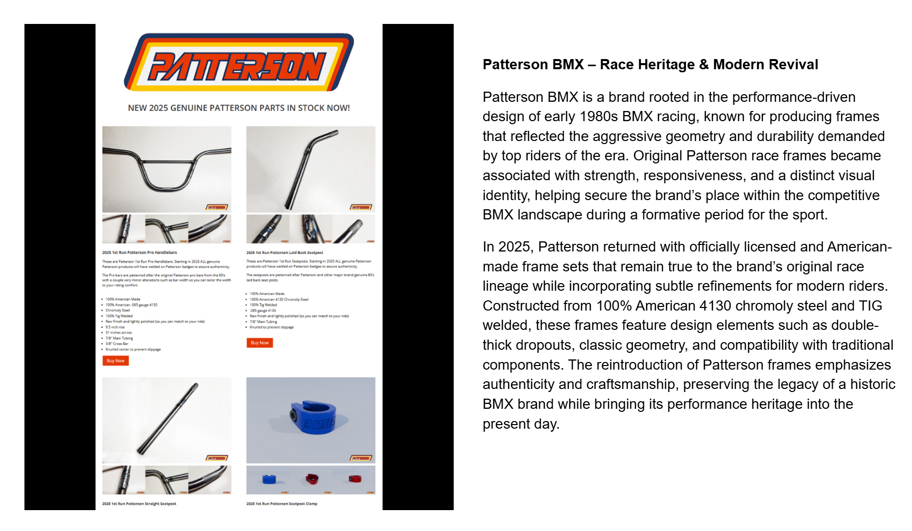

[← Thomsen](./03-thomsen.md) | [Word Search overview](../README.md) | [Learning Resources](../../README.md) | [Hill →](./05-hill.md)

# 04 — Patterson

## Patterson BMX – Race Heritage & Modern Revival

## Record identification

**Official list position:** 4  
**Category:** Brand / manufacturer  
**Content classification:** Factual brand profile  
**Grid status:** Verified unique  
**Live learning page:** [Open live learning page](https://sites.google.com/view/lititzbmxinventorylist/learning-resources/word-search/patterson-word-search)  
**Archive package version:** 1.0  
**Archive display version:** 1.1

---

## Resource structure

1. Original published learning-page text
2. Associated standalone source image
3. Normalized archival summary and puzzle verification
4. Preserved full public learning-page capture
5. Source documentation and verification notes

---

## Original page text

```text
Patterson BMX is a brand rooted in the performance-driven design of early 1980s BMX racing, known for producing frames that reflected the aggressive geometry and durability demanded by top riders of the era. Original Patterson race frames became associated with strength, responsiveness, and a distinct visual identity, helping secure the brand’s place within the competitive BMX landscape during a formative period for the sport.

In 2025, Patterson returned with officially licensed and American-made frame sets that remain true to the brand’s original race lineage while incorporating subtle refinements for modern riders. Constructed from 100% American 4130 chromoly steel and TIG welded, these frames feature design elements such as double-thick dropouts, classic geometry, and compatibility with traditional components. The reintroduction of Patterson frames emphasizes authenticity and craftsmanship, preserving the legacy of a historic BMX brand while bringing its performance heritage into the present day.
```

---

## Associated source image


A Patterson product page advertises 2025 handlebars, laid-back and straight seatposts, and colored seatpost clamps.

---

## Normalized archival summary

The entry presents Patterson BMX as an early-1980s racing brand associated with durable, responsive race design and a modern revival emphasizing licensed, American-made products and historical design continuity.

---

## Puzzle verification

- **Verified match count:** 1
- `R11C13-R19C13 (down)`

---

## Critical verification findings

- The page text emphasizes frame sets while the image shows related 2025 Patterson components. Both are preserved without forcing them to match.
- Visible text includes “NEW 2025 GENUINE PATTERSON PARTS IN STOCK NOW!” and product labels for handlebars, seatposts, and seatpost clamps.
- Historical claims are preserved as statements made by the supplied learning-resource page unless separately verified in a future research audit.

---

[← Thomsen](./03-thomsen.md) | [Back to resource index](../README.md) | [Hill →](./05-hill.md)

---

## Preserved public learning-page capture



This full-page capture preserves the public presentation, image placement, headings, and surrounding learning context as supplied for the archive.

---

## Core documentation

- [Profile page capture](../page-captures/page-004-patterson-profile.png)
- [Standalone source image](../source-images/source-004-patterson-2025-parts.png)
- [Source transcription](../SOURCE-TRANSCRIPTIONS.md#source-004-patterson)
- [Word Search archive overview](../README.md)
- [Puzzle verification and coordinate map](../puzzle/PUZZLE-VERIFICATION.md)
- [Image manifest](../IMAGE-MANIFEST.csv)
- [SHA-256 fixity manifest](../SHA256SUMS.txt)

---

## Preservation note

The Google Site remains the primary public learning experience. This GitHub page provides a durable, searchable, accessible presentation of the published profile while preserving its associated image, full-page capture, puzzle evidence, transcription, and verification record.

---

[← Thomsen](./03-thomsen.md) | [Word Search overview](../README.md) | [Learning Resources](../../README.md) | [Hill →](./05-hill.md)
