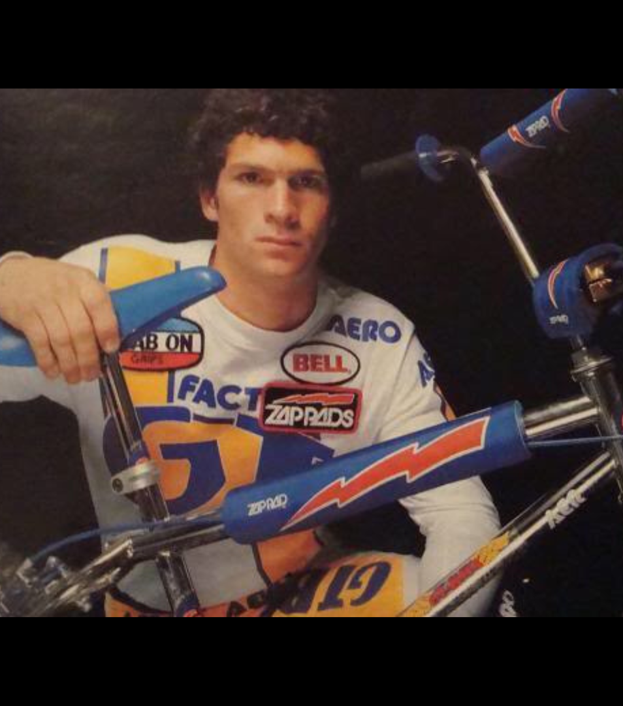

[← Patterson](./04-patterson.md) | [Back to resource index](../README.md) | [Miranda →](./06-miranda.md)

# 05 — Hill

## Greg Hill – BMX Racing Icon & NORA Cup Champion

**Official list position:** 5  
**Category:** Rider  
**Content classification:** Factual rider profile  
**Grid status:** Verified unique  
**Live learning page:** https://sites.google.com/view/lititzbmxinventorylist/learning-resources/word-search/hill-word-search  

## Original page text

```text
Greg Hill is one of the most accomplished riders in BMX racing history, with a career that spans from the sport’s early growth in the 1970s through the professional era of the 1980s and beyond. Beginning in 1974 in Southern California, Hill quickly rose through the amateur ranks, earning multiple National No.1 titles before turning professional at just 14 years old. His breakthrough came with a major win at the 1979 NBA Winter Nationals, launching a dominant run that included national titles across NBA, ABA, and NBL competition, highlighted by the 1982 Jag Pro World Championship and multiple Pro and Pro Cruiser No.1 rankings.

Hill’s influence extended beyond racing through the founding of GHP (Greg Hill Products) in 1983, a brand that became a staple in BMX performance equipment. A four-time NORA Cup winner—awarded by readers of BMX Action Magazine—Hill was recognized not only for his success on the track but for his impact on the sport’s culture. He remained competitive into the 1990s, earning a Veteran Pro World Cup title in 1996 before retiring in 1998, leaving behind a legacy as one of BMX’s most respected champions.
```

## Associated source image



Greg Hill poses with a BMX bicycle while wearing race gear in a vintage portrait-style image.

## Normalized archival summary

The entry traces Greg Hill’s rise from early amateur racing through elite professional success, his NORA Cup recognition, and his broader influence through GHP.

## Puzzle verification

- **Verified match count:** 1
- `R15C2-R18C5 (down-right)`

## Source evidence

- [Profile page capture](../page-captures/page-005-hill-profile.png)
- [Standalone source image](../source-images/source-005-greg-hill-bmx-portrait.png)
- [Source transcription](../SOURCE-TRANSCRIPTIONS.md#source-005-hill)

## Verification notes

- No special exception identified in the supplied source set.
- No additional source-image text is transcribed.
- Historical claims are preserved as statements made by the supplied learning-resource page unless separately verified in a future research audit.

---

[← Patterson](./04-patterson.md) | [Back to resource index](../README.md) | [Miranda →](./06-miranda.md)
