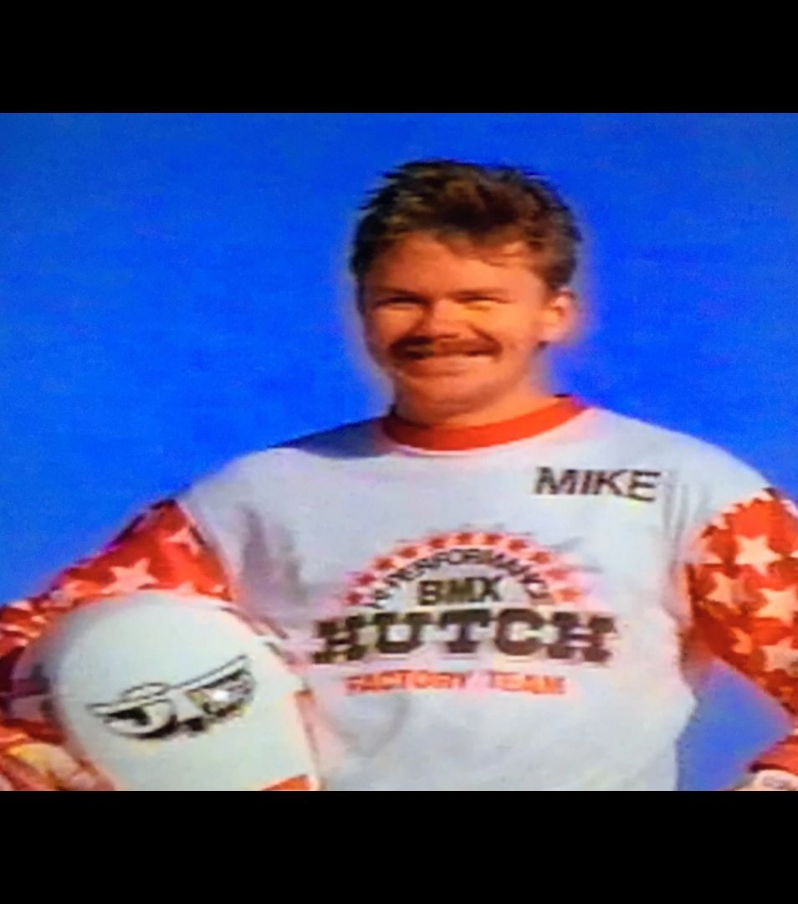

[← Hill](./05-hill.md) | [Back to resource index](../README.md) | [Brackens →](./07-brackens.md)

# 06 — Miranda

## The Brothers Who Rode Beyond BMX

**Official list position:** 6  
**Category:** Rider / creative entry  
**Content classification:** Fictional alternate history  
**Grid status:** Verified unique  
**Live learning page:** https://sites.google.com/view/lititzbmxinventorylist/learning-resources/word-search/miranda-word-search  

## Original page text

```text
In an alternate chapter of BMX history, Mike Miranda and Tommy Brackens weren’t just competitors—they were brothers. Born and raised in Southern California at the height of BMX’s early explosion, the two grew up just blocks from a dusty local track where neighborhood kids gathered every afternoon. From the moment they first pedaled their bikes down that start hill, it was clear they were different. Mike had a natural power and precision, while Tommy carried a smooth, effortless style that made even the most technical sections look easy.

By their teenage years, the brothers had become unstoppable. Traveling the country together in a beat-up van with their bikes strapped to the roof, they dominated local and national circuits alike. Mike’s explosive speed made him a consistent podium threat, while Tommy’s calculated riding turned him into one of the most respected racers in the sport. Fans began referring to them simply as “The Brothers,” a duo that represented both sides of BMX—raw intensity and refined control. Their careers helped define an era, inspiring countless riders and leaving an imprint on the sport’s formative years.

After years at the top, both brothers eventually stepped away from professional racing—but their stories didn’t end there. Mike, known for his leadership and presence, took an unexpected path into public service. His ability to connect with people, forged through years of competition and travel, ultimately led him all the way to the highest office in the country, becoming President of the United States. Tommy, on the other hand, turned his creativity in a different direction. Frustrated one day while trying to keep notes organized in his workshop, he invented a small adhesive paper that could stick and restick without damage—what the world would later know as the Post-it Note.

Though their lives took dramatically different paths, the bond between the brothers never faded. Whether shaping a nation or changing the way people organized their thoughts, both carried with them the same drive that began on a dusty BMX track. In this imagined history, their legacy reminds us that BMX has always been more than racing—it’s a starting point for whatever comes next.
```

## Associated source image



A mustached BMX rider wears a Hutch Factory Team jersey marked “MIKE” and holds a full-face helmet against a blue background.

## Normalized archival summary

The entry is a deliberately fictional alternate-history story that imagines Mike Miranda and Tommy Brackens as brothers whose BMX careers lead to absurdly different later achievements. Its humor reinforces BMX as a starting point for unexpected life paths.

## Puzzle verification

- **Verified match count:** 1
- `R16C15-R10C15 (up)`

## Source evidence

- [Profile page capture](../page-captures/page-006-miranda-profile.png)
- [Standalone source image](../source-images/source-006-mike-miranda-hutch-factory-team.png)
- [Source transcription](../SOURCE-TRANSCRIPTIONS.md#source-006-miranda)

## Verification notes

- This record must remain prominently classified as fictional alternate history. Its invented relationships and later-life claims must not be reused as factual biography.
- Visible jersey text includes “MIKE” and “HUTCH FACTORY TEAM.”
- Historical claims are preserved as statements made by the supplied learning-resource page unless separately verified in a future research audit.

---

[← Hill](./05-hill.md) | [Back to resource index](../README.md) | [Brackens →](./07-brackens.md)
