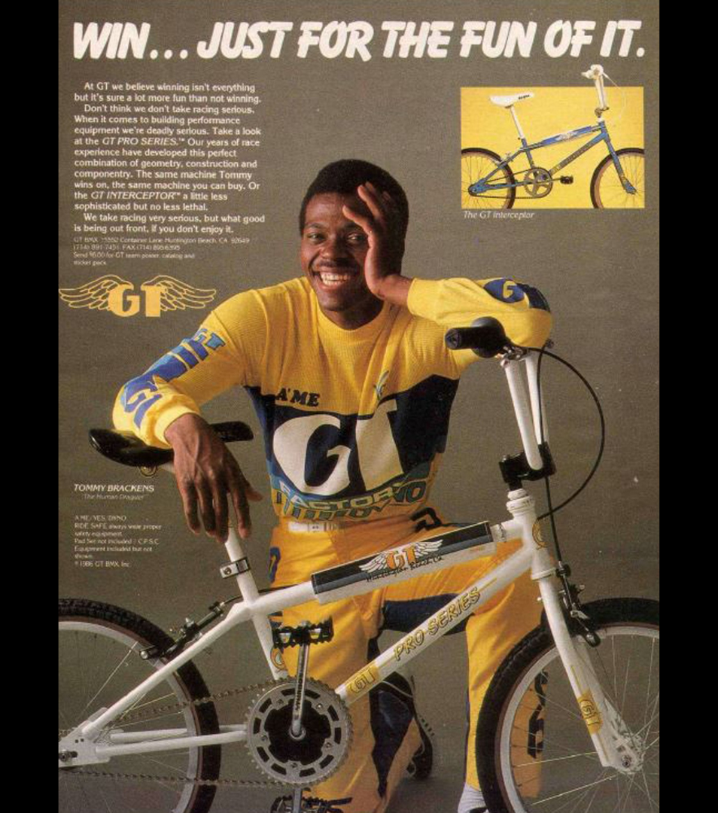

[← Miranda](./06-miranda.md) | [Back to resource index](../README.md) | [Loncarevich →](./08-loncarevich.md)

# 07 — Brackens

## Tommy Brackens – “The Human Dragster”

**Official list position:** 7  
**Category:** Rider  
**Content classification:** Factual rider profile  
**Grid status:** Verified unique  
**Live learning page:** https://sites.google.com/view/lititzbmxinventorylist/learning-resources/word-search/brackens-word-search  

## Original page text

```text
Tommy Brackens, born November 20, 1960, in Los Angeles, California, was one of the most explosive starters in BMX racing history, earning the nickname “The Human Dragster” for his unmatched ability to secure the holeshot. The nickname was coined by NBL announcer Bob Hunt during the 1982 Grand Nationals, reflecting Brackens’ reputation for dominating the first straight. Originally a motocross rider, he transitioned to BMX in 1977 after being introduced to the sport by Anthony Sewell, quickly rising through the ranks on his Redline race bike before turning professional in December 1980 at age 20.

Brackens built a successful professional career throughout the 1980s, highlighted by major victories including the 1981 NBA Winternationals, the ABA Coliseum Classic, and the 1986 IBMXF World Championship. That same year, he won the “King of the Mountain” GPV Championship, reportedly reaching speeds of 92 mph on a 20-inch bike. In 1987, he earned the NORA Cup—awarded by readers of BMX Action Magazine—cementing his status as both a top competitor and fan favorite. He later founded Brackens Racing Products (1988–1990) before retiring from professional BMX in 1990.
```

## Associated source image



Tommy Brackens smiles in yellow-and-blue GT racing gear beside a white GT Pro Series BMX bicycle in a vintage advertisement.

## Normalized archival summary

The entry presents Tommy Brackens as an explosive BMX starter known as “The Human Dragster,” tracing his transition from motocross, professional racing success, NORA Cup recognition, and later business activity.

## Puzzle verification

- **Verified match count:** 1
- `R11C12-R18C12 (down)`

## Source evidence

- [Profile page capture](../page-captures/page-007-brackens-profile.png)
- [Standalone source image](../source-images/source-007-tommy-brackens-gt-advertisement.png)
- [Source transcription](../SOURCE-TRANSCRIPTIONS.md#source-007-brackens)

## Verification notes

- No special exception identified in the supplied source set.
- Visible advertisement text includes “WIN… JUST FOR THE FUN OF IT.” and “TOMMY BRACKENS — The Human Dragster.”
- Historical claims are preserved as statements made by the supplied learning-resource page unless separately verified in a future research audit.

---

[← Miranda](./06-miranda.md) | [Back to resource index](../README.md) | [Loncarevich →](./08-loncarevich.md)
