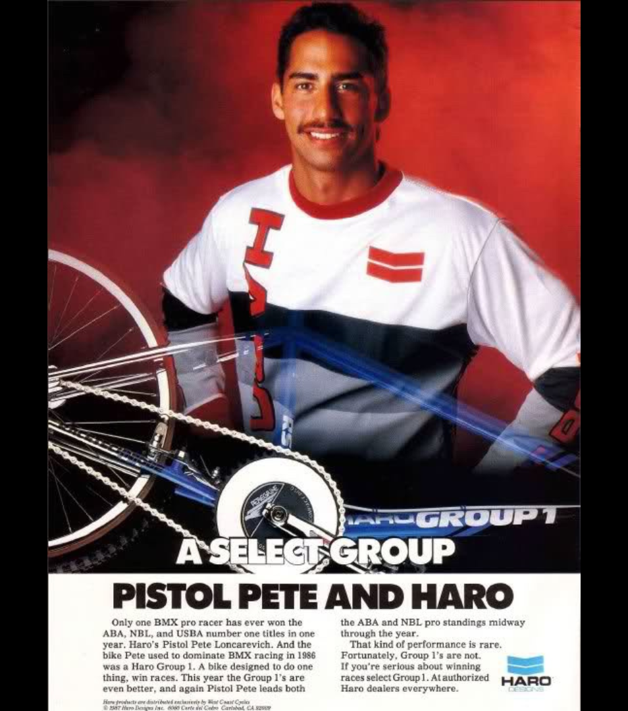
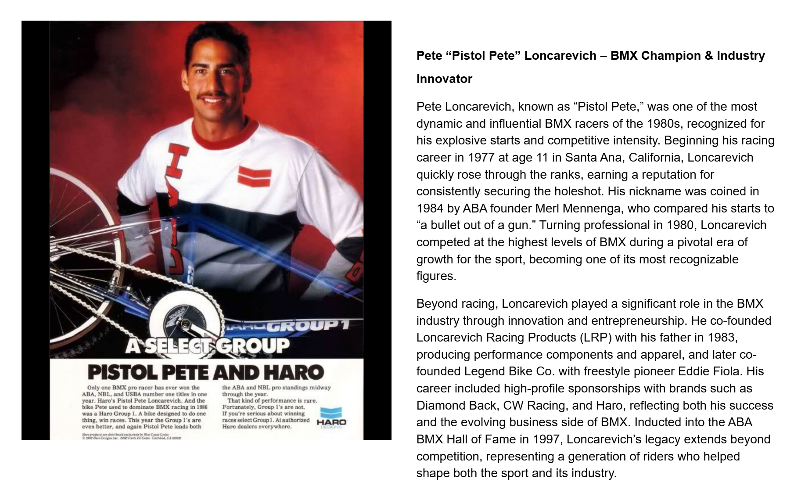

[← Brackens](./07-brackens.md) | [Word Search overview](../README.md) | [Learning Resources](../../README.md) | [Ellis →](./09-ellis.md)

# 08 — Loncarevich

## Pete “Pistol Pete” Loncarevich – BMX Champion & Industry Innovator

## Record identification

**Official list position:** 8  
**Category:** Rider  
**Content classification:** Factual rider profile  
**Grid status:** Verified unique  
**Live learning page:** [Open live learning page](https://sites.google.com/view/lititzbmxinventorylist/learning-resources/word-search/loncarevich-word-search)  
**Archive package version:** 1.0  
**Archive display version:** 1.1

---

## Resource structure

1. Original published learning-page text
2. Associated standalone source image
3. Normalized archival summary and puzzle verification
4. Preserved full public learning-page capture
5. Source documentation and verification notes

---

## Original page text

```text
Pete Loncarevich, known as “Pistol Pete,” was one of the most dynamic and influential BMX racers of the 1980s, recognized for his explosive starts and competitive intensity. Beginning his racing career in 1977 at age 11 in Santa Ana, California, Loncarevich quickly rose through the ranks, earning a reputation for consistently securing the holeshot. His nickname was coined in 1984 by ABA founder Merl Mennenga, who compared his starts to “a bullet out of a gun.” Turning professional in 1980, Loncarevich competed at the highest levels of BMX during a pivotal era of growth for the sport, becoming one of its most recognizable figures.

Beyond racing, Loncarevich played a significant role in the BMX industry through innovation and entrepreneurship. He co-founded Loncarevich Racing Products (LRP) with his father in 1983, producing performance components and apparel, and later co-founded Legend Bike Co. with freestyle pioneer Eddie Fiola. His career included high-profile sponsorships with brands such as Diamond Back, CW Racing, and Haro, reflecting both his success and the evolving business side of BMX. Inducted into the ABA BMX Hall of Fame in 1997, Loncarevich’s legacy extends beyond competition, representing a generation of riders who helped shape both the sport and its industry.
```

---

## Associated source image



Pete Loncarevich poses beside a Haro Group 1 BMX bicycle in a vintage Haro advertisement against a red studio background.

---

## Normalized archival summary

The entry presents Pete Loncarevich as an influential 1980s racer known for explosive starts and as an entrepreneur involved with LRP and Legend Bike Co.

---

## Puzzle verification

- **Verified match count:** 1
- `R8C6-R18C6 (down)`

---

## Critical verification findings

- No special exception identified in the supplied source set.
- Visible advertisement text includes “A SELECT GROUP” and “PISTOL PETE AND HARO.”
- Historical claims are preserved as statements made by the supplied learning-resource page unless separately verified in a future research audit.

---

[← Brackens](./07-brackens.md) | [Back to resource index](../README.md) | [Ellis →](./09-ellis.md)

---

## Preserved public learning-page capture



This full-page capture preserves the public presentation, image placement, headings, and surrounding learning context as supplied for the archive.

---

## Core documentation

- [Profile page capture](../page-captures/page-008-loncarevich-profile.png)
- [Standalone source image](../source-images/source-008-pete-loncarevich-haro-advertisement.png)
- [Source transcription](../SOURCE-TRANSCRIPTIONS.md#source-008-loncarevich)
- [Word Search archive overview](../README.md)
- [Puzzle verification and coordinate map](../puzzle/PUZZLE-VERIFICATION.md)
- [Image manifest](../IMAGE-MANIFEST.csv)
- [SHA-256 fixity manifest](../SHA256SUMS.txt)

---

## Preservation note

The Google Site remains the primary public learning experience. This GitHub page provides a durable, searchable, accessible presentation of the published profile while preserving its associated image, full-page capture, puzzle evidence, transcription, and verification record.

---

[← Brackens](./07-brackens.md) | [Word Search overview](../README.md) | [Learning Resources](../../README.md) | [Ellis →](./09-ellis.md)
