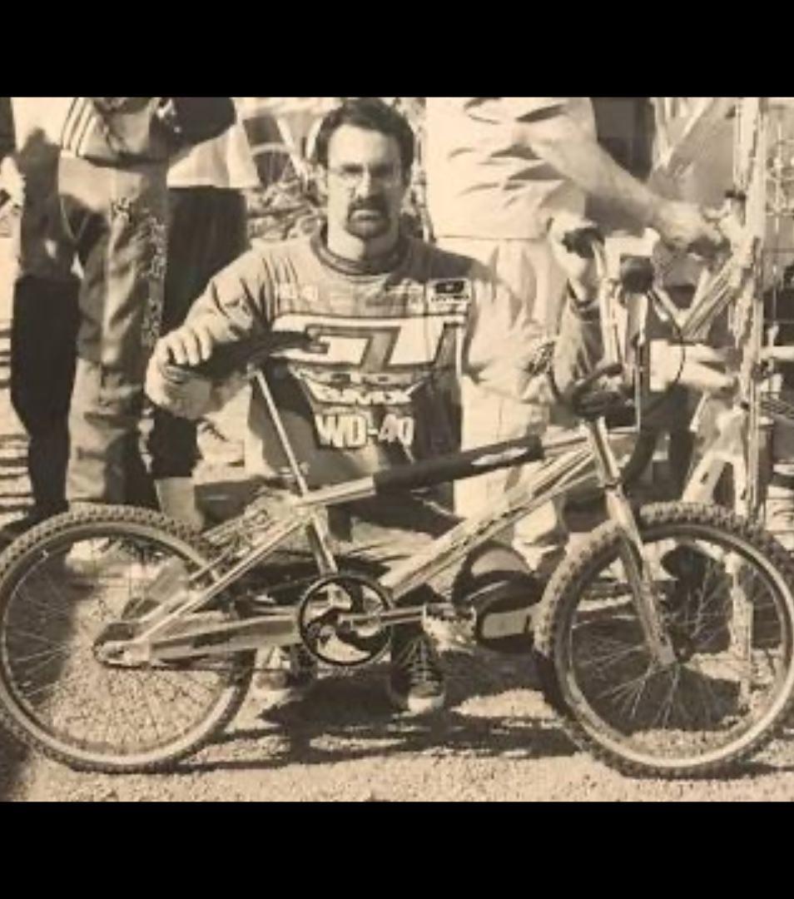
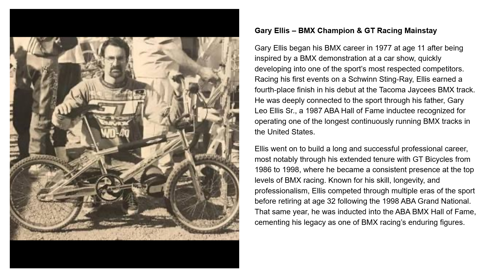

[← Loncarevich](./08-loncarevich.md) | [Word Search overview](../README.md) | [Learning Resources](../../README.md) | [CUP →](./10-cup-known-exception.md)

# 09 — Ellis

## Gary Ellis – BMX Champion & GT Racing Mainstay

## Record identification

**Official list position:** 9  
**Category:** Rider  
**Content classification:** Factual rider profile  
**Grid status:** Verified unique  
**Live learning page:** [Open live learning page](https://sites.google.com/view/lititzbmxinventorylist/learning-resources/word-search/ellis-word-search)  
**Archive package version:** 1.0  
**Archive display version:** 1.1

---

## Resource structure

1. Original published learning-page text
2. Associated standalone source image
3. Normalized archival summary and puzzle verification
4. Preserved full public learning-page capture
5. Source documentation and verification notes

---

## Original page text

```text
Gary Ellis began his BMX career in 1977 at age 11 after being inspired by a BMX demonstration at a car show, quickly developing into one of the sport’s most respected competitors. Racing his first events on a Schwinn Sting-Ray, Ellis earned a fourth-place finish in his debut at the Tacoma Jaycees BMX track. He was deeply connected to the sport through his father, Gary Leo Ellis Sr., a 1987 ABA Hall of Fame inductee recognized for operating one of the longest continuously running BMX tracks in the United States.

Ellis went on to build a long and successful professional career, most notably through his extended tenure with GT Bicycles from 1986 to 1998, where he became a consistent presence at the top levels of BMX racing. Known for his skill, longevity, and professionalism, Ellis competed through multiple eras of the sport before retiring at age 32 following the 1998 ABA Grand National. That same year, he was inducted into the ABA BMX Hall of Fame, cementing his legacy as one of BMX racing’s enduring figures.
```

---

## Associated source image



Gary Ellis poses behind a GT BMX racing bicycle in a vintage black-and-white race photograph.

---

## Normalized archival summary

The entry presents Gary Ellis as a long-tenured professional racer whose career began in 1977 and became closely associated with GT Bicycles from 1986 through 1998.

---

## Puzzle verification

- **Verified match count:** 1
- `R20C13-R20C17 (right)`

---

## Critical verification findings

- No special exception identified in the supplied source set.
- No additional source-image text is transcribed.
- Historical claims are preserved as statements made by the supplied learning-resource page unless separately verified in a future research audit.

---

[← Loncarevich](./08-loncarevich.md) | [Back to resource index](../README.md) | [CUP →](./10-cup-known-exception.md)

---

## Preserved public learning-page capture



This full-page capture preserves the public presentation, image placement, headings, and surrounding learning context as supplied for the archive.

---

## Core documentation

- [Profile page capture](../page-captures/page-009-ellis-profile.png)
- [Standalone source image](../source-images/source-009-gary-ellis-gt-racing.png)
- [Source transcription](../SOURCE-TRANSCRIPTIONS.md#source-009-ellis)
- [Word Search archive overview](../README.md)
- [Puzzle verification and coordinate map](../puzzle/PUZZLE-VERIFICATION.md)
- [Image manifest](../IMAGE-MANIFEST.csv)
- [SHA-256 fixity manifest](../SHA256SUMS.txt)

---

## Preservation note

The Google Site remains the primary public learning experience. This GitHub page provides a durable, searchable, accessible presentation of the published profile while preserving its associated image, full-page capture, puzzle evidence, transcription, and verification record.

---

[← Loncarevich](./08-loncarevich.md) | [Word Search overview](../README.md) | [Learning Resources](../../README.md) | [CUP →](./10-cup-known-exception.md)
