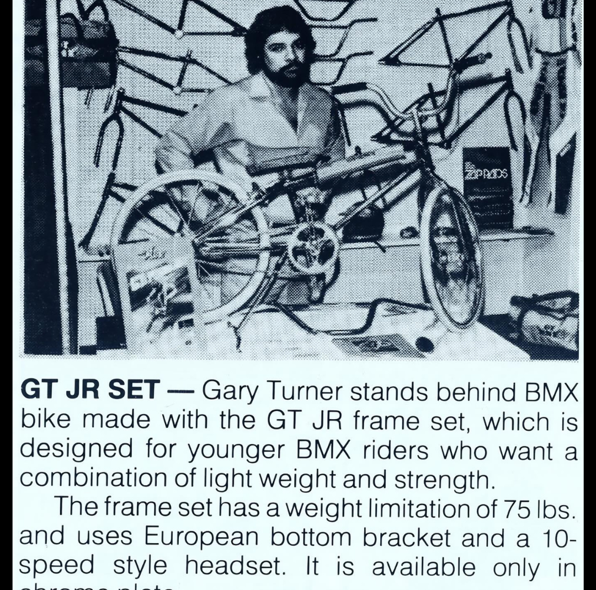

[← CUP](./10-cup-known-exception.md) | [Back to resource index](../README.md) | [Redline →](./12-redline.md)

# 11 — GT

## GT Bicycles – Pioneers of Performance BMX Engineering

**Official list position:** 11  
**Category:** Brand / manufacturer  
**Content classification:** Factual brand profile  
**Grid status:** Multiple matches (5)  
**Live learning page:** https://sites.google.com/view/lititzbmxinventorylist/learning-resources/word-search/gt-word-search  

## Original page text

```text
GT Bicycles traces its origins to 1972, when machinist and welder Gary Turner began building lightweight BMX frames in his Santa Ana, California garage. Inspired by his young son Craig’s involvement in BMX racing, Turner set out to create stronger, lighter race bikes at a time when such equipment was rare. Hand-fabricating each frame and fork, he continually refined his designs as Craig and his brother Glenn Turner began achieving success at local tracks. Demand quickly grew as other riders recognized the performance advantage of Turner’s craftsmanship, laying the foundation for what would become one of BMX’s most influential brands.

In partnership with Richard Long, Turner helped grow GT into a dominant force in BMX throughout the sport’s formative decades, known for innovation, durability, and race-winning performance. GT-sponsored riders became fixtures at the top levels of competition, helping define the look and feel of BMX racing during its peak growth years. Turner eventually stepped away from the corporate bicycle industry in 1998, but his legacy remains deeply embedded in BMX history. Today, GT Bicycles is recognized as one of the foundational brands of the sport, with its early handcrafted frames representing a direct link to the origins of modern BMX design and competition.
```

## Associated source image



A vintage printed feature shows Gary Turner behind a BMX bicycle built with a GT JR frame set in a workshop filled with bicycle frames.

## Normalized archival summary

The entry presents GT Bicycles as a foundational manufacturer originating with Gary Turner’s handcrafted race frames and later expanding with Richard Long into a leading BMX brand.

## Puzzle verification

- **Verified match count:** 5
- `R3C8-R4C8 (down)`
- `R6C8-R5C9 (up-right)`
- `R6C9-R5C9 (up)`
- `R6C9-R7C10 (down-right)`
- `R20C10-R20C9 (left)`

## Source evidence

- [Profile page capture](../page-captures/page-010-gt-profile.png)
- [Standalone source image](../source-images/source-010-gary-turner-gt-jr-frame-set.png)
- [Source transcription](../SOURCE-TRANSCRIPTIONS.md#source-011-gt)

## Verification notes

- GT appears five times in the grid. No intended occurrence is selected without an official answer key.
- Visible caption begins “GT JR SET — Gary Turner stands behind BMX bike made with the GT JR frame set…” The final portion is cropped and is not reconstructed.
- Historical claims are preserved as statements made by the supplied learning-resource page unless separately verified in a future research audit.

---

[← CUP](./10-cup-known-exception.md) | [Back to resource index](../README.md) | [Redline →](./12-redline.md)
