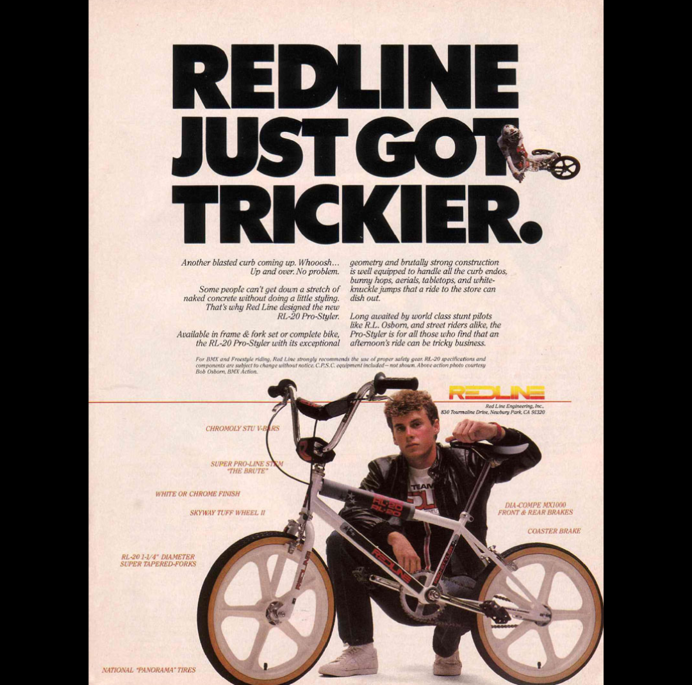
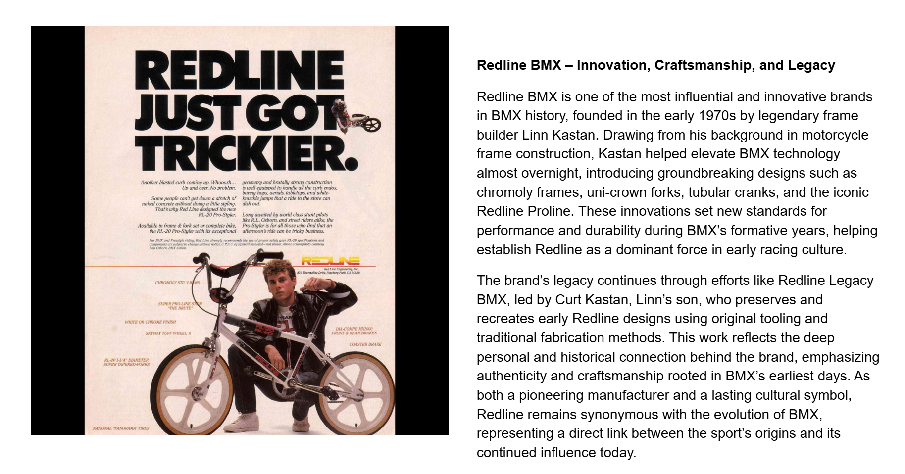

[← GT](./11-gt.md) | [Word Search overview](../README.md) | [Learning Resources](../../README.md) | [Diamondback →](./13-diamondback.md)

# 12 — Redline

## Redline BMX – Innovation, Craftsmanship, and Legacy

## Record identification

**Official list position:** 12  
**Category:** Brand / manufacturer  
**Content classification:** Factual brand profile  
**Grid status:** Verified unique  
**Live learning page:** [Open live learning page](https://sites.google.com/view/lititzbmxinventorylist/learning-resources/word-search/redline-word-search)  
**Archive package version:** 1.0  
**Archive display version:** 1.1

---

## Resource structure

1. Original published learning-page text
2. Associated standalone source image
3. Normalized archival summary and puzzle verification
4. Preserved full public learning-page capture
5. Source documentation and verification notes

---

## Original page text

```text
Redline BMX is one of the most influential and innovative brands in BMX history, founded in the early 1970s by legendary frame builder Linn Kastan. Drawing from his background in motorcycle frame construction, Kastan helped elevate BMX technology almost overnight, introducing groundbreaking designs such as chromoly frames, uni-crown forks, tubular cranks, and the iconic Redline Proline. These innovations set new standards for performance and durability during BMX’s formative years, helping establish Redline as a dominant force in early racing culture.

The brand’s legacy continues through efforts like Redline Legacy BMX, led by Curt Kastan, Linn’s son, who preserves and recreates early Redline designs using original tooling and traditional fabrication methods. This work reflects the deep personal and historical connection behind the brand, emphasizing authenticity and craftsmanship rooted in BMX’s earliest days. As both a pioneering manufacturer and a lasting cultural symbol, Redline remains synonymous with the evolution of BMX, representing a direct link between the sport’s origins and its continued influence today.
```

---

## Associated source image



A vintage Redline advertisement reads “REDLINE JUST GOT TRICKIER” and features an RL-20 Pro-Styler freestyle bicycle and rider.

---

## Normalized archival summary

The entry presents Redline as an influential early BMX manufacturer associated with Linn Kastan, technical innovation, durable performance equipment, and continuing legacy-preservation work.

---

## Puzzle verification

- **Verified match count:** 1
- `R5C18-R11C18 (down)`

---

## Critical verification findings

- The profile gives broad brand history while the associated image documents a specific freestyle-era Redline product.
- Visible headline reads “REDLINE JUST GOT TRICKIER.” The ad references the RL-20 Pro-Styler and contains product callouts.
- Historical claims are preserved as statements made by the supplied learning-resource page unless separately verified in a future research audit.

---

[← GT](./11-gt.md) | [Back to resource index](../README.md) | [Diamondback →](./13-diamondback.md)

---

## Preserved public learning-page capture



This full-page capture preserves the public presentation, image placement, headings, and surrounding learning context as supplied for the archive.

---

## Core documentation

- [Profile page capture](../page-captures/page-011-redline-profile.png)
- [Standalone source image](../source-images/source-011-redline-rl20-pro-styler-advertisement.png)
- [Source transcription](../SOURCE-TRANSCRIPTIONS.md#source-012-redline)
- [Word Search archive overview](../README.md)
- [Puzzle verification and coordinate map](../puzzle/PUZZLE-VERIFICATION.md)
- [Image manifest](../IMAGE-MANIFEST.csv)
- [SHA-256 fixity manifest](../SHA256SUMS.txt)

---

## Preservation note

The Google Site remains the primary public learning experience. This GitHub page provides a durable, searchable, accessible presentation of the published profile while preserving its associated image, full-page capture, puzzle evidence, transcription, and verification record.

---

[← GT](./11-gt.md) | [Word Search overview](../README.md) | [Learning Resources](../../README.md) | [Diamondback →](./13-diamondback.md)
