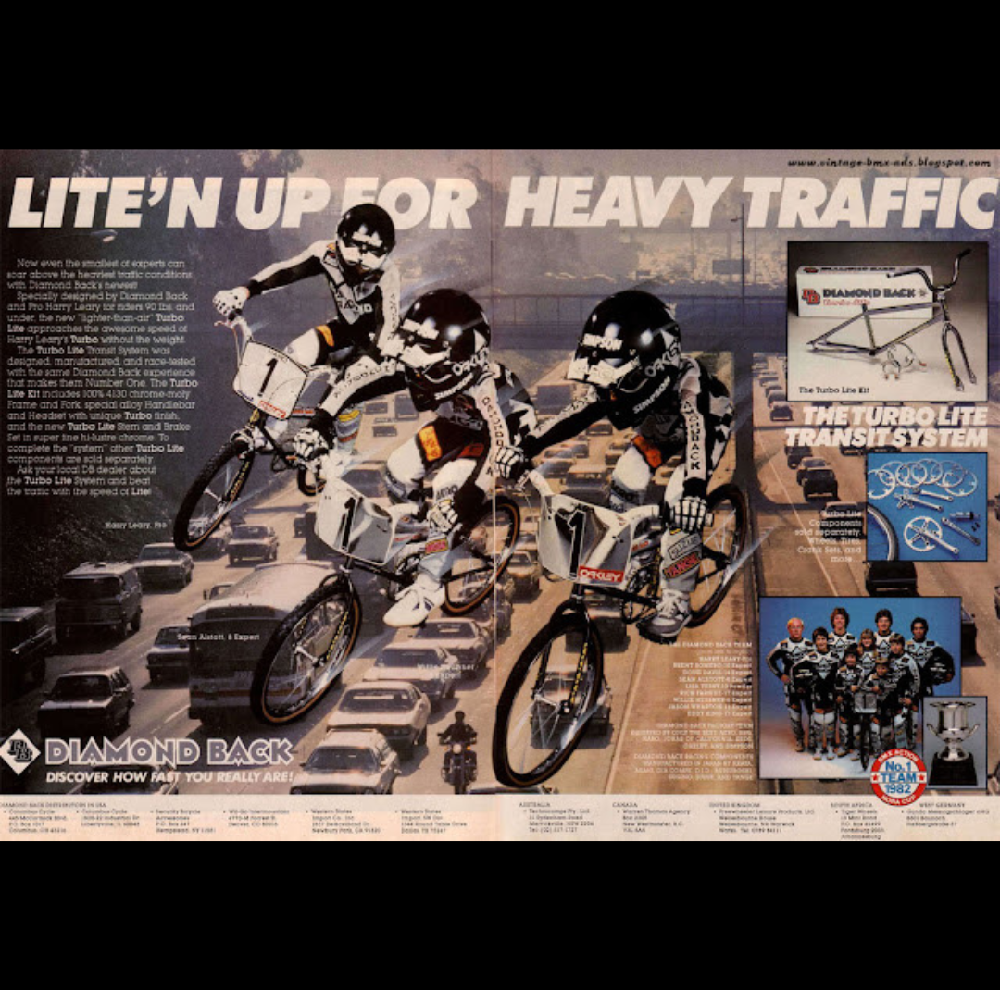

[← Redline](./12-redline.md) | [Back to resource index](../README.md) | [Mongoose →](./14-mongoose.md)

# 13 — Diamondback

## Diamondback – Southern California BMX Innovation & Racing Legacy

**Official list position:** 13  
**Category:** Brand / manufacturer  
**Content classification:** Factual brand profile  
**Grid status:** Verified unique  
**Live learning page:** https://sites.google.com/view/lititzbmxinventorylist/learning-resources/word-search/diamonback-word-search  

## Original page text

```text
Diamondback Bicycles originated in Southern California in the late 1970s as a division of Western States Imports (WSI) and sister company to Centurion Bicycle Workshop. Emerging from a background in 10-speed bicycle production, Diamondback entered the BMX market around 1976–1977 with early framesets that emphasized durability and performance, often constructed from chromoly and mild steel. The name “Diamond Back” was inspired by the frame’s distinctive twin-diamond shape and the era’s fascination with snake imagery. Under the direction of Sandy Finkelman, the brand quickly developed both its race team and product line, focusing initially on the California market before expanding nationally.

Throughout the late 1970s and 1980s, Diamondback became a major force in BMX racing, supported by top riders such as Harry Leary and Eddy King, whose success helped drive innovation in frame design, including features like Turbo dropouts and the Diamond gusset. The brand also gained cultural visibility through its appearance in the 1983 film BMX Bandits, further cementing its place in BMX history. Over time, the company’s branding evolved from “Diamond Back” to “DiamondBack” and ultimately “Diamondback,” reflecting its growth into a globally recognized name. Today, Diamondback remains an enduring presence in BMX, with a legacy rooted in early race performance and continued influence across modern riding disciplines.
```

## Associated source image



A vintage Diamond Back advertisement reads “LITE’N UP FOR HEAVY TRAFFIC” and shows BMX team riders over a freeway-traffic background.

## Normalized archival summary

The entry presents Diamondback as a Southern California BMX brand that grew through racing, product innovation, prominent riders, and evolving brand identity.

## Puzzle verification

- **Verified match count:** 1
- `R7C7-R17C7 (down)`

## Source evidence

- [Profile page capture](../page-captures/page-012-diamondback-profile.png)
- [Standalone source image](../source-images/source-012-diamond-back-heavy-traffic-advertisement.png)
- [Source transcription](../SOURCE-TRANSCRIPTIONS.md#source-013-diamondback)

## Verification notes

- The working live URL uses the slug “diamonback-word-search.” That exact URL is preserved rather than silently corrected.
- Visible text includes “LITE’N UP FOR HEAVY TRAFFIC,” “DIAMOND BACK,” “DISCOVER HOW FAST YOU REALLY ARE!” and “THE TURBO LITE TRANSIT SYSTEM.”
- Historical claims are preserved as statements made by the supplied learning-resource page unless separately verified in a future research audit.

---

[← Redline](./12-redline.md) | [Back to resource index](../README.md) | [Mongoose →](./14-mongoose.md)
