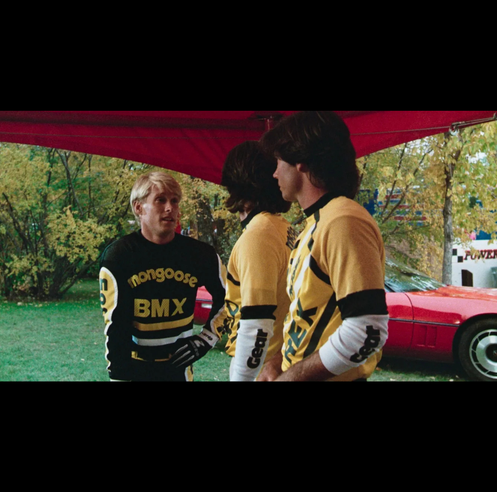

[← Diamondback](./13-diamondback.md) | [Back to resource index](../README.md) | [Robinson →](./15-robinson.md)

# 14 — Mongoose

## Mongoose – From MotoMag Innovation to BMX Icon

**Official list position:** 14  
**Category:** Brand / manufacturer  
**Content classification:** Factual brand profile  
**Grid status:** Verified unique  
**Live learning page:** https://sites.google.com/view/lititzbmxinventorylist/learning-resources/word-search/mongoose-word-search  

## Original page text

```text
Mongoose is one of the most iconic and influential brands in BMX history, originating in 1974 in Simi Valley, California. Founded by visionary Skip Hess under BMX Products, Inc., the brand first gained attention with the revolutionary MotoMag One wheel—a cast-magnesium design that was lighter, stronger, and visually distinct from anything else on the market. This innovation quickly propelled Mongoose into the spotlight, leading to the production of frames and complete bikes that helped define the BMX boom of the late 1970s and early 1980s.

Known for durability, performance, and rider-focused design, Mongoose became a dominant force across both BMX racing and freestyle, supporting top riders and helping shape the sport’s culture during its formative years. As the brand evolved through multiple ownership changes, it expanded into a global name while maintaining its roots in BMX. Today, Mongoose continues to produce BMX bikes for all levels of riders, carrying forward a legacy built on innovation, accessibility, and a deep connection to the riding community.
```

## Associated source image



Vintage BMX riders in Mongoose-branded race jerseys gather beneath a red canopy at an outdoor event.

## Normalized archival summary

The entry presents Mongoose as a foundational BMX brand emerging from Skip Hess’s MotoMag innovation and later expanding through racing, freestyle, global distribution, and broad rider accessibility.

## Puzzle verification

- **Verified match count:** 1
- `R15C9-R8C9 (up)`

## Source evidence

- [Profile page capture](../page-captures/page-013-mongoose-profile.png)
- [Standalone source image](../source-images/source-013-mongoose-riders-event-scene.png)
- [Source transcription](../SOURCE-TRANSCRIPTIONS.md#source-014-mongoose)

## Verification notes

- No special exception identified in the supplied source set.
- Visible rider apparel includes Mongoose BMX branding.
- Historical claims are preserved as statements made by the supplied learning-resource page unless separately verified in a future research audit.

---

[← Diamondback](./13-diamondback.md) | [Back to resource index](../README.md) | [Robinson →](./15-robinson.md)
