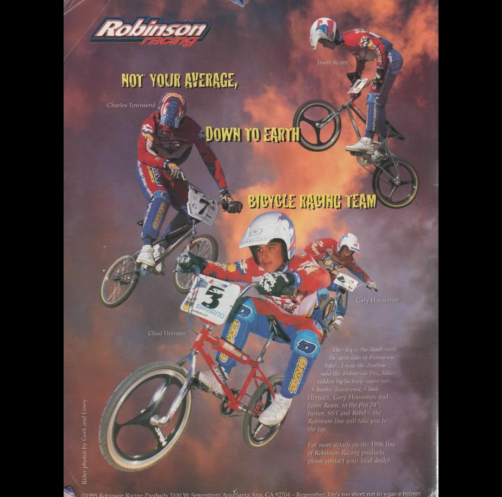
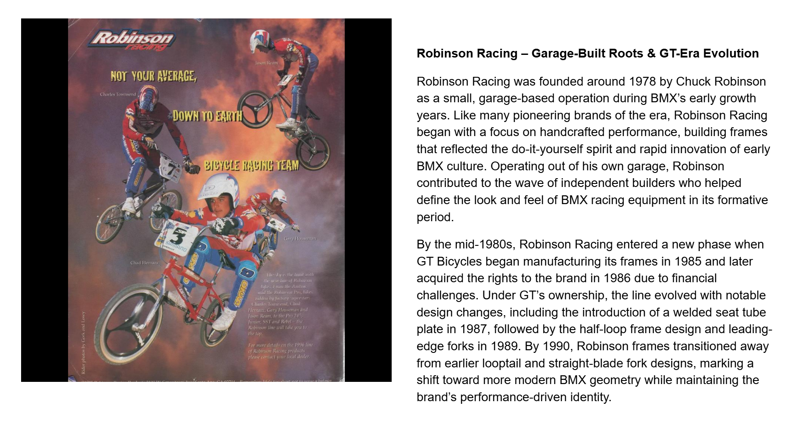

[← Mongoose](./14-mongoose.md) | [Word Search overview](../README.md) | [Learning Resources](../../README.md) | [Hutch →](./16-hutch.md)

# 15 — Robinson

## Robinson Racing – Garage-Built Roots & GT-Era Evolution

## Record identification

**Official list position:** 15  
**Category:** Brand / manufacturer  
**Content classification:** Factual brand profile  
**Grid status:** Verified unique  
**Live learning page:** [Open live learning page](https://sites.google.com/view/lititzbmxinventorylist/learning-resources/word-search/robinson-word-search)  
**Archive package version:** 1.0  
**Archive display version:** 1.1

---

## Resource structure

1. Original published learning-page text
2. Associated standalone source image
3. Normalized archival summary and puzzle verification
4. Preserved full public learning-page capture
5. Source documentation and verification notes

---

## Original page text

```text
Robinson Racing was founded around 1978 by Chuck Robinson as a small, garage-based operation during BMX’s early growth years. Like many pioneering brands of the era, Robinson Racing began with a focus on handcrafted performance, building frames that reflected the do-it-yourself spirit and rapid innovation of early BMX culture. Operating out of his own garage, Robinson contributed to the wave of independent builders who helped define the look and feel of BMX racing equipment in its formative period.

By the mid-1980s, Robinson Racing entered a new phase when GT Bicycles began manufacturing its frames in 1985 and later acquired the rights to the brand in 1986 due to financial challenges. Under GT’s ownership, the line evolved with notable design changes, including the introduction of a welded seat tube plate in 1987, followed by the half-loop frame design and leading-edge forks in 1989. By 1990, Robinson frames transitioned away from earlier looptail and straight-blade fork designs, marking a shift toward more modern BMX geometry while maintaining the brand’s performance-driven identity.
```

---

## Associated source image



A 1995 Robinson Racing team advertisement shows four BMX racers in red-and-blue uniforms performing racing and aerial maneuvers.

---

## Normalized archival summary

The entry presents Robinson Racing as a garage-built company founded around 1978 and later transformed through GT manufacturing, ownership, and design evolution.

---

## Puzzle verification

- **Verified match count:** 1
- `R18C17-R11C17 (up)`

---

## Critical verification findings

- The text addresses origins and GT-era evolution; the 1995 advertisement documents the brand’s later team identity.
- Visible headline reads “NOT YOUR AVERAGE, DOWN TO EARTH BICYCLE RACING TEAM.” Visible rider labels include Charles Townsend, Jason Ream, Chad Hernaez, and Gary Houseman.
- Historical claims are preserved as statements made by the supplied learning-resource page unless separately verified in a future research audit.

---

[← Mongoose](./14-mongoose.md) | [Back to resource index](../README.md) | [Hutch →](./16-hutch.md)

---

## Preserved public learning-page capture



This full-page capture preserves the public presentation, image placement, headings, and surrounding learning context as supplied for the archive.

---

## Core documentation

- [Profile page capture](../page-captures/page-014-robinson-profile.png)
- [Standalone source image](../source-images/source-014-robinson-racing-team-advertisement.png)
- [Source transcription](../SOURCE-TRANSCRIPTIONS.md#source-015-robinson)
- [Word Search archive overview](../README.md)
- [Puzzle verification and coordinate map](../puzzle/PUZZLE-VERIFICATION.md)
- [Image manifest](../IMAGE-MANIFEST.csv)
- [SHA-256 fixity manifest](../SHA256SUMS.txt)

---

## Preservation note

The Google Site remains the primary public learning experience. This GitHub page provides a durable, searchable, accessible presentation of the published profile while preserving its associated image, full-page capture, puzzle evidence, transcription, and verification record.

---

[← Mongoose](./14-mongoose.md) | [Word Search overview](../README.md) | [Learning Resources](../../README.md) | [Hutch →](./16-hutch.md)
