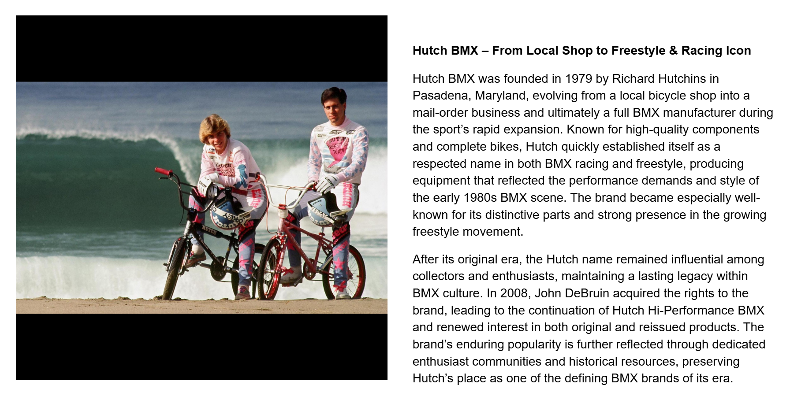

[← Robinson](./15-robinson.md) | [Word Search overview](../README.md) | [Learning Resources](../../README.md) | [Shimano →](./17-shimano.md)

# 16 — Hutch

## Hutch BMX – From Local Shop to Freestyle & Racing Icon

## Record identification

**Official list position:** 16  
**Category:** Brand / manufacturer  
**Content classification:** Factual brand profile  
**Grid status:** Verified unique  
**Live learning page:** [Open live learning page](https://sites.google.com/view/lititzbmxinventorylist/learning-resources/word-search/hutch-word-search)  
**Archive package version:** 1.0  
**Archive display version:** 1.1

---

## Resource structure

1. Original published learning-page text
2. Associated standalone source image
3. Normalized archival summary and puzzle verification
4. Preserved full public learning-page capture
5. Source documentation and verification notes

---

## Original page text

```text
Hutch BMX was founded in 1979 by Richard Hutchins in Pasadena, Maryland, evolving from a local bicycle shop into a mail-order business and ultimately a full BMX manufacturer during the sport’s rapid expansion. Known for high-quality components and complete bikes, Hutch quickly established itself as a respected name in both BMX racing and freestyle, producing equipment that reflected the performance demands and style of the early 1980s BMX scene. The brand became especially well-known for its distinctive parts and strong presence in the growing freestyle movement.

After its original era, the Hutch name remained influential among collectors and enthusiasts, maintaining a lasting legacy within BMX culture. In 2008, John DeBruin acquired the rights to the brand, leading to the continuation of Hutch Hi-Performance BMX and renewed interest in both original and reissued products. The brand’s enduring popularity is further reflected through dedicated enthusiast communities and historical resources, preserving Hutch’s place as one of the defining BMX brands of its era.
```

---

## Associated source image


Two Hutch Freestyle Team riders pose with BMX bicycles on a beach while a large ocean wave breaks behind them.

---

## Normalized archival summary

The entry presents Hutch as a Maryland company that grew from a local shop into a major racing and freestyle manufacturer and later continued through collector interest and revived brand ownership.

---

## Puzzle verification

- **Verified match count:** 1
- `R14C3-R18C7 (down-right)`

---

## Critical verification findings

- The image supports Hutch’s freestyle identity. Individuals are not named from appearance alone.
- Visible team apparel includes Hutch Freestyle Team branding.
- Historical claims are preserved as statements made by the supplied learning-resource page unless separately verified in a future research audit.

---

[← Robinson](./15-robinson.md) | [Back to resource index](../README.md) | [Shimano →](./17-shimano.md)

---

## Preserved public learning-page capture



This full-page capture preserves the public presentation, image placement, headings, and surrounding learning context as supplied for the archive.

---

## Core documentation

- [Profile page capture](../page-captures/page-015-hutch-profile.png)
- [Standalone source image](../source-images/source-015-hutch-freestyle-team-beach.png)
- [Source transcription](../SOURCE-TRANSCRIPTIONS.md#source-016-hutch)
- [Word Search archive overview](../README.md)
- [Puzzle verification and coordinate map](../puzzle/PUZZLE-VERIFICATION.md)
- [Image manifest](../IMAGE-MANIFEST.csv)
- [SHA-256 fixity manifest](../SHA256SUMS.txt)

---

## Preservation note

The Google Site remains the primary public learning experience. This GitHub page provides a durable, searchable, accessible presentation of the published profile while preserving its associated image, full-page capture, puzzle evidence, transcription, and verification record.

---

[← Robinson](./15-robinson.md) | [Word Search overview](../README.md) | [Learning Resources](../../README.md) | [Shimano →](./17-shimano.md)
