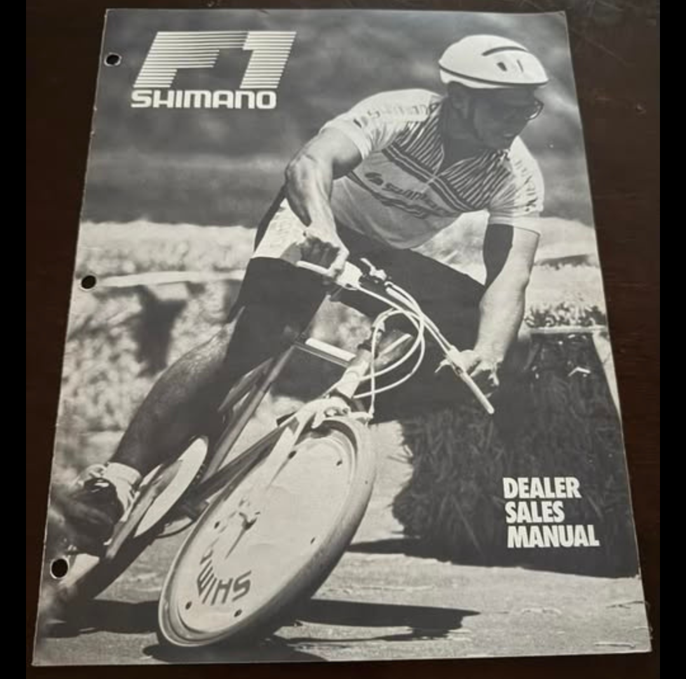
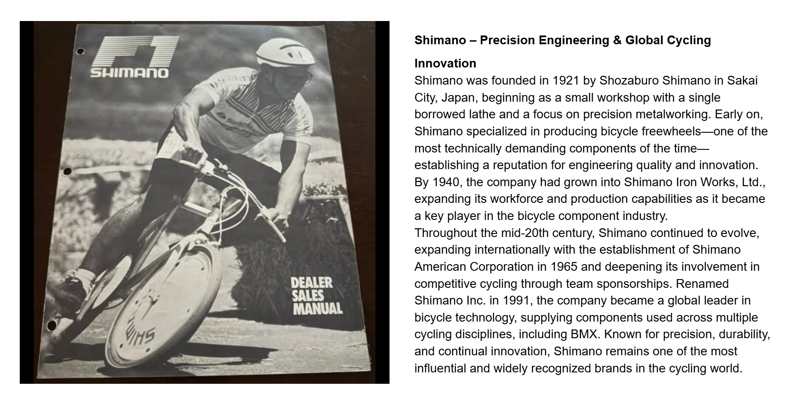

[← Hutch](./16-hutch.md) | [Word Search overview](../README.md) | [Learning Resources](../../README.md)

# 17 — Shimano

## Shimano – Precision Engineering & Global Cycling Innovation

## Record identification

**Official list position:** 17  
**Category:** Brand / component manufacturer  
**Content classification:** Factual brand profile  
**Grid status:** Verified unique  
**Live learning page:** [Open live learning page](https://sites.google.com/view/lititzbmxinventorylist/learning-resources/word-search/shimano-word-search)  
**Archive package version:** 1.0  
**Archive display version:** 1.1

---

## Resource structure

1. Original published learning-page text
2. Associated standalone source image
3. Normalized archival summary and puzzle verification
4. Preserved full public learning-page capture
5. Source documentation and verification notes

---

## Original page text

```text
Shimano was founded in 1921 by Shozaburo Shimano in Sakai City, Japan, beginning as a small workshop with a single borrowed lathe and a focus on precision metalworking. Early on, Shimano specialized in producing bicycle freewheels—one of the most technically demanding components of the time—establishing a reputation for engineering quality and innovation. By 1940, the company had grown into Shimano Iron Works, Ltd., expanding its workforce and production capabilities as it became a key player in the bicycle component industry.

Throughout the mid-20th century, Shimano continued to evolve, expanding internationally with the establishment of Shimano American Corporation in 1965 and deepening its involvement in competitive cycling through team sponsorships. Renamed Shimano Inc. in 1991, the company became a global leader in bicycle technology, supplying components used across multiple cycling disciplines, including BMX. Known for precision, durability, and continual innovation, Shimano remains one of the most influential and widely recognized brands in the cycling world.
```

---

## Associated source image



A photographed black-and-white Shimano dealer sales manual shows a helmeted cyclist leaning a bicycle sharply into a turn.

---

## Normalized archival summary

The entry traces Shimano from a 1921 precision-metalworking workshop to an international bicycle-component company influential across cycling disciplines, including BMX.

---

## Puzzle verification

- **Verified match count:** 1
- `R11C14-R17C14 (down)`

---

## Critical verification findings

- No manual date, edition, model, or rider identity is supplied and none is invented.
- Visible cover text includes the Shimano logo and “DEALER SALES MANUAL.”
- Historical claims are preserved as statements made by the supplied learning-resource page unless separately verified in a future research audit.

---

[← Hutch](./16-hutch.md) | [Back to resource index](../README.md)

---

## Preserved public learning-page capture



This full-page capture preserves the public presentation, image placement, headings, and surrounding learning context as supplied for the archive.

---

## Core documentation

- [Profile page capture](../page-captures/page-016-shimano-profile.png)
- [Standalone source image](../source-images/source-016-shimano-dealer-sales-manual.png)
- [Source transcription](../SOURCE-TRANSCRIPTIONS.md#source-017-shimano)
- [Word Search archive overview](../README.md)
- [Puzzle verification and coordinate map](../puzzle/PUZZLE-VERIFICATION.md)
- [Image manifest](../IMAGE-MANIFEST.csv)
- [SHA-256 fixity manifest](../SHA256SUMS.txt)

---

## Preservation note

The Google Site remains the primary public learning experience. This GitHub page provides a durable, searchable, accessible presentation of the published profile while preserving its associated image, full-page capture, puzzle evidence, transcription, and verification record.

---

[← Hutch](./16-hutch.md) | [Word Search overview](../README.md) | [Learning Resources](../../README.md)
