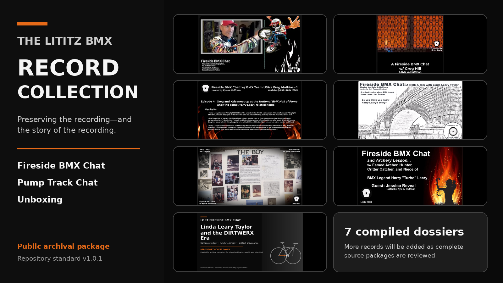
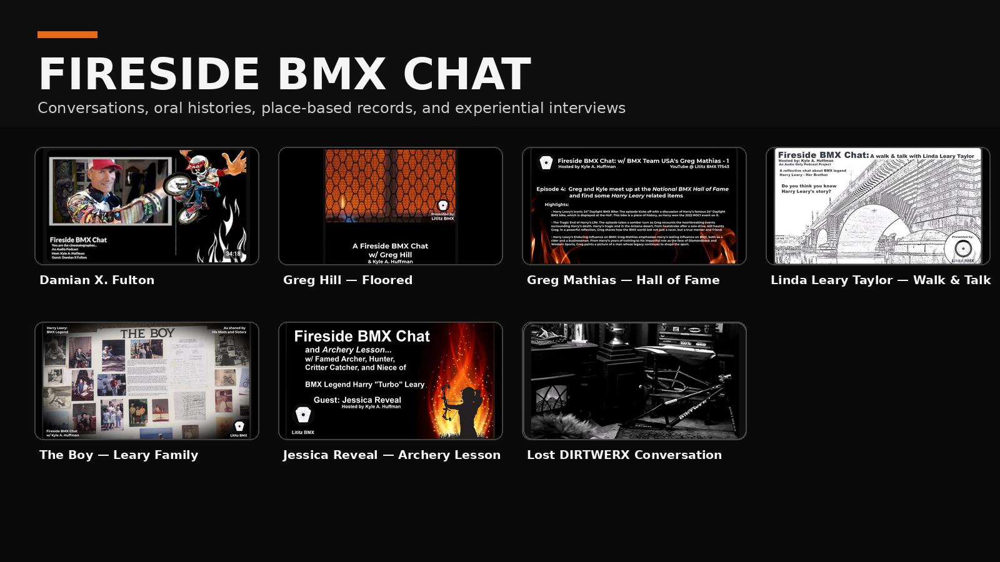

<p align="center">
  
</p>

# The Lititz BMX Record Collection

**Repository location:** `Article134-tech/lititzbmx-docs/record-collection/`  
**Integration method:** Controlled replacement of the existing `record-collection/` folder; no repository restructuring.  
**Public package:** v1.3.0  
**Archival standard:** v1.0.1  
**Compiled:** 2026-07-22  
**Publisher and curator:** Lititz BMX / Kyle A. Huffman

The **Lititz BMX Record Collection** preserves the historical footprint surrounding original Lititz BMX media: the recording, descriptive record, transcript layers, planning documents, publication materials, derivative clips, verification notes, and preservation history.

The purpose is not merely to save videos. It is to preserve **how each recording came to exist, how it was presented, what survives, and what remains uncertain**.

## Explore the collection

<table>
<tr>
<td width="33%" valign="top"><a href="collections/fireside-bmx-chat/README.md"></a><br><strong><a href="collections/fireside-bmx-chat/README.md">Fireside BMX Chat</a></strong><br><strong>8 dossiers</strong><br>Oral histories, family memory, museum encounters, and campaign records.</td>
<td width="33%" valign="top"><a href="collections/pump-track-chat/README.md"></a><br><strong><a href="collections/pump-track-chat/README.md">Pump Track Chat</a></strong><br><strong>5 dossiers</strong><br>Planning, access, advocacy, community history, and track-building knowledge.</td>
<td width="33%" valign="top"><a href="collections/unboxing/README.md"></a><br><strong><a href="collections/unboxing/README.md">Unboxing</a></strong><br><strong>9 dossiers</strong><br>Arrival, identification, condition, provenance clues, and first archival response.</td>
</tr>
</table>

## Collection totals

| Category | Dossiers | Primary record types |
|---|---:|---|
| [Fireside BMX Chat](collections/fireside-bmx-chat/README.md) | 8 | Interview Dossiers and one campaign/charity Recording Dossier |
| [Pump Track Chat](collections/pump-track-chat/README.md) | 5 | Interview Dossiers and one Presentation Dossier |
| [Unboxing](collections/unboxing/README.md) | 9 | Recording Dossiers |
| **Complete collection** | **22** | Three established top-level categories |

> The four derivative clips added to “The Boy” remain inside that dossier and are not counted as additional dossiers.

## Browse all 22 dossiers

### Fireside BMX Chat

- [Fireside BMX Chat - Episode 1: Damian X. Fulton](collections/fireside-bmx-chat/records/fbc-001-damian-x-fulton/README.md) — Interview Dossier
- [Fireside BMX Chat: Greg Hill - Floored](collections/fireside-bmx-chat/records/fbc-greg-hill-floored/README.md) — Interview Dossier
- [Chasing Harry - Episode 4: Greg Mathias at the National BMX Hall of Fame](collections/fireside-bmx-chat/records/fbc-004-greg-mathias-chasing-harry-hof/README.md) — Interview Dossier
- [A Walk & Talk with Linda Leary Taylor](collections/fireside-bmx-chat/records/fbc-linda-leary-taylor-walk-talk/README.md) — Interview Dossier
- [The Boy: Harry Leary as Remembered by His Mother and Sisters](collections/fireside-bmx-chat/records/fbc-005-the-boy-leary-ladies/README.md) — Interview Dossier
- [Fireside BMX Chat and Archery Lesson with Jessica Reveal](collections/fireside-bmx-chat/records/fbc-jessica-reveal-archery-lesson/README.md) — Interview Dossier
- [Lost Fireside BMX Chat: Linda Leary Taylor and the DIRTWERX Era](collections/fireside-bmx-chat/records/fbc-lost-linda-leary-taylor-dirtwerx/README.md) — Interview Dossier
- [Damian X. Fulton / Radical Rick / Samaritan’s Purse Campaign Recording](collections/fireside-bmx-chat/records/fbc-damian-fulton-samaritans-purse/README.md) — Recording Dossier

### Pump Track Chat

- [Warwick Township Pump Track Public-Comment Rehearsal / Reconstruction](collections/pump-track-chat/records/ptc-warwick-public-comment-rehearsal/README.md) — Presentation Dossier
- [Update! Pump Track Chat Podcast — Warwick Township Follow-Up](collections/pump-track-chat/records/ptc-warwick-follow-up/README.md) — Interview Dossier
- [The Past — Our Hope for the Future of Lititz](collections/pump-track-chat/records/ptc-lititz-past-future/README.md) — Interview Dossier
- [Pump Track Builds with Brandon Hetrick](collections/pump-track-chat/records/ptc-brandon-hetrick-pump-track-builds/README.md) — Interview Dossier
- [Pump Track Chat #2: Coleman Bike Park and Hope for Warwick Township](collections/pump-track-chat/records/ptc-brandon-hetrick-coleman-warwick-update/README.md) — Interview Dossier

### Unboxing

- [Custom Hooligan BMX Radical Rick 1:24 Figure](collections/unboxing/records/unb-hooligan-radical-rick-figure/README.md) — Recording Dossier
- [Torker / Cathy Hanna / Bob Haro Surprise Unboxing](collections/unboxing/records/unb-torker-cathy-hanna-bob-haro/README.md) — Recording Dossier
- [Harry Leary’s Personal BMX Legacy — Sent by Linda Leary Taylor](collections/unboxing/records/unb-harry-leary-legacy-linda/README.md) — Recording Dossier
- [Harry Leary DIRTWERX PR12 Prototype from Justin Dumas / Livermore Boss](collections/unboxing/records/unb-dirtwerx-pr12-justin-dumas/README.md) — Recording Dossier
- [BMX History Found? Possible Early Radical Rick Artwork with Brandon Hetrick](collections/unboxing/records/unb-possible-early-radical-rick-art/README.md) — Recording Dossier
- [Opening the Pages Intended for Turbo — An Unboxing](collections/unboxing/records/unb-pages-intended-for-turbo/README.md) — Recording Dossier
- [Reynolds Racing Unboxing](collections/unboxing/records/unb-reynolds-racing/README.md) — Recording Dossier
- [Bill Allen / RAD Movie Mail Call](collections/unboxing/records/unb-bill-allen-rad-mail-call/README.md) — Recording Dossier
- [Radical Rick Sticker-Pack Mystery Envelope](collections/unboxing/records/unb-radical-rick-sticker-pack/README.md) — Recording Dossier

## Start with the public record

- [Complete Collection Index](COLLECTION_INDEX.md)
- [Archival Standard](ARCHIVAL_STANDARD.md)
- [Visual Presentation Standard](docs/VISUAL_PRESENTATION_STANDARD.md)
- [Public/Private Preservation Rules](SECURITY_AND_PRIVACY.md)
- [v1.3.0 Deployment Validation](docs/V1.3.0_DEPLOYMENT_VALIDATION.md)
- [v1.3.0 Change Report](docs/V1.3.0_CHANGE_REPORT.md)
- [v1.3.0 GitHub Deployment Walkthrough](docs/V1.3.0_GITHUB_DEPLOYMENT_WALKTHROUGH.md)
- [Greg Mathias Episode 4 Shorts Register](collections/fireside-bmx-chat/records/fbc-004-greg-mathias-chasing-harry-hof/derivatives/shorts/README.md)
- [v1.2.0 Deployment Validation](docs/V1.2.0_DEPLOYMENT_VALIDATION.md)
- [v1.2.0 Change Report](docs/V1.2.0_CHANGE_REPORT.md)
- [v1.2.0 GitHub Deployment Walkthrough](docs/V1.2.0_GITHUB_DEPLOYMENT_WALKTHROUGH.md)
- [Visual Asset Inventory](docs/VISUAL_ASSET_INVENTORY.md)

## Repository hierarchy

```text
The Lititz BMX Record Collection
├── collections/
│   ├── fireside-bmx-chat/       8 dossiers; includes Chasing Harry subseries
│   ├── pump-track-chat/         5 dossiers
│   └── unboxing/                9 dossiers
├── templates/                   Reusable dossier templates
├── schemas/                     Machine-readable metadata schema
└── docs/                        Standards, deployment, and validation
```

## Core archival rule

> The original recording is the primary source. A transcript is an access aid. A dossier record is a descriptive archival record. Supporting documents preserve context, but must not be confused with what was actually said or shown in the recording.

## Public and private preservation layers

This repository is the **public-access package**. Direct contact details and unaltered originals requiring privacy review are stored separately in the private preservation supplement. Public-access redactions and cleanups are labeled explicitly; no alteration is hidden.

Read [SECURITY_AND_PRIVACY.md](SECURITY_AND_PRIVACY.md) before publishing or moving source materials.

## Transcript status

Original machine transcripts are preserved unchanged when supplied. Corrected machine-transcript layers are stored separately as access aids. Records without supplied transcripts identify that gap explicitly; missing transcripts are not invented or borrowed from another record.

## Rights

No open-source license is implied. See [RIGHTS.md](RIGHTS.md).
