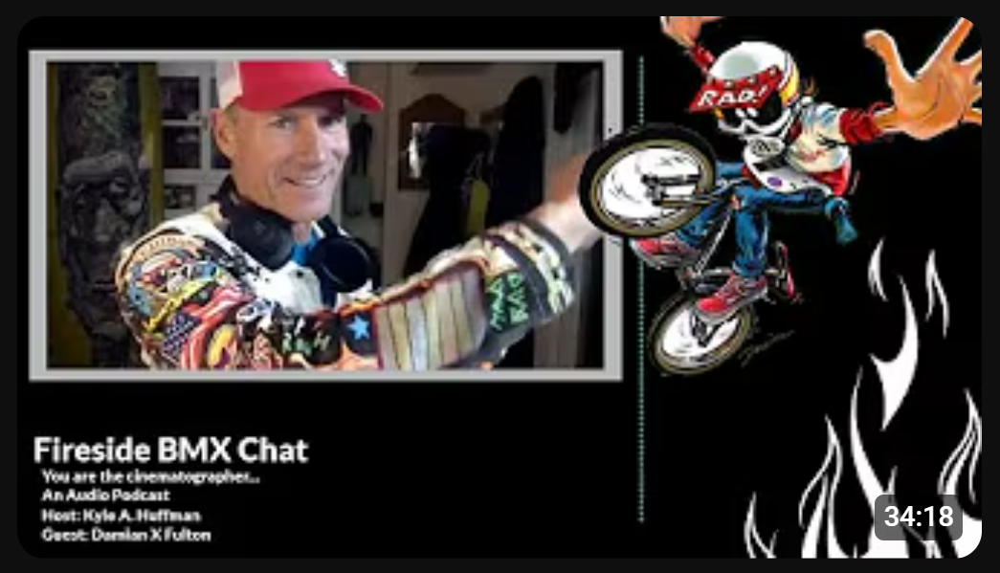
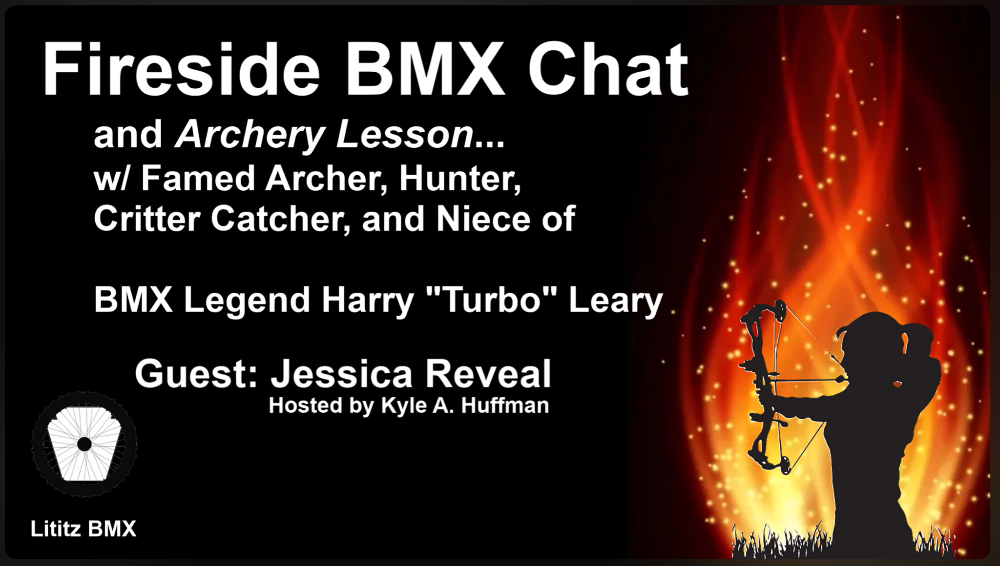
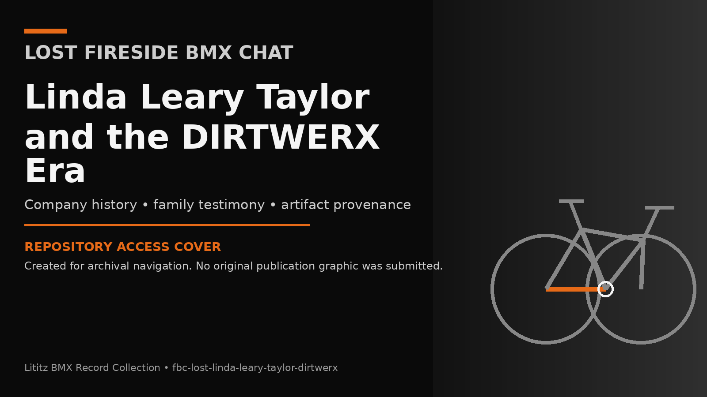

<p align="center">
  
</p>

# The Lititz BMX Record Collection

**Repository location:** `Article134-tech/lititzbmx-docs/record-collection/`  
**Integration method:** Additive folder upload to the existing Lititz BMX documentation repository; no repository restructuring required.  
**Repository standard:** v1.0.1  
**Compiled:** 2026-07-20  
**Publisher and curator:** Lititz BMX / Kyle A. Huffman

The **Lititz BMX Record Collection** preserves the complete historical footprint surrounding original Lititz BMX media: the recording, its descriptive record, transcript layers, planning documents, publication materials, derivative clip records, verification notes, and preservation history.

The goal is not merely to save videos. It is to preserve **how each recording came to exist, how it was presented, what survives, and what remains uncertain**.

## Explore the collection

<table>
<tr>
<td width="33%" valign="top">
<a href="collections/fireside-bmx-chat/README.md"></a><br>
<strong><a href="collections/fireside-bmx-chat/README.md">Fireside BMX Chat</a></strong><br>
Interviews and oral histories presented through human settings, family memory, museum encounters, and shared activities.
</td>
<td width="33%" valign="top">
<a href="collections/pump-track-chat/README.md"></a><br>
<strong><a href="collections/pump-track-chat/README.md">Pump Track Chat</a></strong><br>
Conversations about access, planning, riding, community development, and advocacy.
</td>
<td width="33%" valign="top">
<a href="collections/unboxing/README.md"></a><br>
<strong><a href="collections/unboxing/README.md">Unboxing</a></strong><br>
Records of opening, identifying, documenting, and first responding to newly received material.
</td>
</tr>
</table>

## Compiled record dossiers

<table>
<tr>
<td width="30%" valign="top"><a href="collections/fireside-bmx-chat/records/fbc-001-damian-x-fulton/README.md"></a></td>
<td valign="top"><strong><a href="collections/fireside-bmx-chat/records/fbc-001-damian-x-fulton/README.md">Damian X. Fulton</a></strong><br>Creative-industry oral history and BMX cultural history interview.<br><br><a href="https://www.youtube.com/watch?v=vtVr6GBJtlM">Watch recording</a> · <a href="collections/fireside-bmx-chat/records/fbc-001-damian-x-fulton/interview-record.md">Interview Record</a></td>
</tr><tr>
<td width="30%" valign="top"><a href="collections/fireside-bmx-chat/records/fbc-greg-hill-floored/README.md"></a></td>
<td valign="top"><strong><a href="collections/fireside-bmx-chat/records/fbc-greg-hill-floored/README.md">Greg Hill — Floored</a></strong><br>Experiential interview that begins as a garage-floor consultation and evolves into BMX oral history.<br><br><a href="https://www.youtube.com/watch?v=EI_tBe4Gf-A">Watch recording</a> · <a href="collections/fireside-bmx-chat/records/fbc-greg-hill-floored/interview-record.md">Interview Record</a></td>
</tr><tr>
<td width="30%" valign="top"><a href="collections/fireside-bmx-chat/records/fbc-004-greg-mathias-chasing-harry-hof/README.md"></a></td>
<td valign="top"><strong><a href="collections/fireside-bmx-chat/records/fbc-004-greg-mathias-chasing-harry-hof/README.md">Greg Mathias — Hall of Fame</a></strong><br>On-location interview and collection encounter conducted inside the National BMX Hall of Fame.<br><br><a href="https://www.youtube.com/watch?v=EUTzVetaoLc">Watch recording</a> · <a href="collections/fireside-bmx-chat/records/fbc-004-greg-mathias-chasing-harry-hof/interview-record.md">Interview Record</a></td>
</tr><tr>
<td width="30%" valign="top"><a href="collections/fireside-bmx-chat/records/fbc-linda-leary-taylor-walk-talk/README.md"></a></td>
<td valign="top"><strong><a href="collections/fireside-bmx-chat/records/fbc-linda-leary-taylor-walk-talk/README.md">Linda Leary Taylor — Walk & Talk</a></strong><br>On-location memorial walk, family oral history, and place-based remembrance interview.<br><br><a href="https://www.youtube.com/watch?v=2EWCctB6bss">Watch recording</a> · <a href="collections/fireside-bmx-chat/records/fbc-linda-leary-taylor-walk-talk/interview-record.md">Interview Record</a></td>
</tr><tr>
<td width="30%" valign="top"><a href="collections/fireside-bmx-chat/records/fbc-005-the-boy-leary-ladies/README.md"></a></td>
<td valign="top"><strong><a href="collections/fireside-bmx-chat/records/fbc-005-the-boy-leary-ladies/README.md">The Boy — Leary Family</a></strong><br>Family oral history centered on preserved writings, memorial objects, and multi-generational testimony.<br><br><a href="https://www.youtube.com/watch?v=92rxPCGK6Pg">Watch recording</a> · <a href="collections/fireside-bmx-chat/records/fbc-005-the-boy-leary-ladies/interview-record.md">Interview Record</a></td>
</tr><tr>
<td width="30%" valign="top"><a href="collections/fireside-bmx-chat/records/fbc-jessica-reveal-archery-lesson/README.md"></a></td>
<td valign="top"><strong><a href="collections/fireside-bmx-chat/records/fbc-jessica-reveal-archery-lesson/README.md">Jessica Reveal — Archery Lesson</a></strong><br>Experiential oral history built around mentorship, learning, and skill transfer through an archery lesson.<br><br><a href="https://www.youtube.com/watch?v=Gyuvtnze9N8">Watch recording</a> · <a href="collections/fireside-bmx-chat/records/fbc-jessica-reveal-archery-lesson/interview-record.md">Interview Record</a></td>
</tr><tr>
<td width="30%" valign="top"><a href="collections/fireside-bmx-chat/records/fbc-lost-linda-leary-taylor-dirtwerx/README.md"></a></td>
<td valign="top"><strong><a href="collections/fireside-bmx-chat/records/fbc-lost-linda-leary-taylor-dirtwerx/README.md">Lost DIRTWERX Conversation</a></strong><br>Recovered or “lost” conversational record centered on company history, family testimony, artifact provenance, and preservation stewardship.<br><br><a href="https://www.youtube.com/watch?v=pdP6kqSLUUs">Watch recording</a> · <a href="collections/fireside-bmx-chat/records/fbc-lost-linda-leary-taylor-dirtwerx/interview-record.md">Interview Record</a></td>
</tr>
</table>

## Start with the public record

- [Complete Collection Index](COLLECTION_INDEX.md)
- [Fireside BMX Chat visual index](collections/fireside-bmx-chat/README.md)
- [Archival Standard](ARCHIVAL_STANDARD.md)
- [Visual Presentation Standard](docs/VISUAL_PRESENTATION_STANDARD.md)
- [Public/Private Preservation Rules](SECURITY_AND_PRIVACY.md)
- [Validation Report](docs/VALIDATION_REPORT.md)
- [Pre-Publication QA Results](docs/PREPUBLICATION_QA_RESULTS.md)
- [Visual Asset Inventory](docs/VISUAL_ASSET_INVENTORY.md)
- [v1.0.0 → v1.0.1 Change Manifest](docs/V1.0.0_TO_V1.0.1_CHANGE_MANIFEST.md)

## Repository hierarchy

```text
The Lititz BMX Record Collection
├── collections/
│   ├── fireside-bmx-chat/
│   │   ├── records/                 Individual Interview Dossiers
│   │   └── series/chasing-harry/   Explicit subseries documentation
│   ├── pump-track-chat/            Category established; dossiers pending
│   └── unboxing/                    Category established; dossiers pending
├── templates/                      Reusable dossier templates
├── schemas/                        Machine-readable metadata schema
└── docs/                           Standards, upload instructions, and validation
```

## Core archival rule

> The original recording is the primary source. A transcript is an access aid. An Interview Record is a descriptive archival record. Supporting documents preserve context, but must not be confused with what was actually said or shown in the recording.

## Public and private preservation layers

This repository is the **public-access package**. Direct contact details and unaltered originals requiring privacy review are stored separately in the private preservation supplement. Public-access redactions and cleanups are labeled explicitly; no alteration is hidden.

Read [SECURITY_AND_PRIVACY.md](SECURITY_AND_PRIVACY.md) before publishing or moving source materials.

## Important status note

The supplied transcripts are machine-generated. They are preserved unchanged and accompanied by normalized working copies, but they are **not yet fully speaker-labeled, punctuated, name-verified, or checked line-by-line against the audio**.

## Rights

No open-source license is implied. See [RIGHTS.md](RIGHTS.md).
