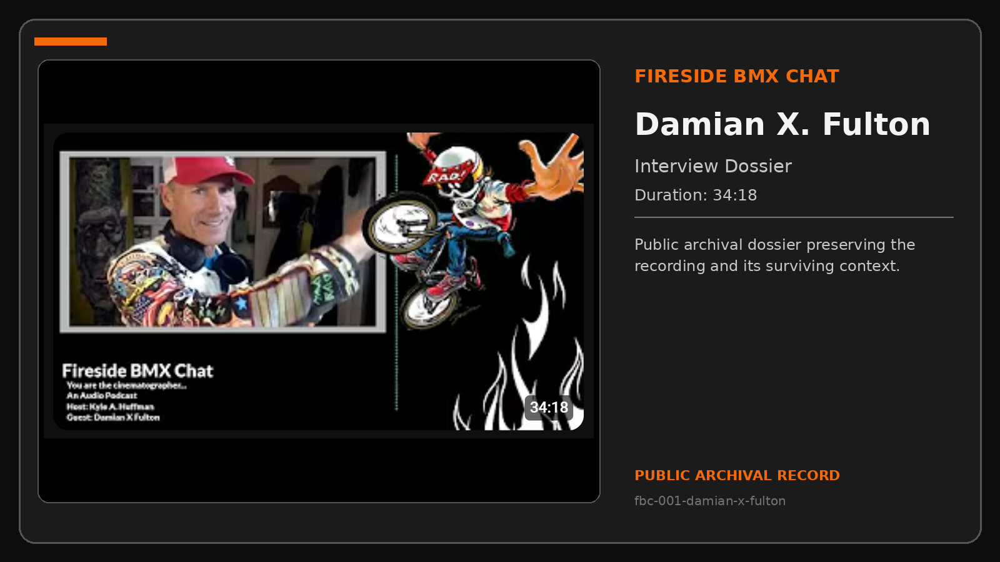
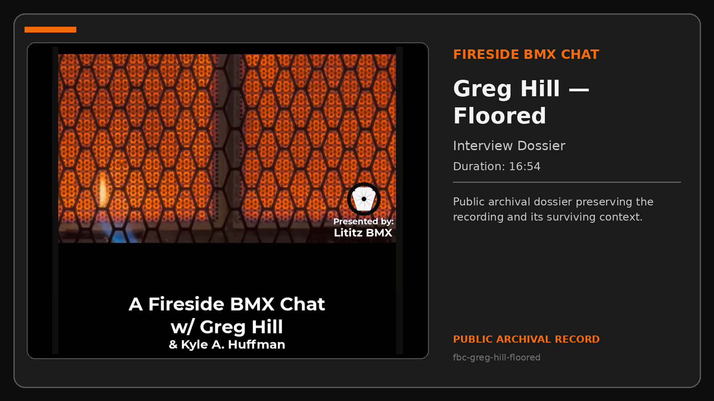
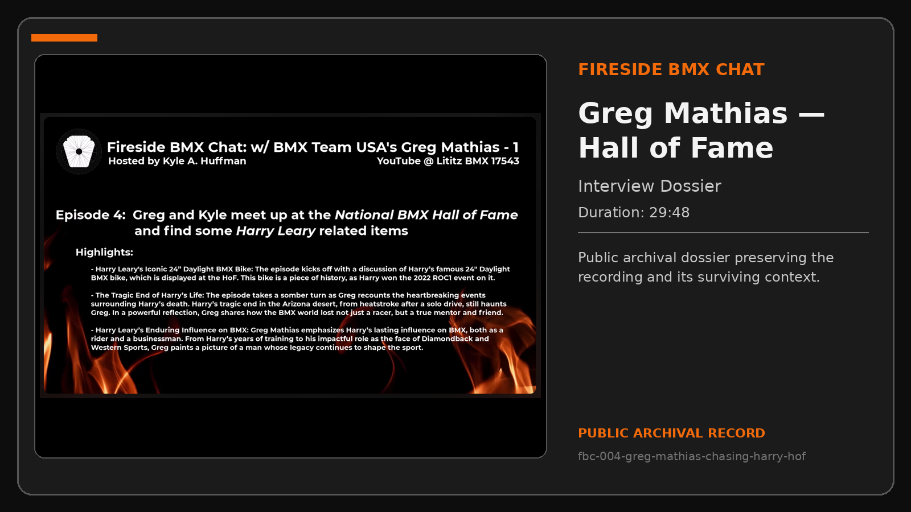
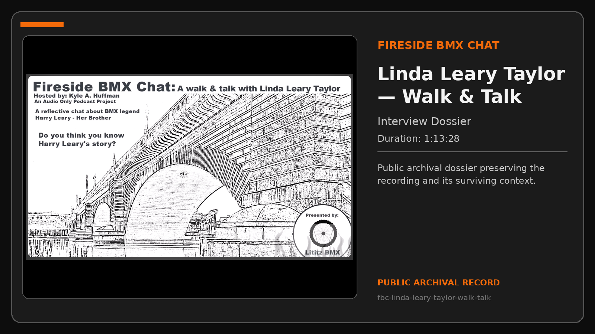
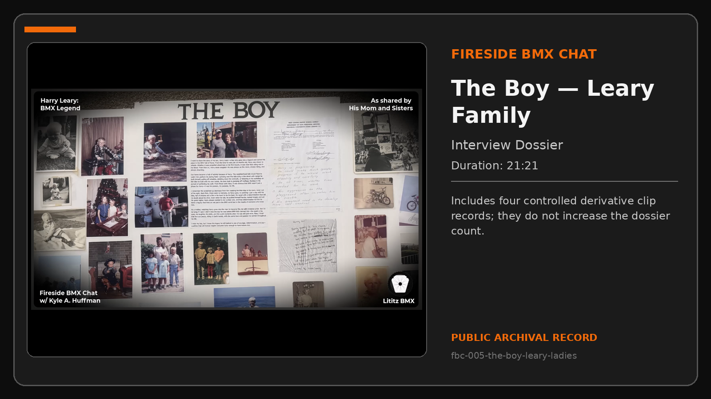
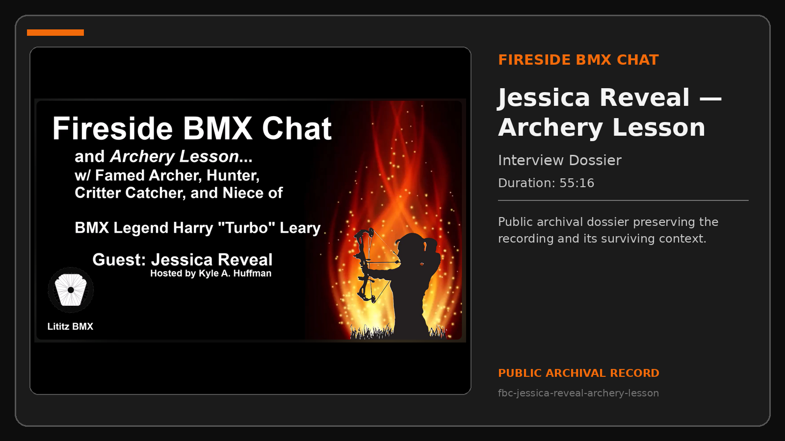
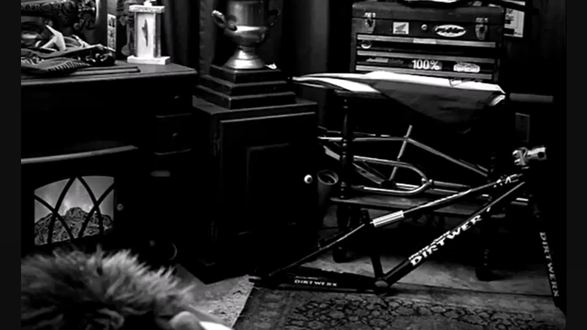
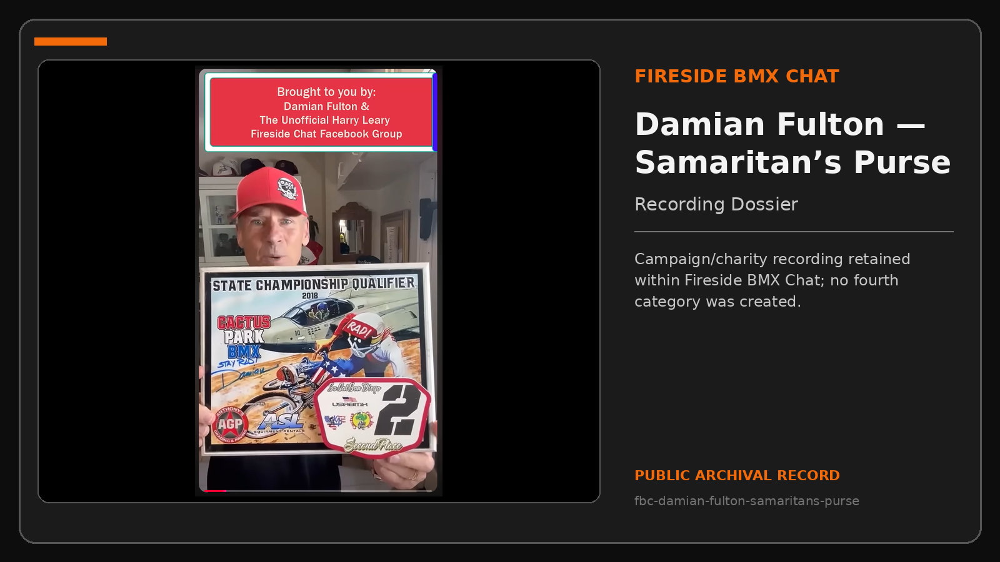

# Fireside BMX Chat

Fireside BMX Chat preserves conversations and recordings that place BMX history inside human settings: family remembrance, museum encounters, shared activities, recovered conversations, and campaign work.

**Compiled dossiers:** 8  
**Public package:** v1.1.0  
**Dossier types:** Interview and Recording Dossiers

## Visual dossier index

<table>
<tr>
<td width="34%" valign="top"></td>
<td valign="top"><strong><a href="records/fbc-001-damian-x-fulton/README.md">Fireside BMX Chat - Episode 1: Damian X. Fulton</a></strong> Damian X.   <strong>Duration:</strong> 34:18 <strong>Type:</strong> Interview Dossier <a href="https://www.youtube.com/watch?v=vtVr6GBJtlM">Watch on YouTube</a> · <a href="records/fbc-001-damian-x-fulton/interview-record.md">Open Interview Record</a></td>
</tr>
<tr>
<td width="34%" valign="top"></td>
<td valign="top"><strong><a href="records/fbc-greg-hill-floored/README.md">Fireside BMX Chat: Greg Hill - Floored</a></strong> Greg Hill visits Kyle’s garage to discuss flooring options, materials, process, cost, and warranties.   <strong>Duration:</strong> 16:54 <strong>Type:</strong> Interview Dossier <a href="https://www.youtube.com/watch?v=EI_tBe4Gf-A">Watch on YouTube</a> · <a href="records/fbc-greg-hill-floored/interview-record.md">Open Interview Record</a></td>
</tr>
<tr>
<td width="34%" valign="top"></td>
<td valign="top"><strong><a href="records/fbc-004-greg-mathias-chasing-harry-hof/README.md">Chasing Harry - Episode 4: Greg Mathias at the National BMX Hall of Fame</a></strong> Kyle and Greg Mathias meet in person at the National BMX Hall of Fame and examine Harry Leary-related bicycles and display objects.   <strong>Duration:</strong> 29:48 <strong>Type:</strong> Interview Dossier <a href="https://www.youtube.com/watch?v=EUTzVetaoLc">Watch on YouTube</a> · <a href="records/fbc-004-greg-mathias-chasing-harry-hof/interview-record.md">Open Interview Record</a>  <strong><a href="records/fbc-004-greg-mathias-chasing-harry-hof/derivatives/shorts/README.md">Explore the 32-record visual Shorts archive</a></strong></td>
</tr>
<tr>
<td width="34%" valign="top"></td>
<td valign="top"><strong><a href="records/fbc-linda-leary-taylor-walk-talk/README.md">A Walk & Talk with Linda Leary Taylor</a></strong> Kyle, Anne-Marie, and Linda Leary Taylor walk across the London Bridge toward Harry Leary’s memorial paver.   <strong>Duration:</strong> 1:13:28 <strong>Type:</strong> Interview Dossier <a href="https://www.youtube.com/watch?v=2EWCctB6bss">Watch on YouTube</a> · <a href="records/fbc-linda-leary-taylor-walk-talk/interview-record.md">Open Interview Record</a></td>
</tr>
<tr>
<td width="34%" valign="top"></td>
<td valign="top"><strong><a href="records/fbc-005-the-boy-leary-ladies/README.md">The Boy: Harry Leary as Remembered by His Mother and Sisters</a></strong> Beverly Leary and Harry Leary’s sisters Linda and Cammie discuss the family poster board created for Dirtyfest, read three family writings, recall Harry as a child and family member, and describe him through the “One Word” exercise.  <strong>Duration:</strong> 21:21 <strong>Type:</strong> Interview Dossier <a href="https://www.youtube.com/watch?v=92rxPCGK6Pg">Watch on YouTube</a> · <a href="records/fbc-005-the-boy-leary-ladies/interview-record.md">Open Interview Record</a>  <em>Includes four controlled derivative clip records; they do not increase the dossier count.</em></td>
</tr>
<tr>
<td width="34%" valign="top"></td>
<td valign="top"><strong><a href="records/fbc-jessica-reveal-archery-lesson/README.md">Fireside BMX Chat and Archery Lesson with Jessica Reveal</a></strong> Jessica Reveal teaches Kyle archery safety, equipment, and shooting fundamentals while sharing memories of her uncle Harry Leary.   <strong>Duration:</strong> 55:16 <strong>Type:</strong> Interview Dossier <a href="https://www.youtube.com/watch?v=Gyuvtnze9N8">Watch on YouTube</a> · <a href="records/fbc-jessica-reveal-archery-lesson/interview-record.md">Open Interview Record</a></td>
</tr>
<tr>
<td width="34%" valign="top"></td>
<td valign="top"><strong><a href="records/fbc-lost-linda-leary-taylor-dirtwerx/README.md">Lost Fireside BMX Chat: Linda Leary Taylor and the DIRTWERX Era</a></strong> Linda and Kyle discuss Harry Leary’s DIRTWERX era, Livermore Boss frame production, family financial support, a newly acquired NOS DIRTWERX frame, and the provenance of a complete DIRTWERX bike that traveled from Harry to Linda’s son…  <strong>Duration:</strong> 30:28 <strong>Type:</strong> Interview Dossier <a href="https://www.youtube.com/watch?v=pdP6kqSLUUs">Watch on YouTube</a> · <a href="records/fbc-lost-linda-leary-taylor-dirtwerx/interview-record.md">Open Interview Record</a></td>
</tr>
<tr>
<td width="34%" valign="top"></td>
<td valign="top"><strong><a href="records/fbc-damian-fulton-samaritans-purse/README.md">Damian X. Fulton / Radical Rick / Samaritan’s Purse Campaign Recording</a></strong> A Fireside BMX Chat campaign/charity recording connecting Damian X.   <strong>Duration:</strong> Not supplied <strong>Type:</strong> Recording Dossier <a href="https://youtube.com/shorts/t22nVfWSC6s">Watch on YouTube</a> · <a href="records/fbc-damian-fulton-samaritans-purse/recording-record.md">Open Recording Record</a>  <em>Campaign/charity recording retained within Fireside BMX Chat; no fourth category was created.</em></td>
</tr>
</table>

## Archival treatment

- `Chasing Harry` is treated as an explicit subseries only where the source publication uses that name.
- The Samaritan’s Purse record remains a Fireside BMX Chat campaign/charity recording.
- The four “The Boy” clips remain derivative records inside that single dossier.

[Open the Chasing Harry subseries record](series/chasing-harry/README.md)

[Return to the complete Record Collection](../../README.md)
