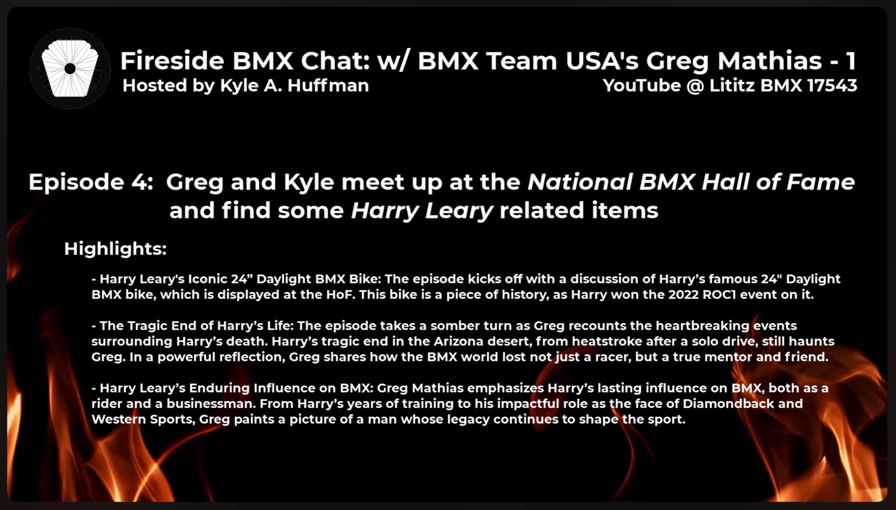
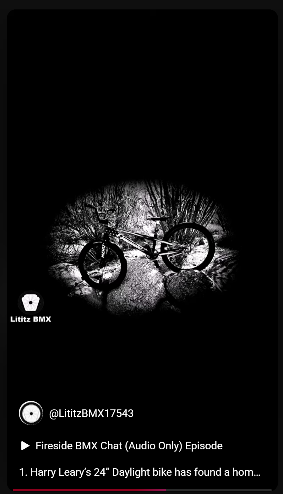
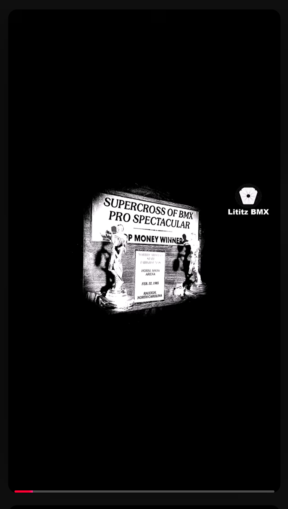
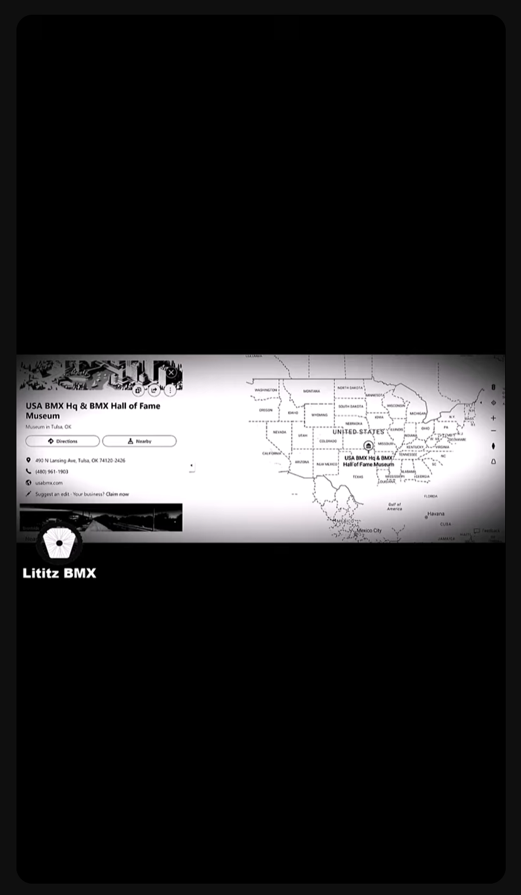

  

# Chasing Harry — Episode 4: Greg Mathias at the National BMX Hall of Fame

<strong><a href="https://www.youtube.com/watch?v=EUTzVetaoLc">▶ Watch the complete recording on YouTube</a></strong>

## Explore the 32-Short visual publication archive

The Episode 4 dossier includes a complete visual index of the 32 supplied published-frame captures, with GM-010 documented as missing and the two published number-12 records preserved separately as GM-012A and GM-012B.

<table>
<tr>
<td width="33%" align="center"></td>
<td width="33%" align="center"></td>
<td width="33%" align="center"></td>
</tr>
</table>

<strong><a href="derivatives/shorts/README.md">Open the complete 32-record visual Shorts archive →</a></strong>

## At a glance

| Field | Record |
|---|---|
| **Record ID** | `fbc-004-greg-mathias-chasing-harry-hof` |
| **Dossier type** | Interview Dossier |
| **Classification** | On-location interview and collection encounter conducted inside the National BMX Hall of Fame. |
| **Participants** | Kyle A. Huffman, Greg Mathias, Anne-Marie Huffman |
| **Setting** | National BMX Hall of Fame; city not supplied in the submitted materials |
| **Duration** | 29:48 |
| **Preservation status** | Dossier compiled; machine transcript preserved; full audio verification pending |

## Record summary

Kyle and Greg Mathias meet in person at the National BMX Hall of Fame and examine Harry Leary-related bicycles and display objects. Greg recounts his friendship with Harry, the provenance of a 24-inch Daylight bicycle, the damaged and replacement 20-inch Daylight bicycles, Harry’s final days, the theft and recovery of a loaner bicycle, and the preservation of Harry-related materials.

## Why this recording matters

Links first-person testimony directly to museum objects and preserves both object provenance and the emotional history surrounding Harry Leary.

## Explore the dossier

| Public record | Context and provenance | Transcript and access |
|---|---|---|
| [Interview Record](interview-record.md) | [Dossier Contents](docs/dossier-contents.md) | [Working Transcript](transcript/working-transcript.md) |
| [Published Description](source/published-description.md) | [Provenance](docs/provenance.md) | [Transcript Status](docs/transcript-status.md) |
| [YouTube Record](source/youtube-record.md) | [Curator Notes](docs/curator-notes.md) | [Preliminary Chapter Index](docs/chapter-index.md) |
| [Metadata](metadata.json) | [Source Inventory](docs/source-inventory.md) | [Topic Index](docs/topic-index.md) |
| [Citation Record](CITATION.cff) | [Verification Notes](docs/verification-notes.md) | [Rights and Access](docs/rights-and-access.md) |

## Archival authority

The original recording is the primary source. The raw transcript is preserved unchanged as an access aid. Descriptive files identify testimony as testimony and record contradictions rather than silently resolving them.

## Current status

- source package compiled;
- public/private review completed;
- visual access layer completed;
- machine transcript preserved;
- full audio verification pending.

## Shorts publication evidence

The [visual Shorts publication archive](derivatives/shorts/README.md) connects each displayed frame to its title, description, publication date, visibility evidence, transcript reference, provenance, qualifications, and preservation record. All 32 captures remain preserved byte-for-byte.
