<table>
<tr>
<td width="33%" align="center" valign="top"> <strong><a href="records/GM-001/README.md">GM-001</a></strong></td>
<td width="33%" align="center" valign="top"> <strong><a href="records/GM-016/README.md">GM-016</a></strong></td>
<td width="33%" align="center" valign="top"> <strong><a href="records/GM-032/README.md">GM-032</a></strong></td>
</tr>
</table>

# Greg Mathias / Chasing Harry Episode 4 — Visual Shorts Publication Archive

**Parent dossier:** [Chasing Harry — Episode 4: Greg Mathias at the National BMX Hall of Fame](../../README.md)  
**Compiled:** 2026-07-22  
**Base deployment:** corrected Lititz BMX Record Collection v1.2.0  
**Current package version:** v1.3.1

This public access layer presents the 32 supplied published-frame captures as the principal visual navigation for the Greg Mathias / *Chasing Harry* Episode 4 Shorts archive. The original captures remain preserved byte-for-byte; the GitHub pages display them directly rather than hiding them behind filename links.

<strong><a href="../../README.md">← Return to the complete Episode 4 dossier</a></strong>

## Visual index

Select any published frame to open its complete GM record. GM-010 remains in its proper numerical position as a documented gap. The two separately published number-12 records remain distinct as GM-012A and GM-012B.

<table>
<tr>
<td width="50%" valign="top" align="center">
 
<strong><a href="records/GM-001/README.md">GM-001 — 24-inch Daylight donated to the Hall of Fame</a></strong> 
2025-11-10 · Public / Published · 1:04 
<a href="source/evidence/published-frames-original/2026-07-22_15-40-37.png">Open full-resolution capture</a>
</td>
<td width="50%" valign="top" align="center">
<a href="records/GM-002/README.md">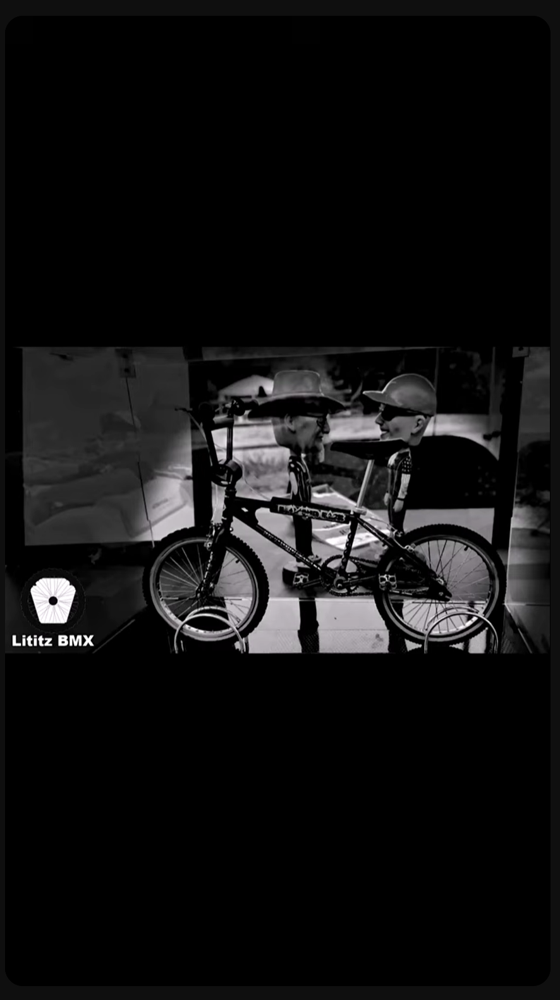</a> 
<strong><a href="records/GM-002/README.md">GM-002 — Harry Leary bobblehead and miniature HLT</a></strong> 
2025-11-10 · Public / Published · 0:13 
<a href="source/evidence/published-frames-original/2026-07-22_15-52-45.png">Open full-resolution capture</a>
</td>
</tr>
<tr>
<td width="50%" valign="top" align="center">
<a href="records/GM-003/README.md">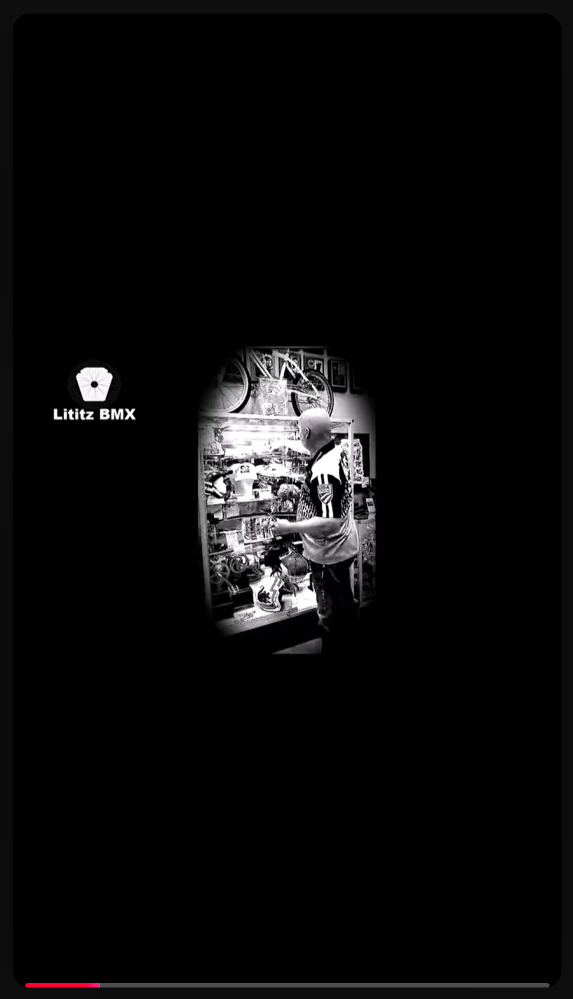</a> 
<strong><a href="records/GM-003/README.md">GM-003 — Greg and gOrk Hall of Fame donations</a></strong> 
2025-11-10 · Public / Published · 0:38 
<a href="source/evidence/published-frames-original/2026-07-22_15-57-49.png">Open full-resolution capture</a>
</td>
<td width="50%" valign="top" align="center">
<a href="records/GM-004/README.md">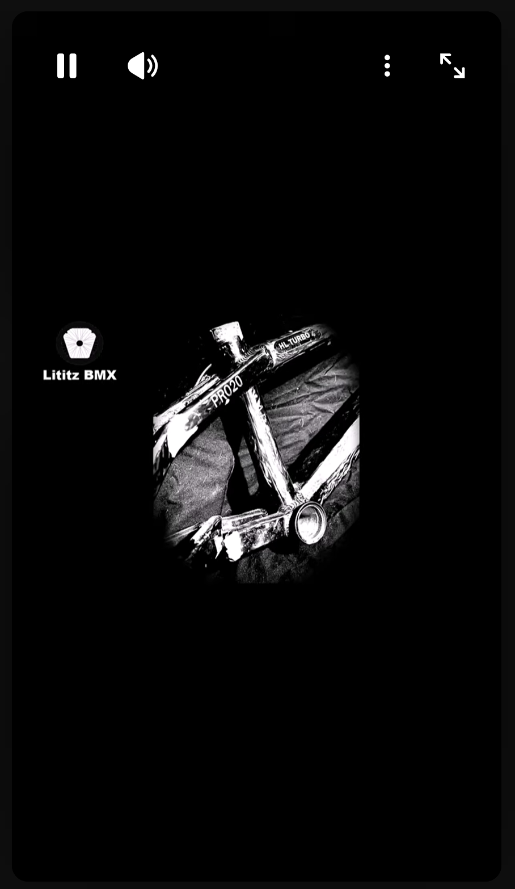</a> 
<strong><a href="records/GM-004/README.md">GM-004 — Last HLT 4 Daylight run-over story</a></strong> 
2025-11-10 · Public / Published · 0:29 
<a href="source/evidence/published-frames-original/2026-07-22_16-00-38.png">Open full-resolution capture</a>
</td>
</tr>
<tr>
<td width="50%" valign="top" align="center">
<a href="records/GM-005/README.md">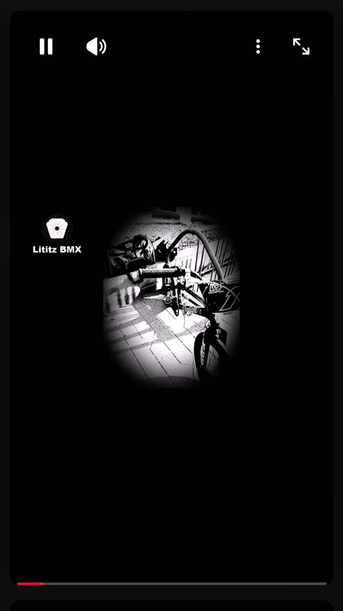</a> 
<strong><a href="records/GM-005/README.md">GM-005 — Loaner replacement Daylight 20-inch</a></strong> 
2025-11-10 · Public / Published · 0:44 
<a href="source/evidence/published-frames-original/2026-07-22_16-03-09.png">Open full-resolution capture</a>
</td>
<td width="50%" valign="top" align="center">
<a href="records/GM-006/README.md">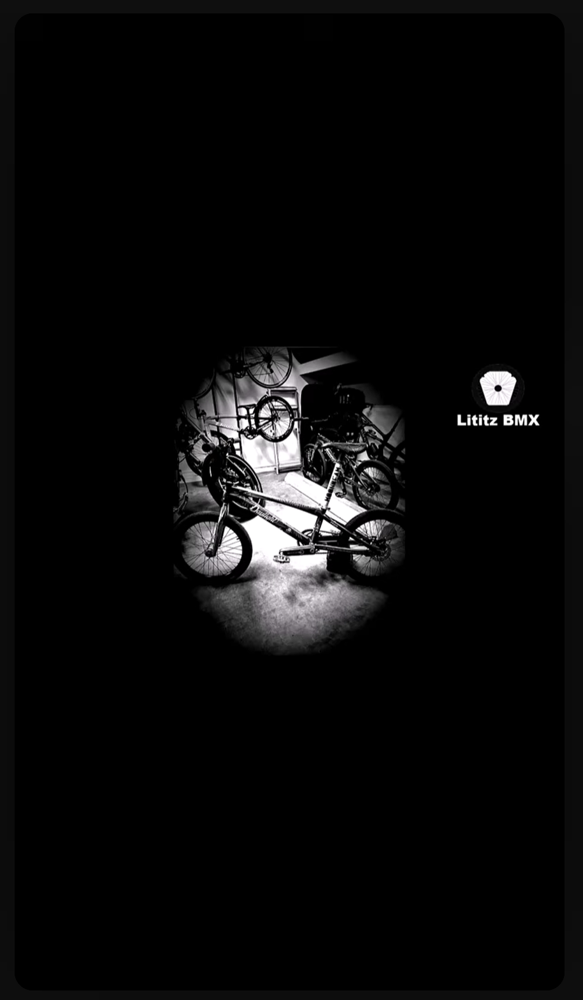</a> 
<strong><a href="records/GM-006/README.md">GM-006 — Mushroom decals and Say No campaign</a></strong> 
2025-11-10 · Public / Published · 0:26 
<a href="source/evidence/published-frames-original/2026-07-22_16-10-07.png">Open full-resolution capture</a>
</td>
</tr>
<tr>
<td width="50%" valign="top" align="center">
<a href="records/GM-007/README.md">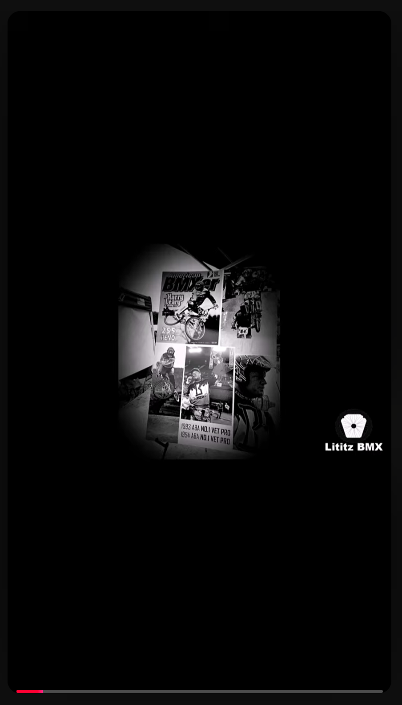</a> 
<strong><a href="records/GM-007/README.md">GM-007 — Last practice with Harry at Black Mountain</a></strong> 
2025-11-10 · Public / Published · 1:07 
<a href="source/evidence/published-frames-original/2026-07-22_16-11-46.png">Open full-resolution capture</a>
</td>
<td width="50%" valign="top" align="center">
 
<strong><a href="records/GM-008/README.md">GM-008 — Greg did not know Harry&#x27;s prior life</a></strong> 
2025-11-10 · Public / Published · 0:36 
<a href="source/evidence/published-frames-original/2026-07-22_16-13-16.png">Open full-resolution capture</a>
</td>
</tr>
<tr>
<td width="50%" valign="top" align="center">
<a href="records/GM-009/README.md">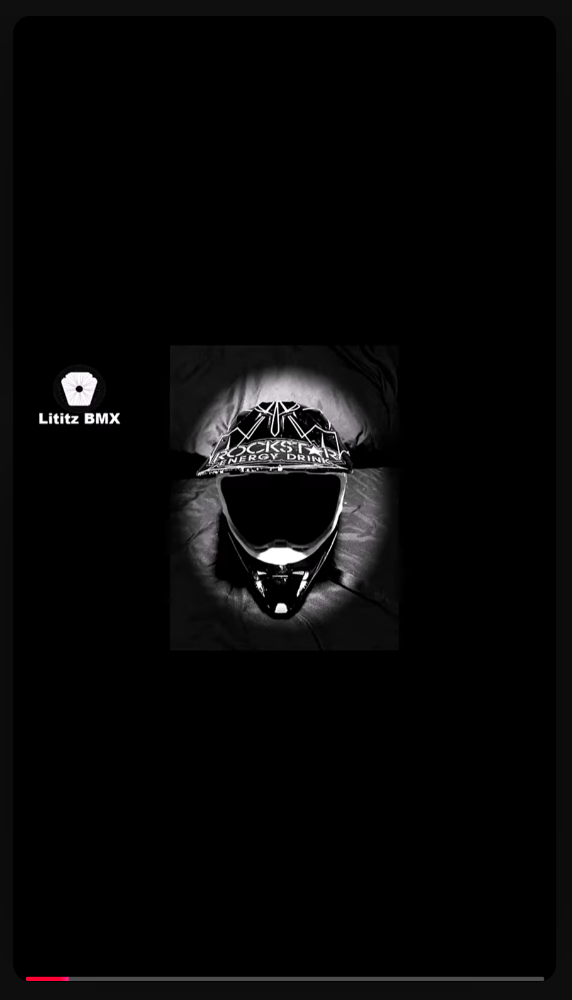</a> 
<strong><a href="records/GM-009/README.md">GM-009 — Concussions and suspected CTE discussion</a></strong> 
2025-11-10 · Public / Published · 0:55 
<a href="source/evidence/published-frames-original/2026-07-22_16-15-27.png">Open full-resolution capture</a>
</td>
<td width="50%" valign="top" align="center">
  <strong>GM-010 — DOCUMENTED GAP</strong> 
No supplied published-frame capture or publication record.  
<a href="records/GM-010-MISSING/README.md">Open the preserved gap record</a>
</td>
</tr>
<tr>
<td width="50%" valign="top" align="center">
 
<strong><a href="records/GM-011/README.md">GM-011 — Harry loved to drive; found outside Phoenix</a></strong> 
2025-11-10 · Public / Published · 0:36 
<a href="source/evidence/published-frames-original/2026-07-22_16-17-31.png">Open full-resolution capture</a>
</td>
<td width="50%" valign="top" align="center">
<a href="records/GM-012A/README.md">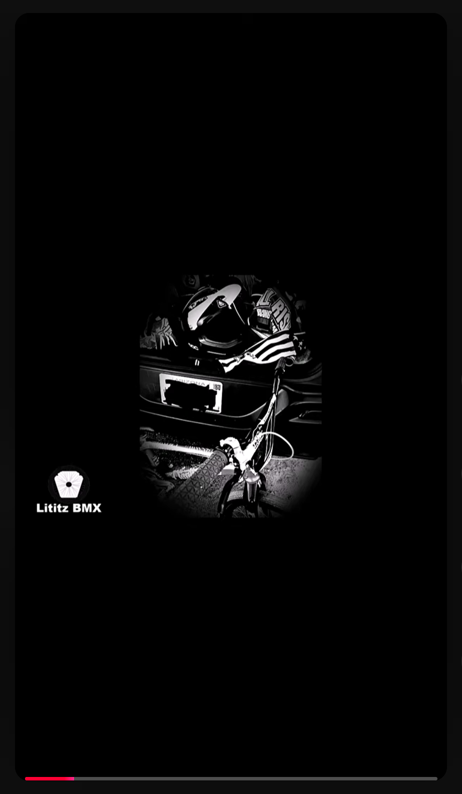</a> 
<strong><a href="records/GM-012A/README.md">GM-012A — Search timeline before Harry was found</a></strong> 
2025-11-10 · Private / Uploaded · 0:36 
<a href="source/evidence/published-frames-original/2026-07-22_16-19-09.png">Open full-resolution capture</a>
</td>
</tr>
<tr>
<td width="50%" valign="top" align="center">
<a href="records/GM-012B/README.md">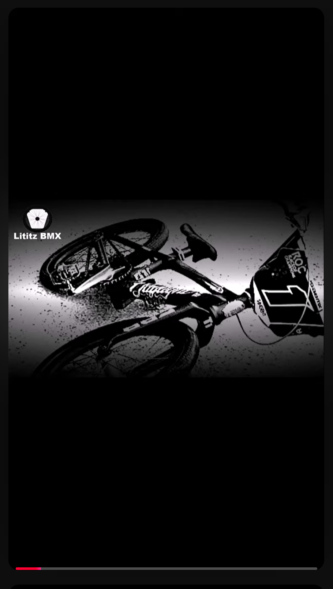</a> 
<strong><a href="records/GM-012B/README.md">GM-012B — Daylight stolen; personal items left</a></strong> 
2025-11-14 · Public / Published · 0:35 
<a href="source/evidence/published-frames-original/2026-07-22_16-21-03.png">Open full-resolution capture</a>
</td>
<td width="50%" valign="top" align="center">
<a href="records/GM-013/README.md">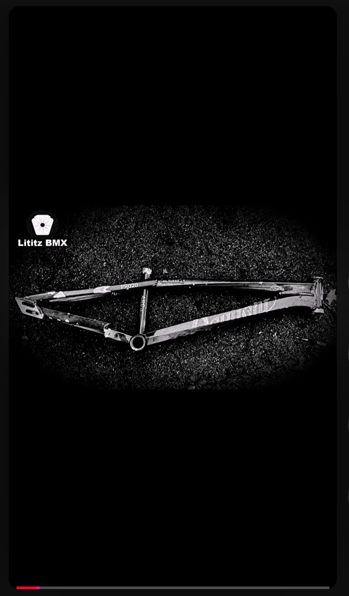</a> 
<strong><a href="records/GM-013/README.md">GM-013 — Six-month stolen-bike recovery with Rob Porter</a></strong> 
2025-11-10 · Public / Published · 1:15 
<a href="source/evidence/published-frames-original/2026-07-22_16-22-57.png">Open full-resolution capture</a>
</td>
</tr>
<tr>
<td width="50%" valign="top" align="center">
<a href="records/GM-014/README.md">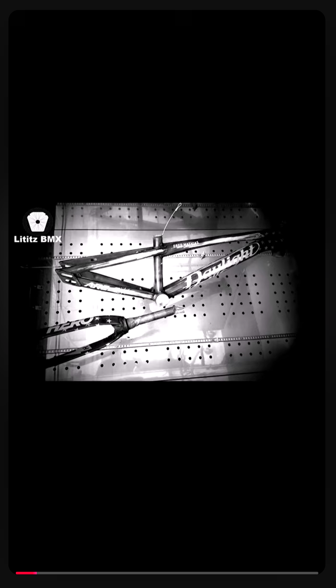</a> 
<strong><a href="records/GM-014/README.md">GM-014 — What happened to the run-over HLT 4</a></strong> 
2025-11-10 · Public / Published · 1:01 
<a href="source/evidence/published-frames-original/2026-07-22_16-24-29.png">Open full-resolution capture</a>
</td>
<td width="50%" valign="top" align="center">
<a href="records/GM-015/README.md">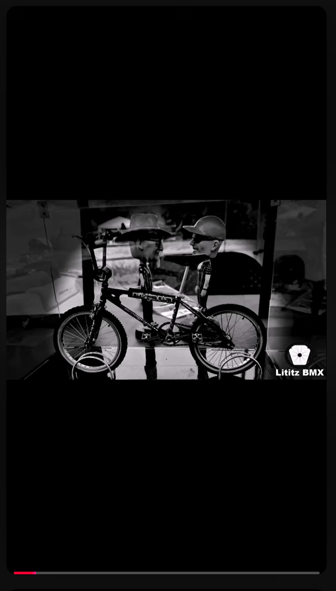</a> 
<strong><a href="records/GM-015/README.md">GM-015 — Daylight brought Greg on after Harry passed</a></strong> 
2025-11-10 · Public / Published · 1:14 
<a href="source/evidence/published-frames-original/2026-07-22_16-25-57.png">Open full-resolution capture</a>
</td>
</tr>
<tr>
<td width="50%" valign="top" align="center">
 
<strong><a href="records/GM-016/README.md">GM-016 — Harry&#x27;s Hall of Fame display case</a></strong> 
2025-11-10 · Public / Published · 1:13 
<a href="source/evidence/published-frames-original/2026-07-22_16-27-20.png">Open full-resolution capture</a>
</td>
<td width="50%" valign="top" align="center">
<a href="records/GM-017/README.md">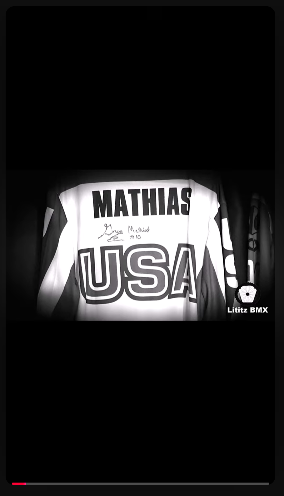</a> 
<strong><a href="records/GM-017/README.md">GM-017 — Harry devalued personal gains</a></strong> 
2025-11-10 · Public / Published · 1:24 
<a href="source/evidence/published-frames-original/2026-07-22_16-32-11.png">Open full-resolution capture</a>
</td>
</tr>
<tr>
<td width="50%" valign="top" align="center">
<a href="records/GM-018/README.md">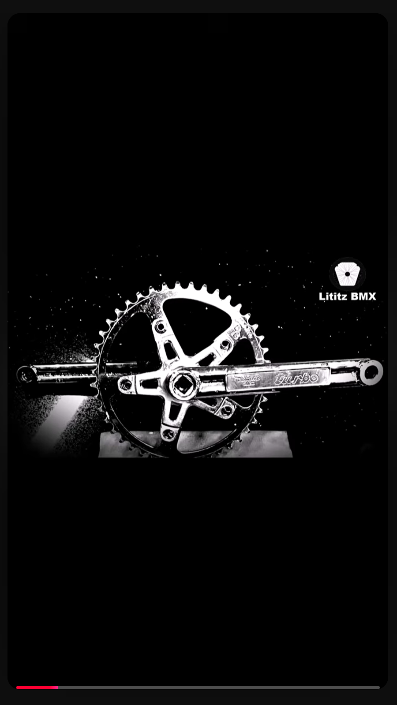</a> 
<strong><a href="records/GM-018/README.md">GM-018 — Locker, romance novels, and three of everything</a></strong> 
2025-11-10 · Public / Published · 1:42 
<a href="source/evidence/published-frames-original/2026-07-22_16-34-00.png">Open full-resolution capture</a>
</td>
<td width="50%" valign="top" align="center">
<a href="records/GM-019/README.md">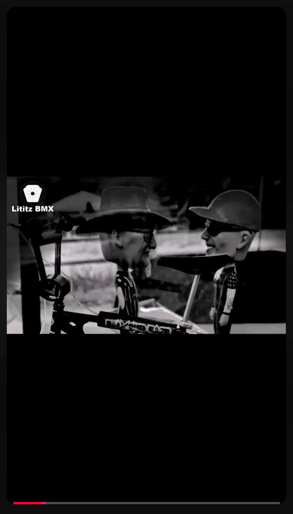</a> 
<strong><a href="records/GM-019/README.md">GM-019 — Turbo cranks in two different sizes</a></strong> 
2025-11-10 · Public / Published · 0:47 
<a href="source/evidence/published-frames-original/2026-07-22_16-35-45.png">Open full-resolution capture</a>
</td>
</tr>
<tr>
<td width="50%" valign="top" align="center">
 
<strong><a href="records/GM-020/README.md">GM-020 — Bobblehead in the Hall of Fame case</a></strong> 
2025-11-10 · Public / Published · 0:54 
<a href="source/evidence/published-frames-original/2026-07-22_16-37-30.png">Open full-resolution capture</a>
</td>
<td width="50%" valign="top" align="center">
<a href="records/GM-021/README.md">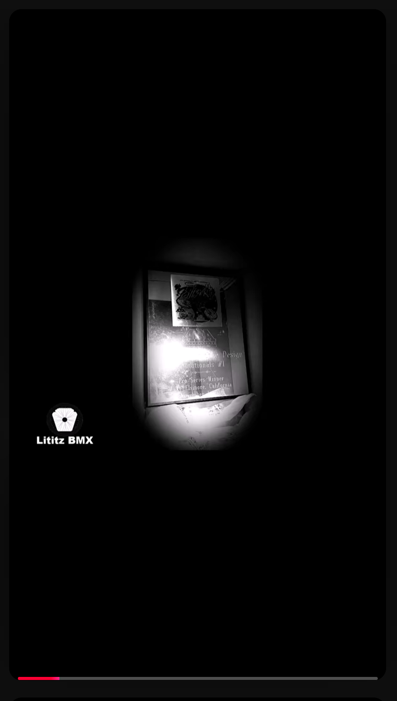</a> 
<strong><a href="records/GM-021/README.md">GM-021 — Greg started and later sold Fall Risk Racing</a></strong> 
2025-11-10 · Public / Published · 1:05 
<a href="source/evidence/published-frames-original/2026-07-22_16-39-35.png">Open full-resolution capture</a>
</td>
</tr>
<tr>
<td width="50%" valign="top" align="center">
<a href="records/GM-022/README.md">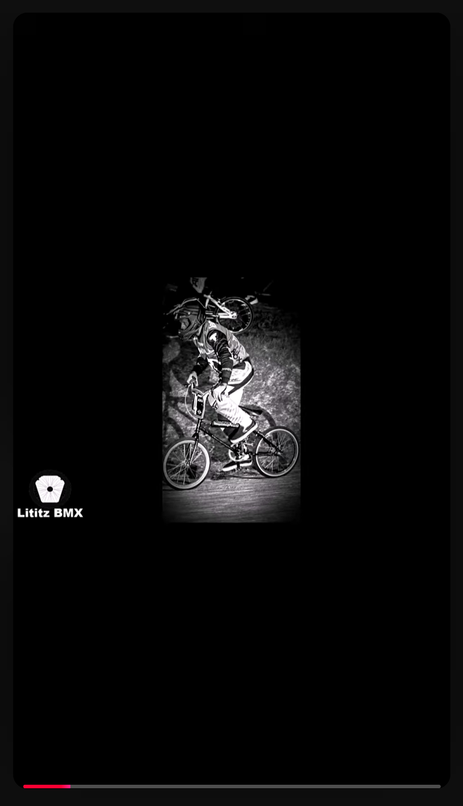</a> 
<strong><a href="records/GM-022/README.md">GM-022 — Kyle&#x27;s 1986 Porsche Design plaque donation</a></strong> 
2025-11-10 · Public / Published · 0:48 
<a href="source/evidence/published-frames-original/2026-07-22_16-42-06.png">Open full-resolution capture</a>
</td>
<td width="50%" valign="top" align="center">
 
<strong><a href="records/GM-023/README.md">GM-023 — Diamond Back from Australia donated then sold</a></strong> 
2025-11-10 · Public / Published · 0:44 
<a href="source/evidence/published-frames-original/2026-07-22_16-44-02.png">Open full-resolution capture</a>
</td>
</tr>
<tr>
<td width="50%" valign="top" align="center">
<a href="records/GM-024/README.md">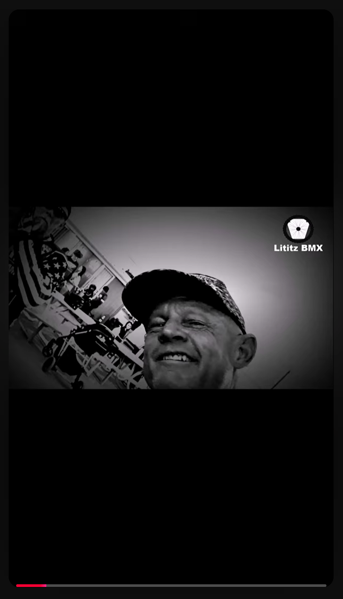</a> 
<strong><a href="records/GM-024/README.md">GM-024 — One of BMX&#x27;s most influential people</a></strong> 
2025-11-10 · Public / Published · 1:35 
<a href="source/evidence/published-frames-original/2026-07-22_16-45-53.png">Open full-resolution capture</a>
</td>
<td width="50%" valign="top" align="center">
<a href="records/GM-025/README.md">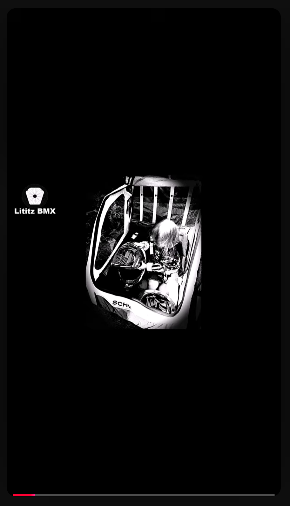</a> 
<strong><a href="records/GM-025/README.md">GM-025 — Animal, fast sucker, training partner</a></strong> 
2025-11-10 · Public / Published · 0:54 
<a href="source/evidence/published-frames-original/2026-07-22_16-47-35.png">Open full-resolution capture</a>
</td>
</tr>
<tr>
<td width="50%" valign="top" align="center">
<a href="records/GM-026/README.md">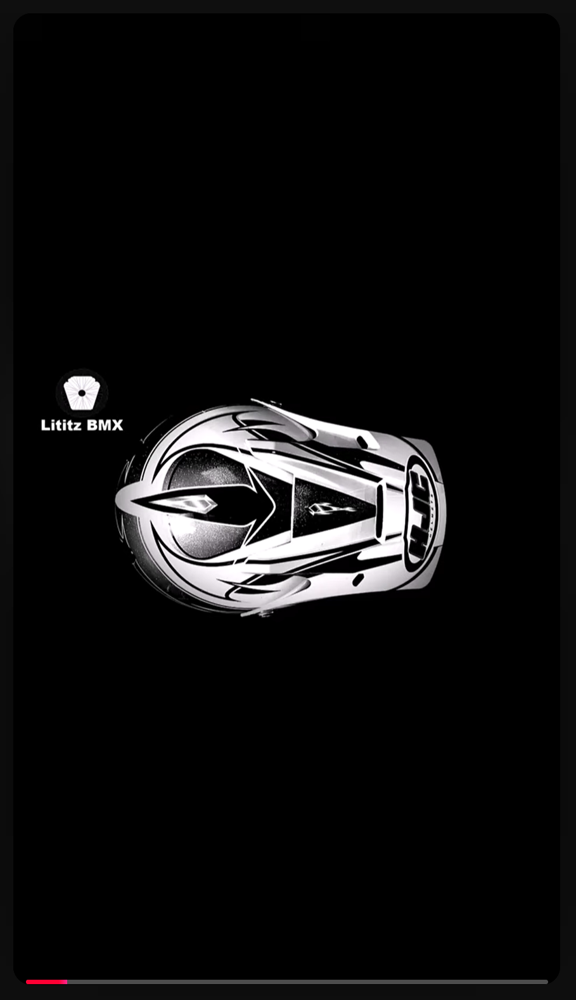</a> 
<strong><a href="records/GM-026/README.md">GM-026 — Helpful to everybody, even kids</a></strong> 
2025-11-10 · Public / Published · 1:03 
<a href="source/evidence/published-frames-original/2026-07-22_16-50-44.png">Open full-resolution capture</a>
</td>
<td width="50%" valign="top" align="center">
<a href="records/GM-027/README.md">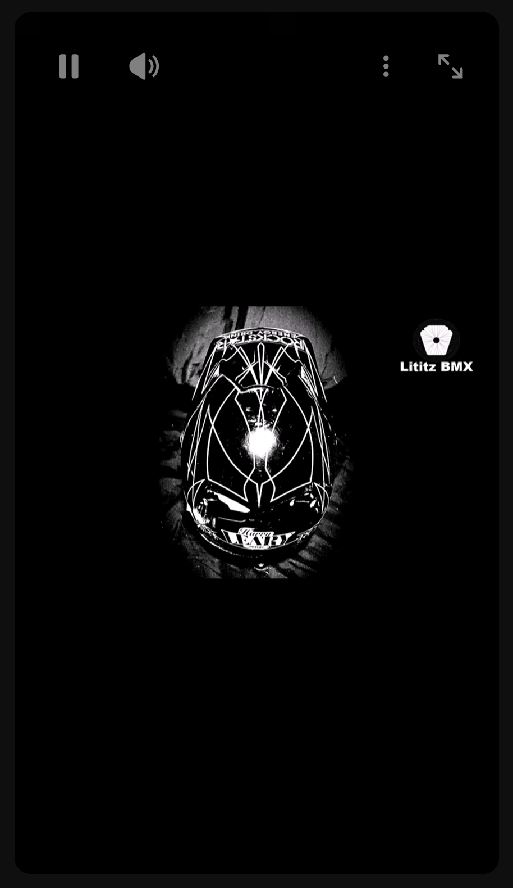</a> 
<strong><a href="records/GM-027/README.md">GM-027 — Demon side and CTE discussion</a></strong> 
2025-11-10 · Public / Published · 1:08 
<a href="source/evidence/published-frames-original/2026-07-22_16-52-41.png">Open full-resolution capture</a>
</td>
</tr>
<tr>
<td width="50%" valign="top" align="center">
<a href="records/GM-028/README.md">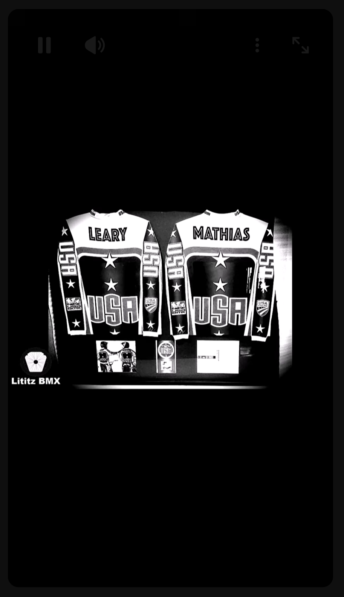</a> 
<strong><a href="records/GM-028/README.md">GM-028 — Knocked out pretty good as a child</a></strong> 
2025-11-10 · Public / Published · 0:10 
<a href="source/evidence/published-frames-original/2026-07-22_16-54-18.png">Open full-resolution capture</a>
</td>
<td width="50%" valign="top" align="center">
 
<strong><a href="records/GM-029/README.md">GM-029 — Harry was Harry; loved him like a brother</a></strong> 
2025-11-10 · Public / Published · 0:11 
<a href="source/evidence/published-frames-original/2026-07-22_16-56-02.png">Open full-resolution capture</a>
</td>
</tr>
<tr>
<td width="50%" valign="top" align="center">
<a href="records/GM-030/README.md">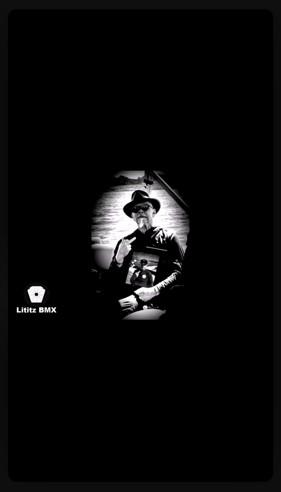</a> 
<strong><a href="records/GM-030/README.md">GM-030 — One word to describe Harry; public title leaves answer blank</a></strong> 
2025-11-10 · Public / Published · 0:29 
<a href="source/evidence/published-frames-original/2026-07-22_16-59-30.png">Open full-resolution capture</a>
</td>
<td width="50%" valign="top" align="center">
<a href="records/GM-031/README.md">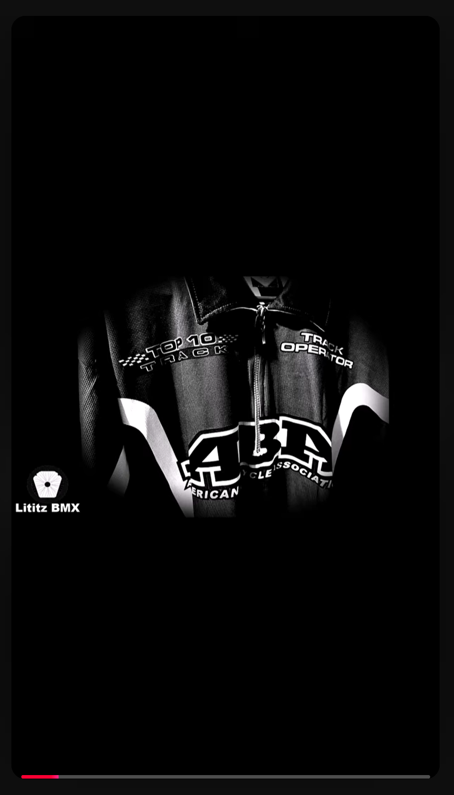</a> 
<strong><a href="records/GM-031/README.md">GM-031 — Harry&#x27;s business mind and brand loyalty</a></strong> 
2025-11-11 · Public / Published · 0:51 
<a href="source/evidence/published-frames-original/2026-07-22_17-01-34.png">Open full-resolution capture</a>
</td>
</tr>
<tr>
<td width="50%" valign="top" align="center">
 
<strong><a href="records/GM-032/README.md">GM-032 — Hall of Fame track and a few laps</a></strong> 
2025-11-11 · Public / Published · 0:10 
<a href="source/evidence/published-frames-original/2026-07-22_17-03-34.png">Open full-resolution capture</a>
</td>
<td width="50%"></td>
</tr>
</table>

## Controlled facts

- **32 supplied published-frame captures are preserved byte-for-byte and displayed above.**
- **GM-010 is documented as missing** and is not filled by renumbering another record.
- **Two distinct records numbered 12 are preserved separately** as GM-012A and GM-012B.
- GM-012A was **Private / Uploaded** in the supplied Studio status capture dated November 10, 2025.
- GM-012B was **Public / Published** in the supplied Studio status capture dated November 14, 2025.
- Direct Short URLs and video IDs were not visible in the supplied evidence and are not invented.
- The supplied parent timestamped transcript, working-source PDF, press release, Studio evidence, descriptions, platform URLs, dates, visibility states, provenance, qualifications, manifests, and fixity records are preserved.

## Detailed register

| Record | Published number | Duration | Date | Studio state | Normalized title |
|---|---:|---:|---|---|---|
| [GM-001](records/GM-001/README.md) | 1 | 1:04 | 2025-11-10 | Public / Published | 24-inch Daylight donated to the Hall of Fame |
| [GM-002](records/GM-002/README.md) | 2 | 0:13 | 2025-11-10 | Public / Published | Harry Leary bobblehead and miniature HLT |
| [GM-003](records/GM-003/README.md) | 3 | 0:38 | 2025-11-10 | Public / Published | Greg and gOrk Hall of Fame donations |
| [GM-004](records/GM-004/README.md) | 4 | 0:29 | 2025-11-10 | Public / Published | Last HLT 4 Daylight run-over story |
| [GM-005](records/GM-005/README.md) | 5 | 0:44 | 2025-11-10 | Public / Published | Loaner replacement Daylight 20-inch |
| [GM-006](records/GM-006/README.md) | 6 | 0:26 | 2025-11-10 | Public / Published | Mushroom decals and Say No campaign |
| [GM-007](records/GM-007/README.md) | 7 | 1:07 | 2025-11-10 | Public / Published | Last practice with Harry at Black Mountain |
| [GM-008](records/GM-008/README.md) | 8 | 0:36 | 2025-11-10 | Public / Published | Greg did not know Harry's prior life |
| [GM-009](records/GM-009/README.md) | 9 | 0:55 | 2025-11-10 | Public / Published | Concussions and suspected CTE discussion |
| [GM-010](records/GM-010-MISSING/README.md) | 10 | — | Not supplied | Missing / not supplied | Documented gap |
| [GM-011](records/GM-011/README.md) | 11 | 0:36 | 2025-11-10 | Public / Published | Harry loved to drive; found outside Phoenix |
| [GM-012A](records/GM-012A/README.md) | 12 | 0:36 | 2025-11-10 | Private / Uploaded | Search timeline before Harry was found |
| [GM-012B](records/GM-012B/README.md) | 12 | 0:35 | 2025-11-14 | Public / Published | Daylight stolen; personal items left |
| [GM-013](records/GM-013/README.md) | 13 | 1:15 | 2025-11-10 | Public / Published | Six-month stolen-bike recovery with Rob Porter |
| [GM-014](records/GM-014/README.md) | 14 | 1:01 | 2025-11-10 | Public / Published | What happened to the run-over HLT 4 |
| [GM-015](records/GM-015/README.md) | 15 | 1:14 | 2025-11-10 | Public / Published | Daylight brought Greg on after Harry passed |
| [GM-016](records/GM-016/README.md) | 16 | 1:13 | 2025-11-10 | Public / Published | Harry's Hall of Fame display case |
| [GM-017](records/GM-017/README.md) | 17 | 1:24 | 2025-11-10 | Public / Published | Harry devalued personal gains |
| [GM-018](records/GM-018/README.md) | 18 | 1:42 | 2025-11-10 | Public / Published | Locker, romance novels, and three of everything |
| [GM-019](records/GM-019/README.md) | 19 | 0:47 | 2025-11-10 | Public / Published | Turbo cranks in two different sizes |
| [GM-020](records/GM-020/README.md) | 20 | 0:54 | 2025-11-10 | Public / Published | Bobblehead in the Hall of Fame case |
| [GM-021](records/GM-021/README.md) | 21 | 1:05 | 2025-11-10 | Public / Published | Greg started and later sold Fall Risk Racing |
| [GM-022](records/GM-022/README.md) | 22 | 0:48 | 2025-11-10 | Public / Published | Kyle's 1986 Porsche Design plaque donation |
| [GM-023](records/GM-023/README.md) | 23 | 0:44 | 2025-11-10 | Public / Published | Diamond Back from Australia donated then sold |
| [GM-024](records/GM-024/README.md) | 24 | 1:35 | 2025-11-10 | Public / Published | One of BMX's most influential people |
| [GM-025](records/GM-025/README.md) | 25 | 0:54 | 2025-11-10 | Public / Published | Animal, fast sucker, training partner |
| [GM-026](records/GM-026/README.md) | 26 | 1:03 | 2025-11-10 | Public / Published | Helpful to everybody, even kids |
| [GM-027](records/GM-027/README.md) | 27 | 1:08 | 2025-11-10 | Public / Published | Demon side and CTE discussion |
| [GM-028](records/GM-028/README.md) | 28 | 0:10 | 2025-11-10 | Public / Published | Knocked out pretty good as a child |
| [GM-029](records/GM-029/README.md) | 29 | 0:11 | 2025-11-10 | Public / Published | Harry was Harry; loved him like a brother |
| [GM-030](records/GM-030/README.md) | 30 | 0:29 | 2025-11-10 | Public / Published | One word to describe Harry; public title leaves answer blank |
| [GM-031](records/GM-031/README.md) | 31 | 0:51 | 2025-11-11 | Public / Published | Harry's business mind and brand loyalty |
| [GM-032](records/GM-032/README.md) | 32 | 0:10 | 2025-11-11 | Public / Published | Hall of Fame track and a few laps |

## Evidence and documentation

- [Machine-readable CSV register](shorts-register.csv)
- [Machine-readable JSON register](shorts-register.json)
- [Known gaps](KNOWN-GAPS.md)
- [Medical and sensitive-claim qualifications](MEDICAL-AND-SENSITIVE-CLAIMS.md)
- [Provenance](PROVENANCE.md)
- [Frame manifest](manifests/FRAME-MANIFEST.csv)
- [Source manifest](manifests/SOURCE-MANIFEST.csv)
- [Derivative fixity](manifests/SHA256SUMS.txt)
- [GitHub deployment instructions](GITHUB-DEPLOYMENT.md)

<strong><a href="../../README.md">← Return to the complete Episode 4 dossier</a></strong>

