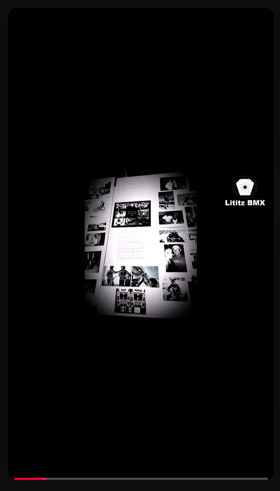

  

<em>Original supplied published-frame capture for GM-008; preserved byte-for-byte. Select the image to open the full-resolution evidence file.</em>

# GM-008 - Greg did not know Harry's prior life

<a href="../GM-007/README.md">← GM-007</a> &nbsp;·&nbsp; <a href="../../README.md">Visual Shorts Index</a> &nbsp;·&nbsp; <a href="../../../../README.md">Parent Episode 4 Dossier</a> &nbsp;·&nbsp; <a href="../GM-009/README.md">GM-009 →</a>

| Field | Preserved record |
|---|---|
| Parent dossier | [fbc-004-greg-mathias-chasing-harry-hof](../../../../README.md) |
| Source number | `8` |
| Duration | 0:36 |
| Publication date | 2025-11-10 |
| Visibility/state in supplied Studio evidence | Public / Published |
| Direct Short URL | Not supplied; not invented |
| Parent recording | [https://www.youtube.com/watch?v=EUTzVetaoLc](https://www.youtube.com/watch?v=EUTzVetaoLc) |
| Parent transcript reference | 6:05-6:31 (provisional) |

## Visible published title

> 8. Greg Mathias did not know anything about Harry Leary’s “prior” life - other than what he saw in…

The title above is a transcription of the title visible in the supplied YouTube Studio evidence. UI truncation is represented by an ellipsis rather than silently completed.

## Supplied working-source title

> Fireside BMX Chat w/ Greg Mathias - did not know anything about Harry Leary’s “prior” life

## Supplied description

Greg Mathias did not know anything about Harry Leary’s “prior” life other than what he saw in the magazines. He didn’t know Harry had a sister, daughter, or son. Greg believes he was Harry’s safezone or sounding board, and Greg like to help Harry put things into perspective.

**Description source:** working-source PDF.

## Evidence

- [Published-frame capture](../../source/evidence/published-frames-original/2026-07-22_16-13-16.png)
- [Publication status evidence](../../source/evidence/studio/2026-07-22_17-09-22.png)
- [Record metadata](metadata.json)
- [Preserved published description](source/published-description.md)
- [Parent transcript reference](source/transcript-reference.md)
- [Provenance](docs/provenance.md)
- [Verification notes](docs/verification-notes.md)

## Qualification

No special medical qualification is required for the core descriptive statement. All oral-history claims remain attributed unless independently verified.

---

<a href="../GM-007/README.md">← GM-007</a> &nbsp;·&nbsp; <a href="../../README.md">Visual Shorts Index</a> &nbsp;·&nbsp; <a href="../../../../README.md">Parent Episode 4 Dossier</a> &nbsp;·&nbsp; <a href="../GM-009/README.md">GM-009 →</a>

